<h1 align="center">HK Frontend</h1>

Home Assistant dashboards inspired by Apple’s Home app. 
Built from your own rooms and devices, and set up entirely in the UI.

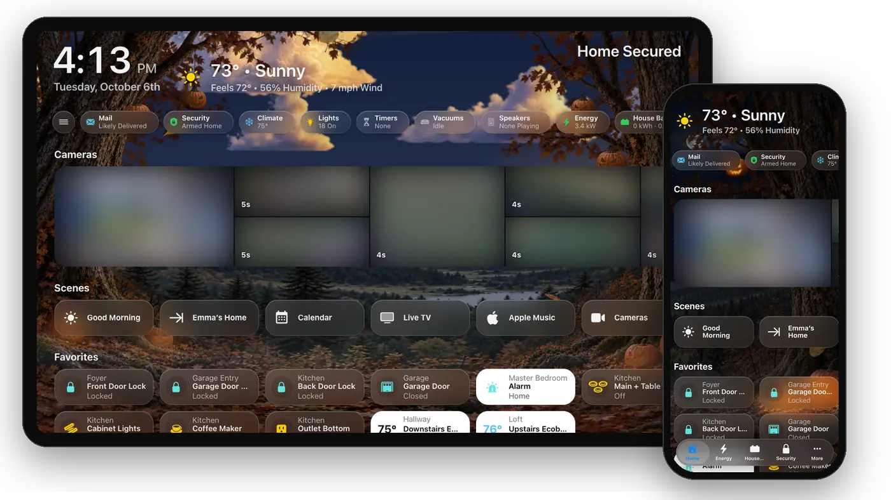

<b><a href="https://github.com/jazzphone/hk-frontend/wiki/Install">Install</a></b> ·
<b><a href="https://github.com/jazzphone/hk-frontend/wiki">Documentation</a></b> ·
<b><a href="https://github.com/jazzphone/hk-frontend/wiki/Gallery">Gallery</a></b> ·
<b><a href="https://github.com/jazzphone/hk-frontend/releases">What’s new</a></b>

## Screens that build themselves

Add a screen and HK Frontend builds it from your floors, areas and devices: the clock and weather, status chips, cameras, scenes, favorites, a section for every room, a page for each room and each kind of device, and a [calendar](https://github.com/jazzphone/hk-frontend/wiki/Calendar) of the month, week or day. A new light shows up on its own. The same screen works on a wall tablet, a computer, an iPad and a phone.

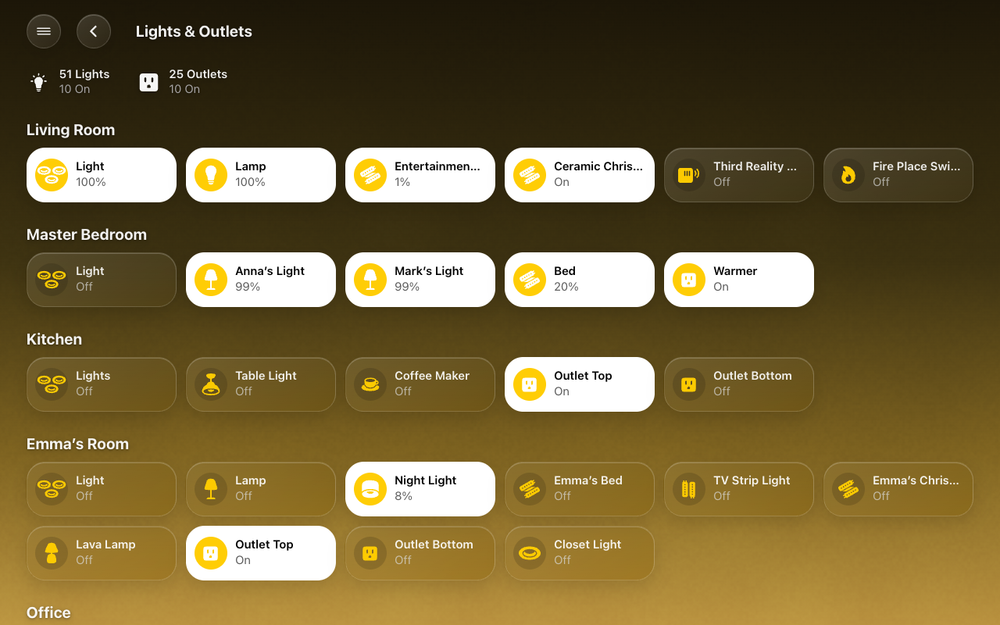
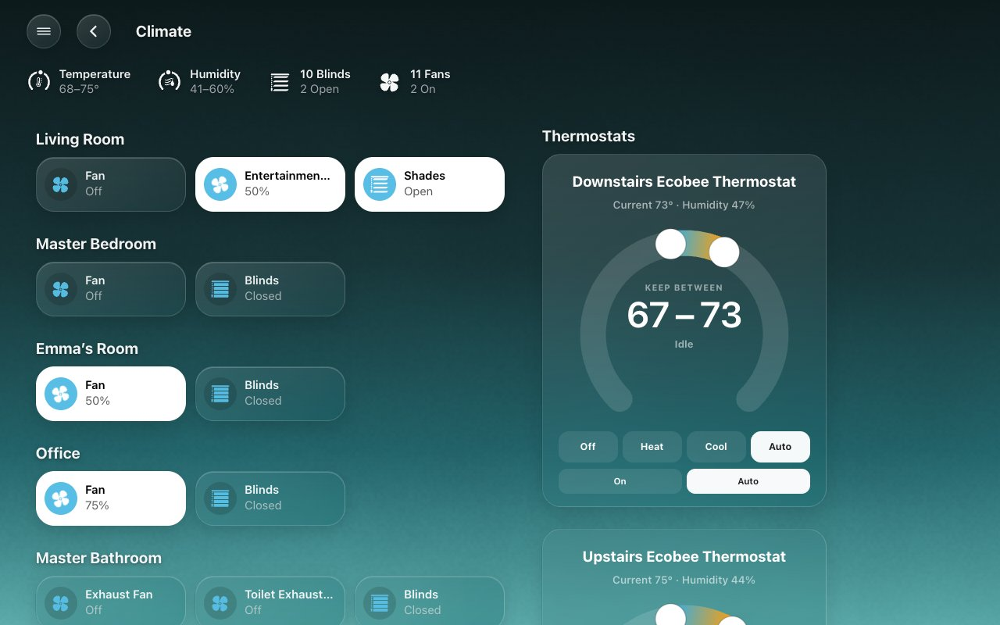

## Get around your way

Every screen chooses how you move between its pages and rooms.

- **A menu like the Home app's sidebar**: always open beside the page, behind a button, or pulled out with a swipe from the left edge. ([Menu](https://github.com/jazzphone/hk-frontend/wiki/Menu))
- **A floating tab bar like iOS apps have**, along the bottom or the top, or as a rail down either side of a tablet.
  - It can shrink to a small button or hide as you scroll, and even start small.
  - Small, Medium or Large, and you choose how many pages get a tab.
  - The page moves smoothly clear of it, so nothing important hides underneath.
  - **More** holds the rest: the other pages, every room, and Home Assistant's own Settings, Integrations and Notifications, as icons or as a list. ([Tab Bar](https://github.com/jazzphone/hk-frontend/wiki/Tab-Bar))

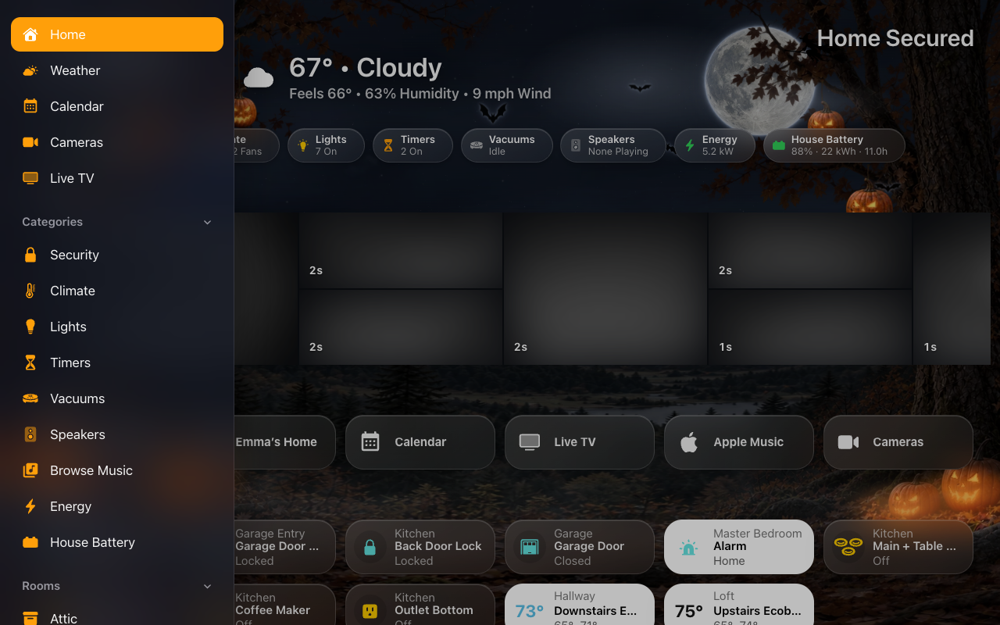
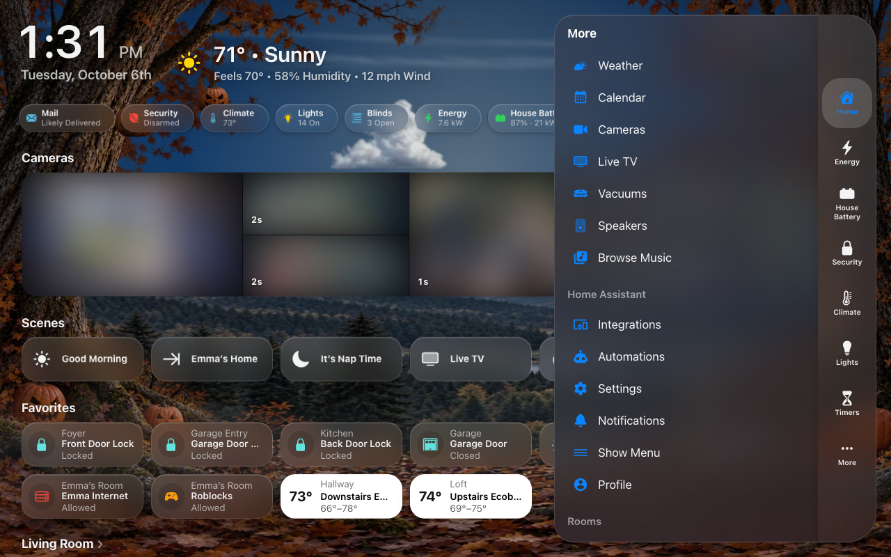

## Tap for the controls

Tap a light, thermostat, lock, garage door, speaker or vacuum and a sheet opens with the controls it needs. Each room and category page has a [status row](https://github.com/jazzphone/hk-frontend/wiki/Status-Rows) like the Home app's: *Motion · Emma’s Room*, *Valve · Running*. Pop-ups show the doorbell camera or the alarm keypad, and an automation can open one on chosen screens. Every accessory can have its own name, icon (any of Apple’s Home glyphs, or Home Assistant’s), tile size and place among its neighbours.

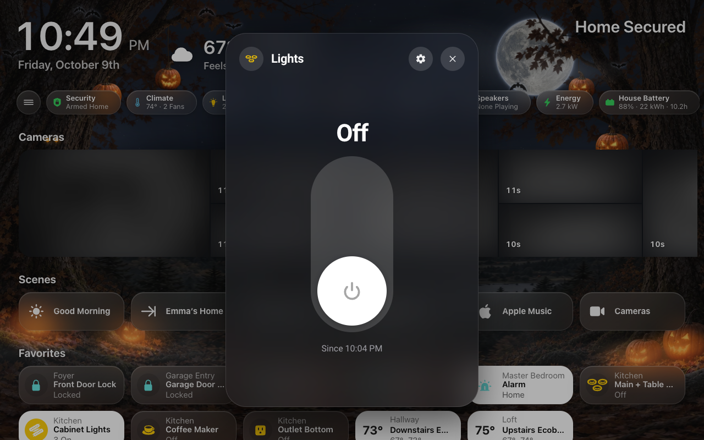
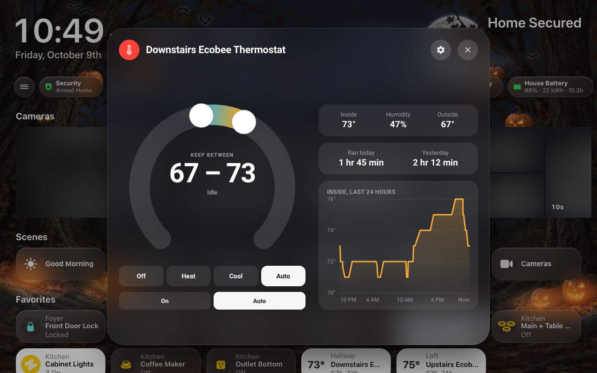

## A live sky

Behind every page, a sky that follows the weather and the time of day: clear and starry, golden at sunset, grey and flashing in a thunderstorm, with rain or snow when it falls. Choose **[Realistic clouds](https://github.com/jazzphone/hk-frontend/wiki/Live-Sky#choose-its-look)** — photographic clouds picked from the weather and lit by the sun — and **[New Decorations](https://github.com/jazzphone/hk-frontend/wiki/Seasonal-Decorations)**, woodland scenery that comes alive for autumn, Halloween, Christmas, birthdays and the rest of the year. Each page can keep its own color, show the live sky, or a still backdrop. **Liveliness** sets how much moves in it — the bats, leaves and fireflies, and how often something crosses the moon — for each occasion and each screen, calming down when nobody is around.

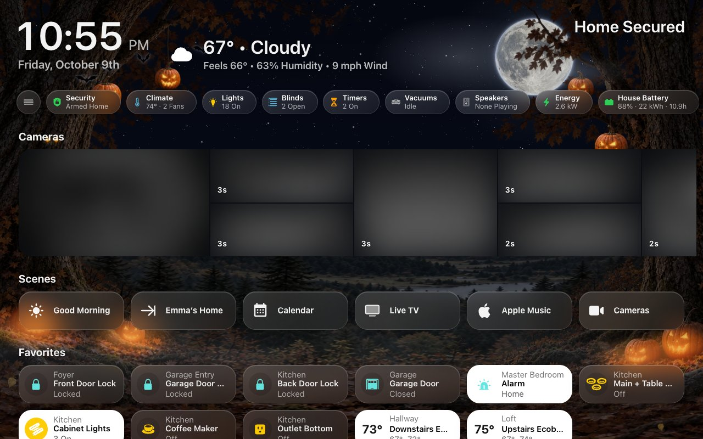
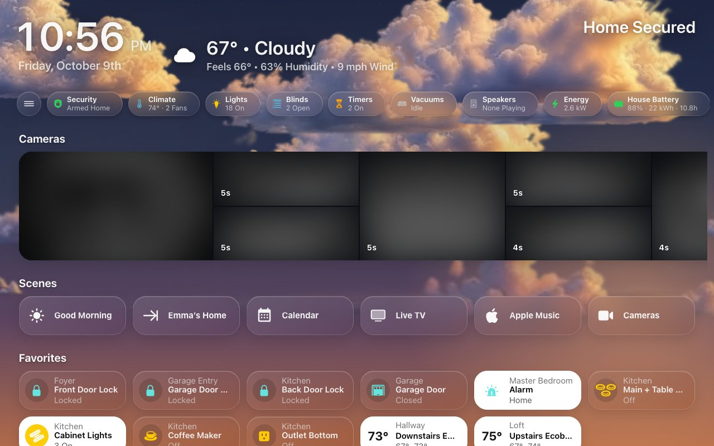

## Made for the wall

Put a screen on a wall tablet and it looks after itself. It returns to Home when left alone, and fills the screen with no Home Assistant header or sidebar.

When nobody is using it, it shows your photos, or the forecast over a living landscape: the sky, the clouds and the light of the moment. The landscape dresses up for Halloween, Christmas, the Fourth of July and birthdays, like the dashboards. Over the top go the clock, the weather, what's playing, the timers and whether the house is secure, with your coming events beside them if you like. ([Screensaver and idle](https://github.com/jazzphone/hk-frontend/wiki/Screensaver-and-Idle))

**[Sleep Screen](https://github.com/jazzphone/hk-frontend/wiki/Sleep-Screen)** keeps each tablet dark when nobody needs it and awake the moment somebody does. HK Frontend decides from the room’s presence sensors, quiet hours, the doorbell, smoke and away mode, sets the brightness for day and night, and fades in from black without a flicker — or your own automations decide, with one action.

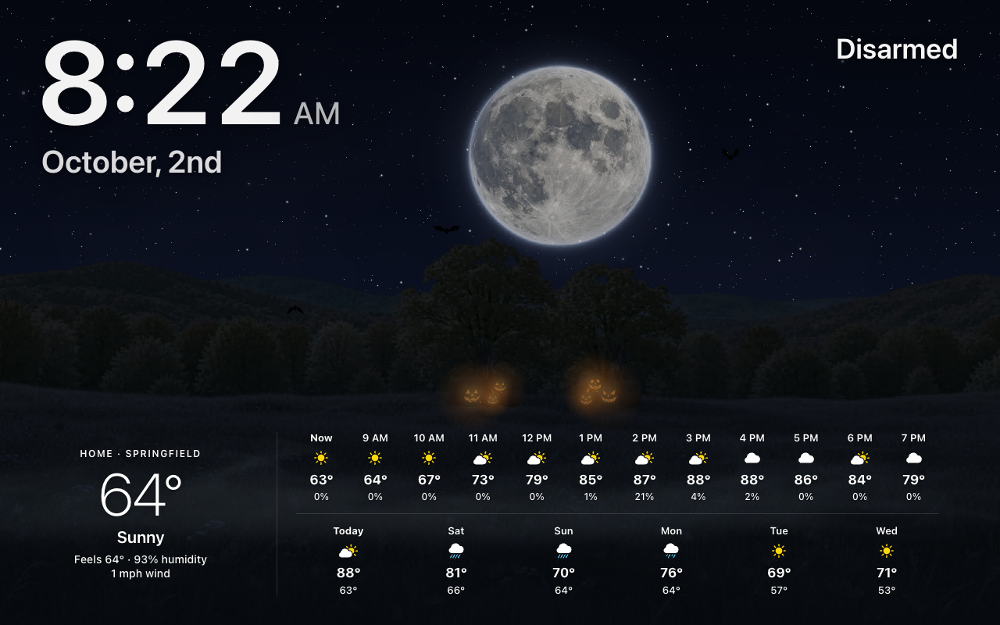
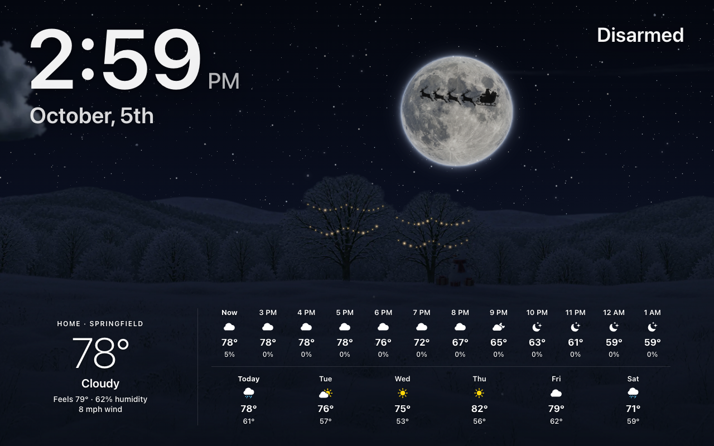

## Energy at a glance

The **[Energy](https://github.com/jazzphone/hk-frontend/wiki/Energy)** feature builds an Energy page from Home Assistant’s own Energy settings: today’s cost, the whole home live, a fortnight of daily bars and a live tile for every circuit, room, appliance and outlet. A screen can show only some pages — a wall panel that is just the Energy page, say.

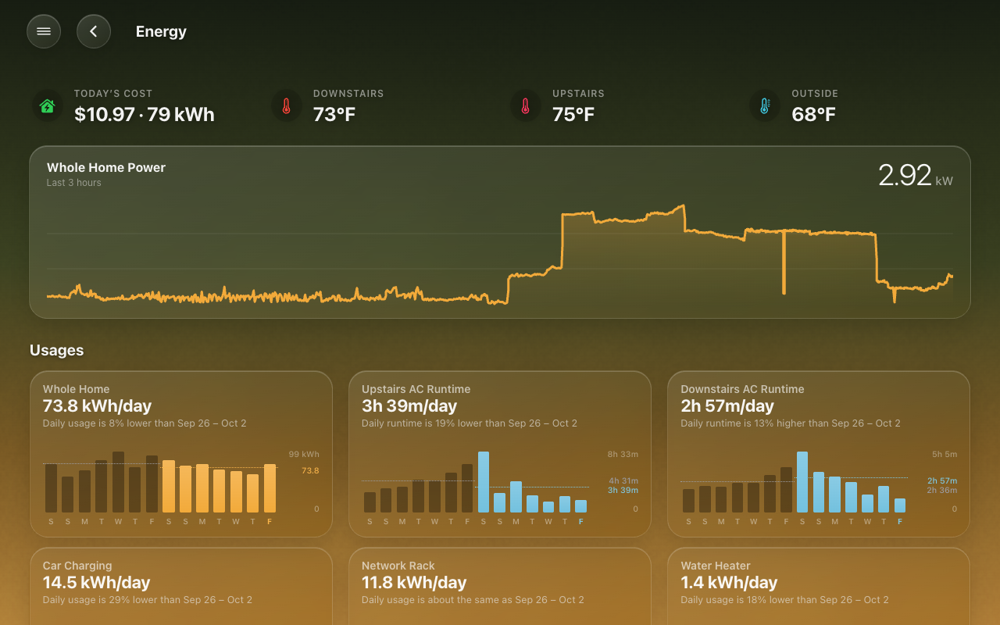

## Set up in the UI

**HK Settings** in the sidebar holds everything, with a live preview of each screen as a phone, an iPad, a wall tablet, a desktop or a car. A Setup Assistant makes your first screen, and Setup Check says what is missing. There is nothing to add to `configuration.yaml`.

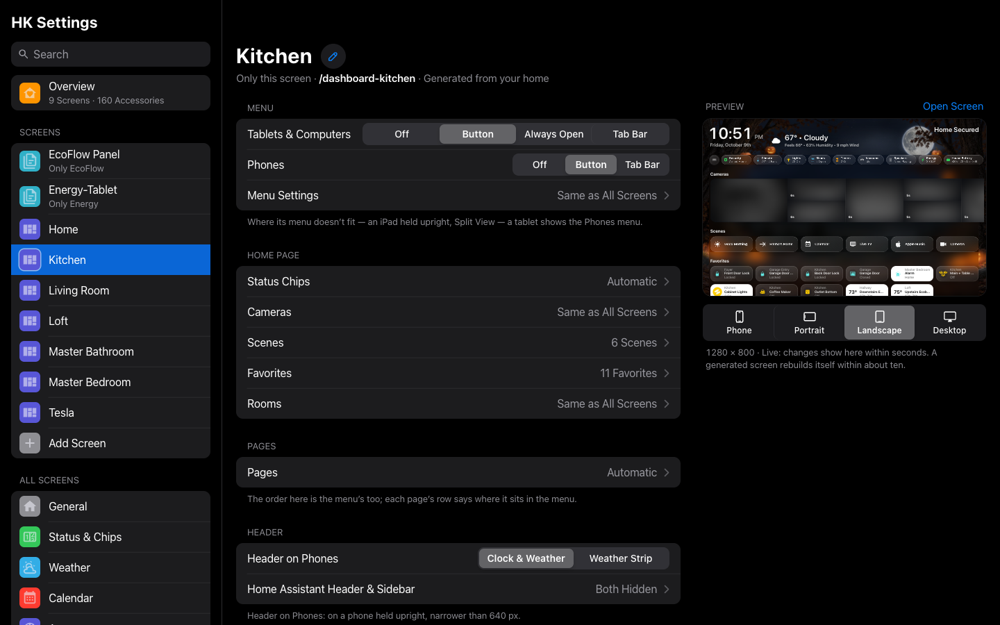

## Install

You need **Home Assistant 2026.8** or newer and **[HACS](https://hacs.xyz)**.

1. In **HACS**, open **⋮** → **Custom repositories**, add `https://github.com/jazzphone/hk-frontend` as an **Integration**, then download **HK Frontend**.
2. Restart Home Assistant.
3. In **Settings** → **Devices & services**, select **Add integration** and choose **HK Frontend**.
4. Open **HK Settings** in the sidebar. The Setup Assistant starts on its own.

Step by step, with what you should see: **[Install](https://github.com/jazzphone/hk-frontend/wiki/Install)**. Apple’s font and glyphs are optional and can’t be bundled; **[Your files](https://github.com/jazzphone/hk-frontend/wiki/Your-Files)** shows how to add your own.

## Optional features

Add each from **Settings** → **Devices & services** → **HK Frontend** → **Add feature**.

| | |
|---|---|
| **[Music](https://github.com/jazzphone/hk-frontend/wiki/Music)** | Whole-home music through Music Assistant: rooms, speaker groups and playlists |
| **[Live TV](https://github.com/jazzphone/hk-frontend/wiki/Live-TV)** | An HDHomeRun tuner’s channels and guide, full screen on any screen |
| **[Clean Areas](https://github.com/jazzphone/hk-frontend/wiki/Clean-Areas)** | Pick rooms and send the vacuums that reach them |
| **[Alarm PIN](https://github.com/jazzphone/hk-frontend/wiki/Alarm-PIN)** | A PIN in front of an alarm panel that takes no code of its own |
| **[Energy](https://github.com/jazzphone/hk-frontend/wiki/Energy)** | An Energy page built from Home Assistant’s Energy settings, with a live tile per circuit and device |

## Help

Start with **[Troubleshooting](https://github.com/jazzphone/hk-frontend/wiki/Troubleshooting)**. To report a problem, [open an issue](https://github.com/jazzphone/hk-frontend/issues) and attach the diagnostics (**Settings** → **Devices & services** → **HK Frontend** → **⋮** → **Download diagnostics**).

---

Screenshots are of one home that has added Apple’s font and glyphs; camera pictures are blurred. HK Frontend is an independent project, not affiliated with or endorsed by Apple Inc. Apple, HomeKit, SF Pro and SF Symbols are trademarks of Apple Inc. The seasonal sky illustrations were generated with OpenAI’s image tools, and the cloud, rain and snow textures by `tools/sky/gen_sky.py`; until you add your own glyphs, icons come from [Material Design Icons](https://pictogrammers.com/library/mdi/) (Apache 2.0). [MIT license](LICENSE).
