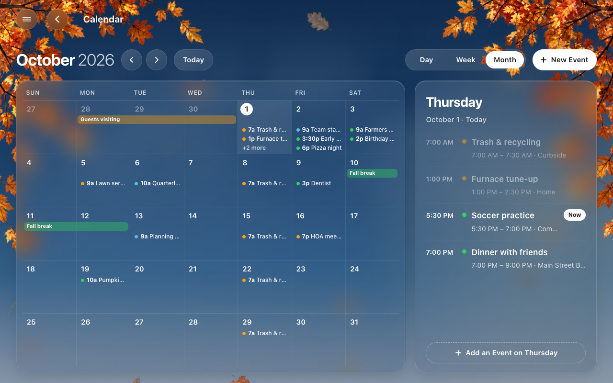
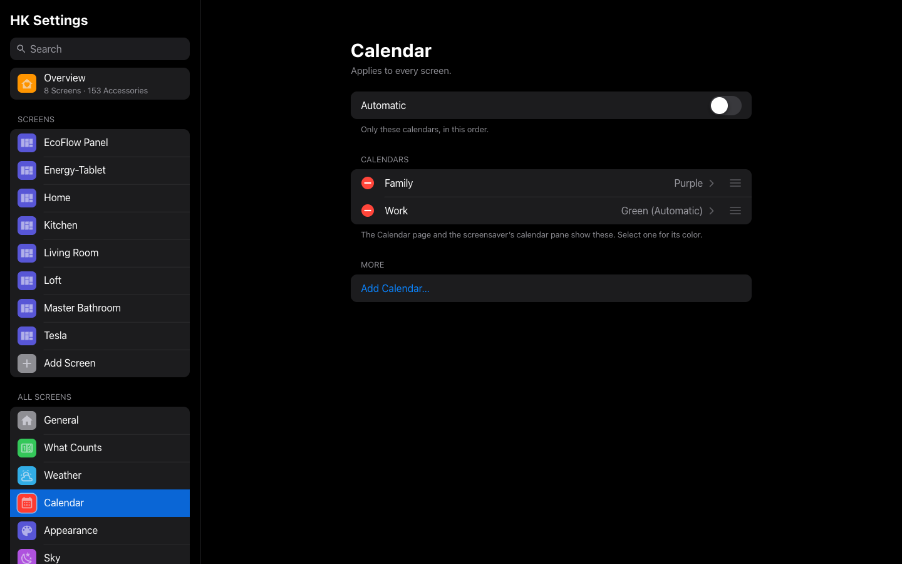
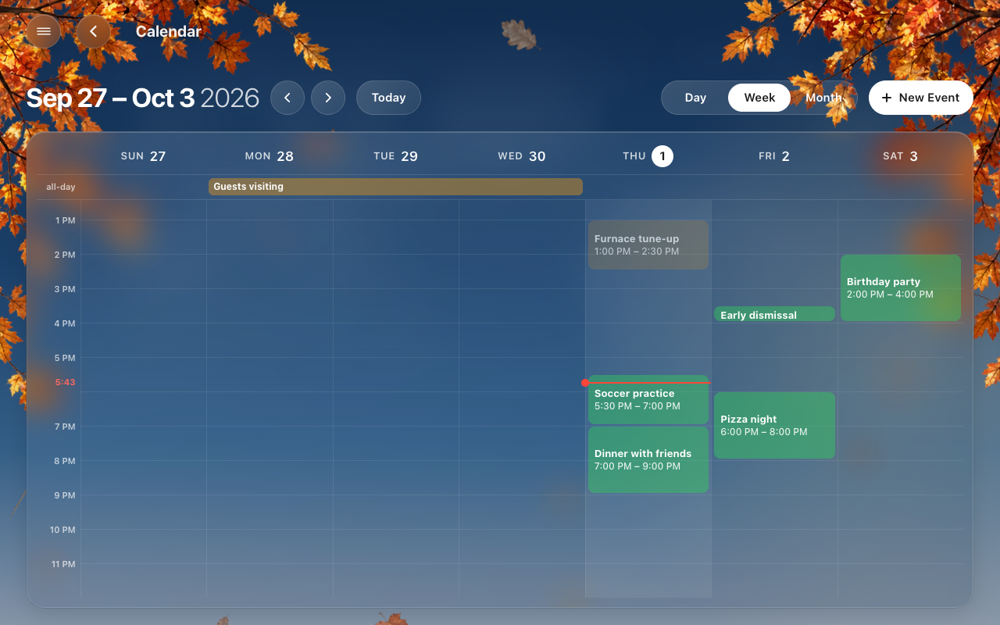
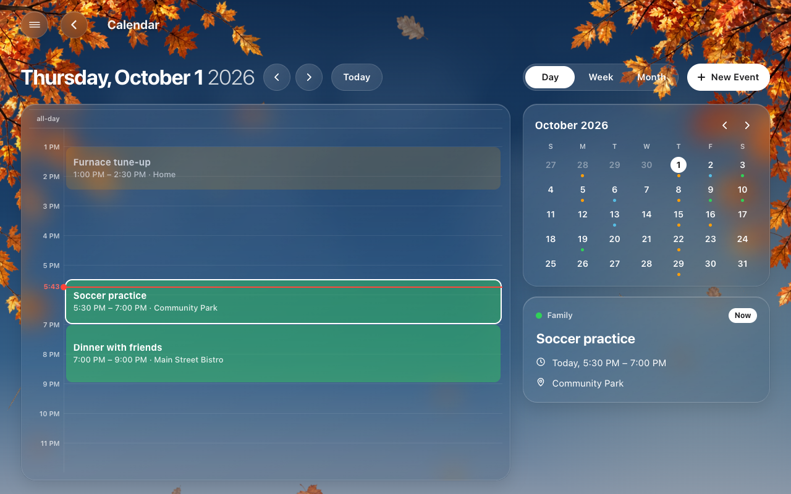
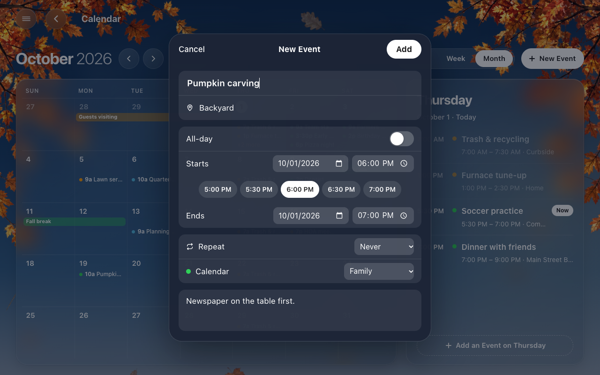

# Calendar

The house’s calendars on every screen: a **Calendar page** with the month, the
week or the day, where events are added, changed and deleted, and a
**calendar pane** for the photo screensaver. Both read the same settings:
**HK Settings → All Screens → Calendar**.

Any calendar Home Assistant has works: **Local Calendar**, Google Calendar,
CalDAV, a holiday or school feed. Events can be added, changed and deleted
wherever the calendar itself allows it (a Local Calendar does); a read-only
feed is shown, never edited.

## All Screens → Calendar

| Setting | Default | What it does |
|---|---|---|
| Automatic | On | Every calendar in Home Assistant, A to Z. Off: only the calendars you choose, in your order (**Add Calendar…**, drag to reorder). |
| Calendars → a calendar → Color | Automatic | Its events’ colour on the page and the screensaver. Automatic: orange, green, purple, blue, pink and so on, by its place in the list. The page also says whether its events can be added, changed and deleted. |

## The Calendar page

A generated screen has a Calendar page whenever the house has a calendar; it
comes after Weather in the menu. A screen whose **Pages** are chosen by hand
gets it once **Calendar** is added there.

- **Month**: the month’s weeks, each day with its events (an event lasting
  several days is one bar across them), and the chosen day’s events beside it.
  Tap a day to choose it; tap it again to open it in Day.
- **Week**: the week’s hours, day by day, with all-day events along the top
  and a red line at the time now.
- **Day**: the day’s hours, a small month to jump to any day, and the chosen
  event, with **Edit** and **Delete**.
- **The arrows** go back and forward a month, a week or a day; a sideways
  swipe does the same. **Today** comes back.
- **New Event** (or a tap on an empty hour in Week or Day, or **Add an Event**
  under a day) opens the event sheet: Title, Location, All-day, Starts and
  Ends (with quick times around the start), Repeat (never, daily, weekly,
  monthly, yearly), Calendar and Notes.
- Tap an event to see it, then **Edit** or **Delete**. A repeating event asks
  whether to change or delete **This Event Only** or **This and Future
  Events**.

| | |
|---|---|
|  |  |
| The week | The day, with the chosen event |

On a phone the page stands up: the month with a dot under each day that has
events and the chosen day below it, the week as a list day by day, and the
day’s hours.

The page asks Home Assistant for the events of the range it shows, again
every five minutes, and straight away after any change made from a screen.

## The screensaver’s calendar pane

**Screensaver Options → Calendar Pane**: today’s events and the coming days’
down the right of the screensaver, the photos (or the forecast) beside it.

See [Screensaver and Idle](Screensaver-and-Idle.md#the-calendar-pane).

## The cards

| Card | What it is |
|---|---|
| `custom:hk-calendar-card` | The Calendar page. `view: month` (or `week`, `day`) is the view it opens with. |
| `custom:hk-calendar-pane-card` | The screensaver’s list: `days: 2` (1 to 7). |

Both read **All Screens → Calendar** for which calendars and their colours.
