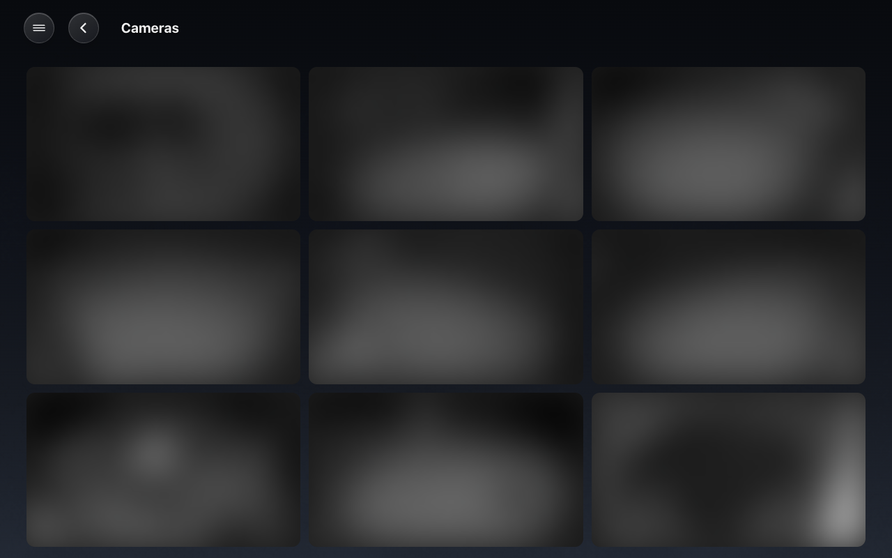
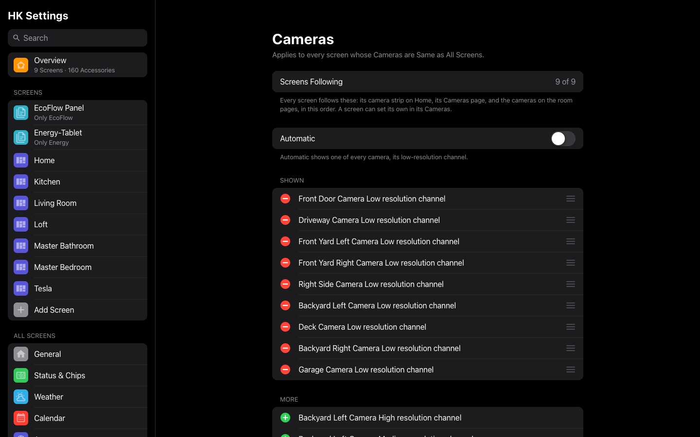
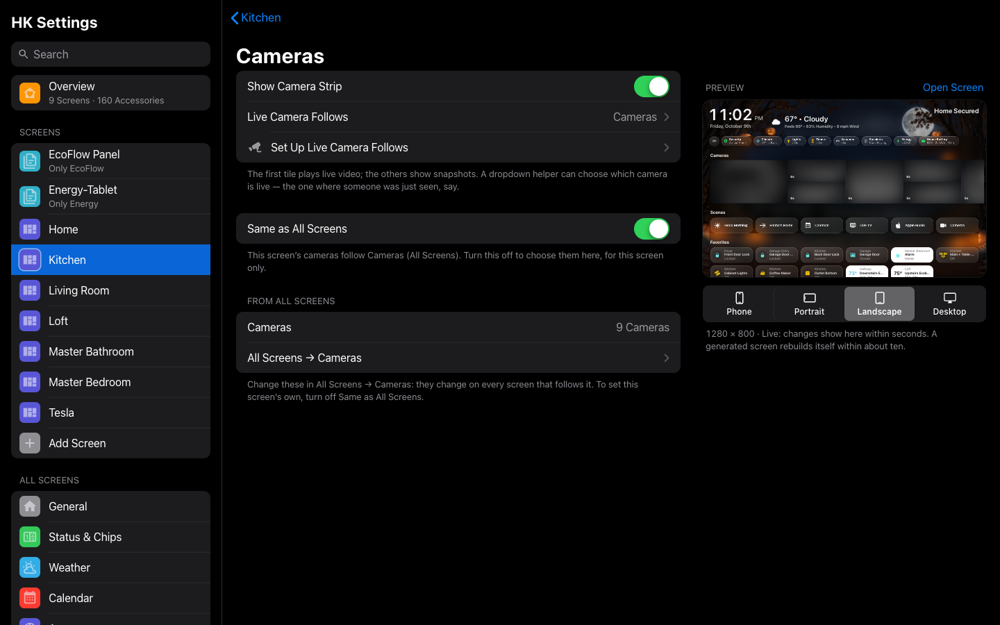
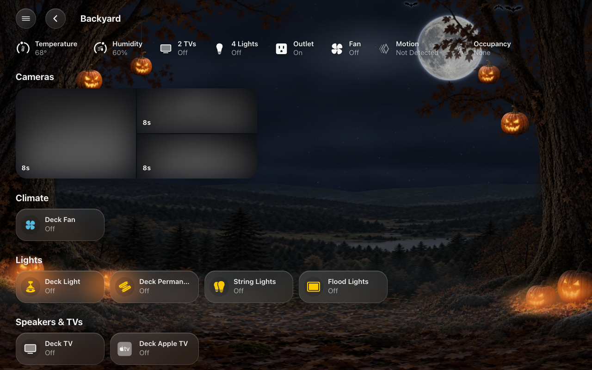

# Cameras

Your cameras appear in three places:

- **The camera strip on Home.** One camera plays live, the others show
  snapshots that refresh.
- **The Cameras page.** Every camera live, three across.
- **A room’s page.** That room’s cameras, as snapshots.

Tap any camera to open it full size, live, with sound, and hold-to-talk if
it has a speaker (talking needs Home Assistant over https).



## Which cameras, in what order

**HK Settings → All Screens → Cameras** is one list for every screen: its
camera strip on Home, its Cameras page, and the cameras on its room pages, in
this order.

- **Automatic** (on) shows one tile per camera, using its low-resolution
  channel when it has several, and never a wall tablet’s own camera or a Live
  TV channel. Turn it off to add, remove and drag cameras into your order.
- **A screen of its own:** **Screens → (the screen) → Cameras → Same as All
  Screens**, off, and that screen keeps its own list (it starts from All
  Screens’). Turn it on again to follow All Screens.



Before 1.6.0 every screen kept its own list. Upgrading moves the list most
screens shared to All Screens, and every screen with that list (or none)
follows it. A screen whose list was different keeps its own.

## The camera strip

The strip under the status chips on a generated screen’s Home: the live camera
large on the left, then the others in columns, two stacked and one tall,
taking turns.

- **Choose the live one**: see [Live Camera Follows](#live-camera-follows)
  below. Nothing chosen: the first camera.
- **Turn it off**: **Screens → (the screen) → Cameras → Show Camera Strip**.



## The Cameras page

Every camera live, three across. To be easy on the browser and on Home
Assistant’s streaming, the cameras **take turns connecting**, three at a time:

- Each tile opens on the camera’s last picture: the last frame kept from the
  strip or the page, else its snapshot.
- When its turn comes it connects underneath that picture, and the picture
  goes away only once the live video is actually on screen, so a tile never
  blinks blank.
- The next camera starts as soon as one is playing, or after 2.5 seconds at
  most.
- A camera that hasn’t shown a picture after 8 seconds is reconnected, up to
  three times.
- Leaving the page puts every tile back on its picture, so coming back takes
  turns again.

All the cameras are live within a few seconds. The page is all silent: sound
plays only in a camera’s own sheet (tap it).

Why turns: desktop Safari could not connect nine live cameras at once. Each
connection hung for good, and the page showed nothing but snapshots. Three at
a time connect every time, in every browser.

## On a room’s page

A room with cameras shows them under its status, as a strip of snapshots,
never live: one tall, then two stacked, and so on, as the Home app draws a
room. A room with a single camera shows one wide 16:9 snapshot. Each shows how
old its picture is, and tapping one opens it live. The order is the camera
list’s (above).



## Live Camera Follows

The strip plays one camera live. **Live Camera Follows** lets something else
choose which one, so the strip can jump to where someone was just seen.

It takes a **dropdown helper** (an `input_select`, or a `select`) whose options
are your cameras’ names. Whichever option is chosen, that camera plays live.
An option names a camera when it is the camera’s name or the start of it, so
`Front Door` names *Front Door Camera Low resolution channel*. An option that
names no camera, or nothing chosen, plays the first camera.

**HK Settings → Screens → (the screen) → Cameras → Set Up Live Camera Follows**
does the rest for you:

1. **The dropdown.** It lists the option each camera in the strip needs.
   **Create the Dropdown** makes a helper called *Live Camera* with those
   options and chooses it. If you already chose one, it shows which cameras
   your dropdown has no option for.
2. **The automation.** It writes one for your cameras, from the person
   sensor on each camera’s device (or its motion sensor): when that sensor
   turns on, its camera is chosen; after five minutes with every sensor off,
   the first camera is chosen again. **Copy Automation**, then in
   **Settings → Automations & Scenes** choose **Create Automation → Create New
   Automation → ⋮ → Edit in YAML**, paste it over everything there, and save.

The automation it writes looks like this, for two cameras:

```yaml
alias: Live camera follows motion
mode: queued
triggers:
  - trigger: state
    entity_id: binary_sensor.front_door_person_detected
    to: "on"
    id: "Front Door"
  - trigger: state
    entity_id: binary_sensor.driveway_person_detected
    to: "on"
    id: "Driveway"
  - trigger: state
    entity_id:
      - binary_sensor.front_door_person_detected
      - binary_sensor.driveway_person_detected
    to: "off"
    for:
      minutes: 5
    id: all quiet
actions:
  - if:
      - condition: trigger
        id: all quiet
    then:
      - condition: state
        entity_id:
          - binary_sensor.front_door_person_detected
          - binary_sensor.driveway_person_detected
        state: "off"
      - action: input_select.select_option
        target:
          entity_id: input_select.live_camera
        data:
          option: "Front Door"
    else:
      - action: input_select.select_option
        target:
          entity_id: input_select.live_camera
        data:
          option: "{{ trigger.id }}"
```

Each trigger’s `id` is the option it chooses, so it must be spelled exactly as
in the dropdown.

## Cameras settings

| Setting | Default | What it does |
|---|---|---|
| Show Camera Strip | On | *Generated.* The live camera strip under the chips. |
| Same as All Screens | On | The cameras and their order are All Screens’ (**All Screens → Cameras**). Off: this screen’s own, starting from All Screens’. |
| Live Camera Follows | First Camera | A dropdown helper (input select or select) whose option names the camera to show live, set by an automation (for example on person detection). An option matches the camera whose name starts with it. The other tiles show snapshots. |
| Set Up Live Camera Follows | — | Explains it, lists the option each camera needs, makes the dropdown for you (**Create the Dropdown**), and writes the automation for your cameras’ person or motion sensors (**Copy Automation**). See [Screens](#live-camera-follows). |
| Automatic | On | One tile per camera, using its low-resolution channel when it has several. Never a wall tablet’s own camera or a Live TV channel. (All Screens, or a screen of its own.) |
| Shown / More | — | The cameras, in order: the strip, the Cameras page and the room pages. |
