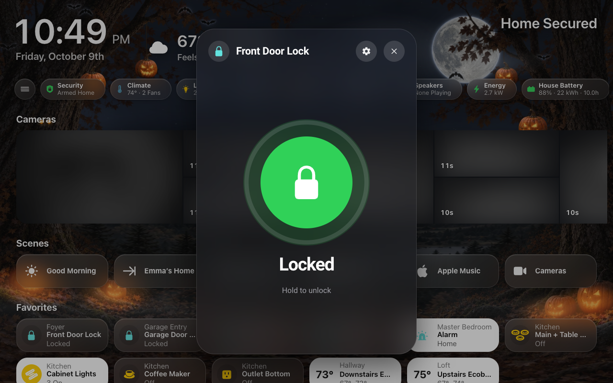
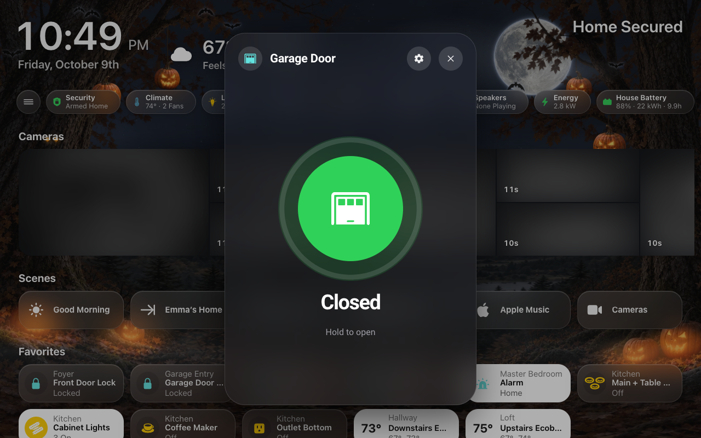
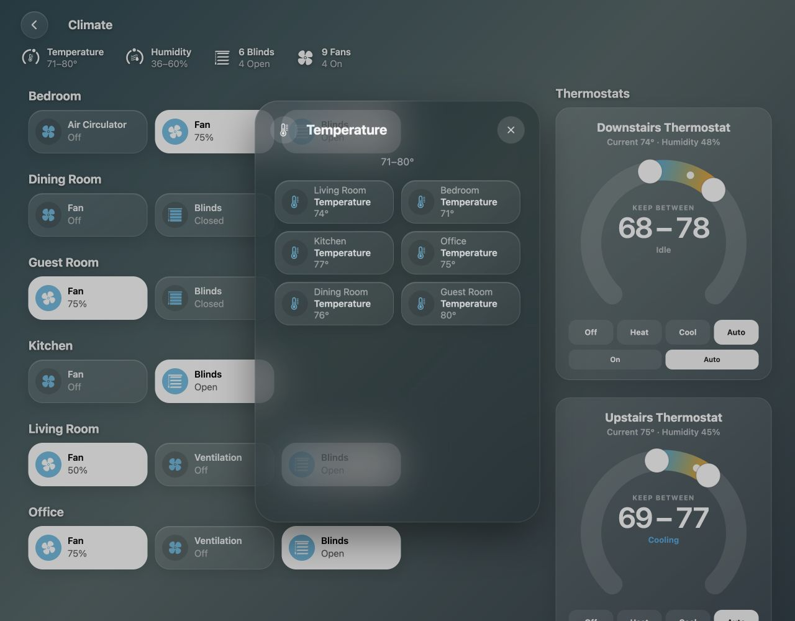
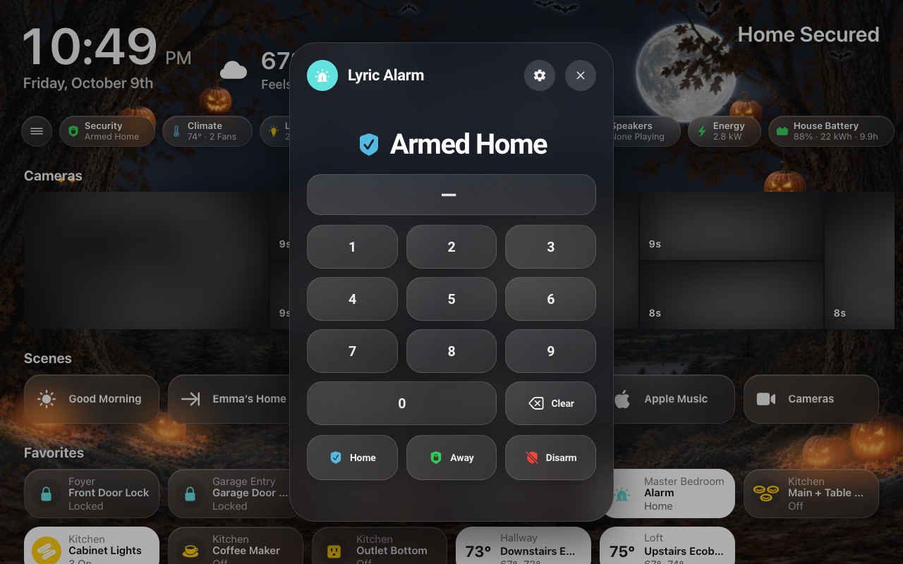
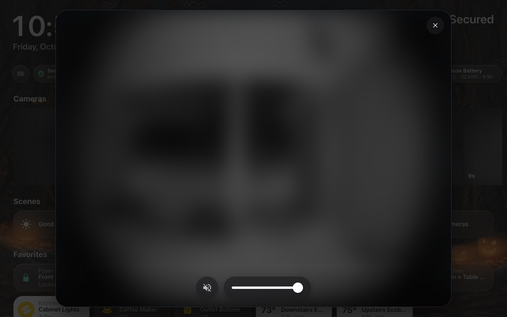
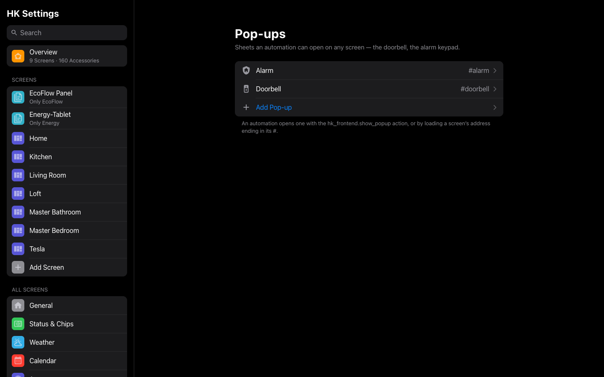

# Detail Sheets and Pop-ups

The sheet that opens when you tap an accessory, and the sheets an automation
can open on your screens: the doorbell, the alarm keypad.

**Detail sheets.** Tapping an accessory’s name opens a sheet with its controls:
a brightness slider, the thermostat, the player, a graph. Tapping its glyph
toggles it. Locks, the alarm, garage doors, valves, thermostats, water
heaters, sirens, vacuums and cameras never change from a single tap. On a
computer, right-clicking a tile opens its sheet too, wherever you click. A
button, such as a computer’s Wake on LAN, has a sheet with one big button: tap
it to wake the computer (or press the button), and the line under it says when
that last happened. To use
Home Assistant’s own dialog instead, turn off
[HK Detail Sheets](Accessories.md#accessories-settings) (**Library →
Accessories**).


| | | |
|---|---|---|
|  |  |  |
| Thermostat | Lock | Garage door |

**Energy devices.** A device on the [Energy](Energy.md) page has more on its
sheet: today’s kWh, its cost and the usual day; Week and Month as daily bars
from its meter; the circuit it is part of and the ones inside it; and the
switch it is plugged into. Its gear adds **On the Energy page** (its name and
section there, and whether it shows).

**Climate lists.** The [Climate page](Climate.md) has temperature, humidity,
blind and fan summaries. Tapping one opens its room-labelled accessory pills.
Tap a pill for its details; the Back button, closing the accessory sheet or
browser Back returns to the category list. The list and its summary follow
live readings and membership changes.



**Pop-ups** are sheets that an automation opens on a screen: the doorbell when
someone rings, the alarm keypad when the alarm needs a code. Each pop-up has an
address (a hash, such as `#front-door`) that any screen answers.



| Type | Shows |
|---|---|
| Camera or Doorbell | The camera’s picture to every edge, with sound, and hold-to-talk when it has a speaker |
| Alarm Keypad | The alarm’s keypad |
| Accessories | Several accessories on one sheet, in the order you pick |
| Custom | Your own cards, written in YAML: any Home Assistant card or custom card, on a narrow or wide sheet |



## Add a doorbell pop-up

1. Open **HK Settings → Library → Pop-ups → Add Pop-up**.
2. **Name**: “Front Door”. The **Address** becomes `front-door`.
3. **Type**: **Camera or Doorbell**.
4. Pick the **Camera**, and the **Talk-Back Speaker** if the doorbell has one.
5. Select **Add Pop-up**.

On the pop-up’s page you can then set how long it stays open (**Close After**),
and which screens answer it. Every setting: [Pop-ups](#pop-ups-settings).



For a **Custom** pop-up, its cards are the next step: a YAML list, for example

```yaml
- type: custom:hk-heading-card
  name: Garage
- type: tile
  entity: cover.garage_door
- type: picture-entity
  entity: camera.garage
```

## Open a pop-up from an automation

There are two ways.

**The Show pop-up action** opens it on the screens that are showing a
dashboard now, over whatever page they are on:

```yaml
action: hk_frontend.show_popup
data:
  popup: front-door
  dashboards:
    - hk-kitchen
```

| Field | What it does |
|---|---|
| `popup` | Its address, with or without the `#`. An address with no pop-up is an error that lists the ones there are. |
| `dashboards` | Only screens showing these dashboards (their addresses, such as `hk-kitchen`). Empty: any. |
| `users` | Only screens signed in as these users (user IDs). Empty: anyone. |

It doesn’t wake a sleeping tablet or change its page. A screen that is dark
when the action arrives keeps it, and opens the pop-up when it lights again
(within the pop-up’s **Close after**). Asked again while the pop-up is up, it
stays open and its **Close after** starts over — so a second ring of the
doorbell keeps the camera up, and a keypad being typed into is never closed.

**The Close pop-up action** is the other half, for a pop-up held open for as
long as something lasts — the alarm keypad while the alarm sounds:

```yaml
action: hk_frontend.close_popup
data:
  popup: alarm
  dashboards:
    - hk-kitchen
```

It takes the same fields as Show pop-up. Only a screen showing that pop-up
closes it; anything else open on a screen is left alone.

On a wall tablet running **Kiosk Satellite**, wake the tablet first (its
**Screensaver active** switch off, and its **Bring to front** button), then
call Show pop-up — the photo screensaver would otherwise cover the sheet.

**The screen’s address with the pop-up’s hash**, such as
`/hk-kitchen/0#front-door`, opens the screen and then the pop-up. A kiosk
browser’s “load URL” command does this, and wakes the tablet too: see
[Wall tablets](Wall-Tablets.md).

A pop-up closes itself **Close After** the last touch: a minute unless you
change it (an Alarm Keypad pop-up added in HK Settings starts at an hour). Closed by hand or by time, its hash leaves the address, so
nothing opens it again.

**Where pop-ups open.** A screen with **Allow Pop-ups** off (its Behavior
group) never shows one: turn it off for a car’s screen. A pop-up can also be
limited to some screens (its **Screens** group).

**The alarm keypad on a generated screen.** A generated screen answers
`#alarm` with the alarm keypad by itself. Add a pop-up with the address `alarm`
to set its Close After or limit it to some screens.

**On a YAML dashboard**, an `hk-popup-card` on the page that claims the same
hash wins over the Library’s pop-up.

### An example: the doorbell

A screen that is hidden when the action runs (behind a screensaver, say) opens
the pop-up when it is shown again, if that is within the pop-up’s **Close
After** time.

```yaml
automation:
  - alias: Doorbell on the screens
    triggers:
      - trigger: state
        entity_id: binary_sensor.front_door_doorbell
        to: "on"
    actions:
      - action: hk_frontend.show_popup
        data:
          popup: front-door
```

To also wake a wall tablet and bring it to the dashboard, load the dashboard
with the pop-up’s hash on the end, through the Fully Kiosk Browser
integration, instead:

```yaml
action: fully_kiosk.load_url
data:
  device_id: 0123456789abcdef0123456789abcdef   # the tablet's device
  url: https://homeassistant.local:8123/hk-kitchen/0#front-door
```

## Pop-ups settings

**Library → Pop-ups.** Sheets an automation can open on any screen: the
doorbell, the alarm keypad. How they open is above.

**Add Pop-up** asks for:

| Setting | Default | What it does |
|---|---|---|
| Name | — | Its title. |
| Address | Made from the name | The hash that opens it: *Front Door* becomes `#front-door`. Lowercase letters, digits, `-` and `_`. Can’t be changed once added. |
| Type | Camera or Doorbell | **Camera or Doorbell**: the picture to every edge, with talk-back when it has a speaker. **Alarm Keypad**. **Accessories**: several accessories on one sheet. **Custom**: your own cards, in YAML. Can’t be changed once added. |

A pop-up’s page:

| Setting | Default | What it does |
|---|---|---|
| Name | — | Its title. |
| Type · Address | — | Shown, not changeable. |
| Camera | — | *Camera or Doorbell.* The camera it shows. |
| Talk-Back Speaker | The speaker on the camera’s own device, if any | *Camera or Doorbell.* The speaker for the talk button. |
| Live Stream | The camera device’s high-resolution channel, else the camera itself | *Camera or Doorbell.* The camera entity streamed in the sheet. |
| Alarm Panel | Same as General | *Alarm Keypad.* The panel it controls. **Same as General** names the panel it uses now, *Same as General (Front Door Alarm)*. |
| Accessories | — | *Accessories.* What the sheet shows, in order. |
| Cards | None | *Custom.* The sheet’s cards, as a YAML list: any card, Home Assistant’s own or a custom card’s. A card that can’t be built shows Home Assistant’s error card in its place. |
| Icon | `mdi:card-text-outline` | *Custom.* The glyph beside its name (`mdi:` or `hk:`). |
| Width | Narrow | *Custom.* **Narrow** (460 px, a detail sheet’s) or **Wide** (820 px). |
| Close After | 1 Minute (an Alarm Keypad added here: 1 Hour) | It closes itself this long after the last touch: 30 seconds to 1 hour. |
| Screens → Show on Every Screen | On | Off: tick the screens that answer its address. A screen with Allow Pop-ups off never shows one. |
| Delete Pop-up… | — | Automations that open it will open nothing. |
