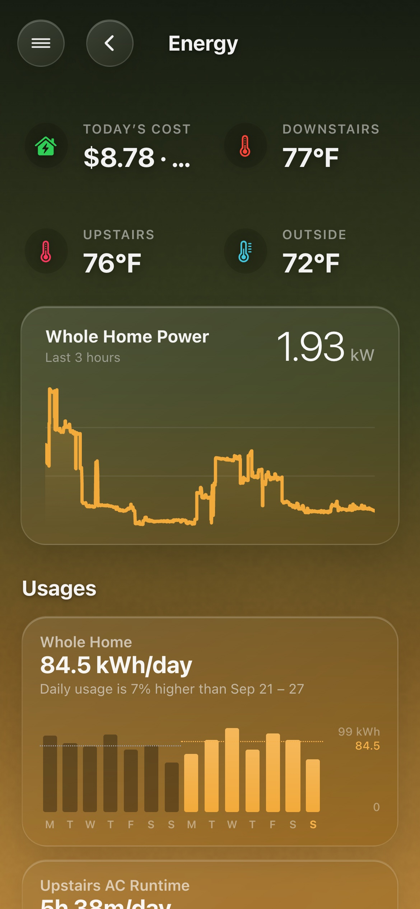

# Energy

An Energy page for your screens, built from Home Assistant’s own Energy
settings.

The page has:

- **The readings row**: today’s cost and kWh, your thermostats and the
  outside temperature.
- **The whole home, live**: the last three hours of its power.
- **Daily bars**: a fortnight of each day’s use for the devices that matter,
  each against the week before.
- **A section of live tiles for each group of devices** (Heating & Cooling,
  Rooms, Appliances, Outlets, Charging). Each tile shows its watts now and its
  kWh today, and its glyph dims while it draws nothing.
- **Home Assistant’s own energy charts** at the end: the day’s sources, and
  each device by the hour.

| | |
|---|---|
|  |  |
| On a phone | **HK Settings → Features → Energy** |

## What it starts from

Everything comes from **Settings → Dashboards → Energy** in Home Assistant:

| From the Energy settings | On the page |
|---|---|
| The grid meter (kWh) and its price or cost | Today’s Cost, the Whole Home daily bars |
| Each device’s meter | A tile, its kWh today, its daily bars |
| A device “inside” another (*Upstream device*) | Its sheet says *Part of*; the other’s sheet says *Includes* |
| A device’s power sensor | The tile’s live watts |
| The house battery’s level | A battery tile |

Most homes leave a device’s **power sensor** empty in the Energy settings, so
HK Frontend also looks for it:

1. The **Power Sensor** you pick for that device on HK Settings.
2. The device’s **power sensor** in Home Assistant’s Energy settings.
3. **The meter’s source.** A Utility Meter counts an Integral (Riemann sum)
   sensor, which integrates a power sensor. HK Frontend follows those helpers
   back to the watts.
4. **A power sensor on the same device**, such as a smart plug’s W beside its
   kWh (also on the device of the sensor a Utility Meter counts).

A device with none of these still gets a tile, showing its kWh today instead
of watts.

What the Energy settings can’t say is guessed from each device’s name, and
every guess can be changed:

- **Its section.**
  - *Heating & Cooling*: an AC, air handler, heat pump or furnace.
  - *Charging*: a charger or wall connector.
  - *Outlets*: an outlet or plug.
  - *Rooms*: a name that is one of your areas (or two joined by “&”).
  - *Appliances*: everything else.
- **Its name.** “Office Utility” becomes “Office”: words like *Utility*,
  *Energy*, *Power* and *Consumption* at the end are dropped.
- **Its glyph and color.**

Cars are found by themselves: a battery level on a device that also reports
a range. They go into Charging, with their range under the level.

## Set it up

1. In Home Assistant, set up **Settings → Dashboards → Energy**: the grid and
   your devices. The more it lists, the less there is to do here.
2. Go to **Settings → Devices & services → HK Frontend → Add feature → Energy**.
3. Give a screen the page:
   - **Any generated screen.** With Automatic pages, Energy is included. With
     pages of its own, add **Energy** from **More** on its **Pages**. The
     Energy chip opens the page.
   - **A screen that is only the Energy page** (a page screen, see
     [Whole screens and page screens](Pages.md#whole-screens-and-page-screens)).
     In **HK Settings → Add Screen**, pick **Shown On → Energy Display**, or
     **Shows → Only the Energy Page**. It has no Home page, no menu, and Home
     Assistant’s header hidden. The same button is on the Energy settings
     page: **Add an Energy Display**.

## Settings

**HK Settings → Features → Energy**:

| Setting | Default | What it does |
|---|---|---|
| List Their Devices | On | Every device in Home Assistant’s Energy settings gets a tile, including ones you add there later. Off: only the devices you add here. |
| Title | Energy | The page’s name, in the menu and at the top of the page. |
| Readings | Automatic | Today’s Cost (on or off), then up to three readings. Automatic: the first two thermostats from [Status & Chips](Status-Chips.md), then the outside temperature from [Weather](Weather.md). |
| Daily Bars | Automatic | Up to nine. Automatic: the whole home, then the five devices whose meters read the most. Each bar can have its own name and color. A runtime sensor (hours) shows its daily runtime. |
| Sections | Automatic | The sections in order. Rename one, give its heading a **Link** to another page (a panel’s own dashboard, say), drag tiles into order, or **Move Here** from another section. Turning Automatic off keeps the sections as they are now. A device you place in no section goes to the one its name suggests, or *Other*. |
| Devices | — | Each device’s **Name**, **Glyph** and **Color**, **Show on the Energy Page**, its **Section**, its **Power Sensor**, and **Switched By** (the plug or switch that powers it). The page also says how its power sensor was found. **Add a Device** adds one the Energy settings don’t list. |
| Batteries | Automatic | The house battery and the cars. Each has a name, and a reading under it: a range, or the energy stored. |
| Home Assistant’s Charts | On | The day’s sources and each device’s use at the end of the page. |
| Whole Home | Automatic | The power sensor, energy meter and cost the top of the page uses. Automatic: the grid meter, its cost, and the power sensor behind it (or **General → Power Use**). |

Its gear in **Devices & services** has **List Their Devices**. Everything
else is on the HK Settings page.

## A device’s sheet

Tap a tile and its sheet opens, as for any sensor. On the Energy page’s
devices it also shows:

- **Today, Cost Today and Usual Day.** Today’s kWh is compared with the usual
  day so far. The cost uses the grid’s price, or what a kWh has cost the house
  today.
- **Week and Month as daily bars** from the device’s meter, rather than a line
  of its watts.
- **Part of / Includes**: the circuit it sits inside and the ones inside it,
  with their watts now. Tap one to open its sheet.
- **Switch**: the plug or switch it is on, to turn it off and on.

The sheet’s **gear** (for admins) has an **On the Energy page** section:
**Name there**, **Section**, **Show there**, and **More energy settings**,
which opens the device on HK Settings.

## Notes

- **A custom page called `energy`.** A screen that showed one keeps showing
  it until the Energy feature is added. After that, the generated page takes
  that address on every screen.
- **Renaming an entity.** A rename is followed in the readings row and the
  whole home’s settings. A device’s own settings are kept by its meter’s
  entity id, so renaming the meter starts that device from automatic again.
- **Removing the feature** (**⋮ → Delete** on its item) removes the page from
  every screen. Nothing else changes.
