# Gallery

Every screen of HK Frontend, as it looks in one home. The screenshots are of a
home that has added Apple’s font and glyphs ([Your files](Your-Files.md));
camera pictures are blurred on purpose.

## A wall tablet

| | |
|---|---|
|  |  |
| A room | Lights |
|  |  |
| Climate | Security |
|  |  |
| Doors & Windows | Water |
|  |  |
| Timers | Vacuums |
|  |  |
| Weather | Cameras |
|  |  |
| A room’s [cameras](Cameras.md#on-a-rooms-page) | A screen’s Cameras settings |
|  |  |
| Play Music ([Music](Music.md)) | Browse Music |
|  |  |
| Live TV ([Live TV](Live-TV.md)) | [Energy](Energy.md) |
|  |  |
| [Calendar](Calendar.md): the month | The week |
|  |  |
| The day | A new event |

The [photo screensaver](Screensaver-and-Idle.md#5-add-the-photo-screensaver) (HK Frontend’s own fall sky standing in for a photo).

| | |
|---|---|
|  | 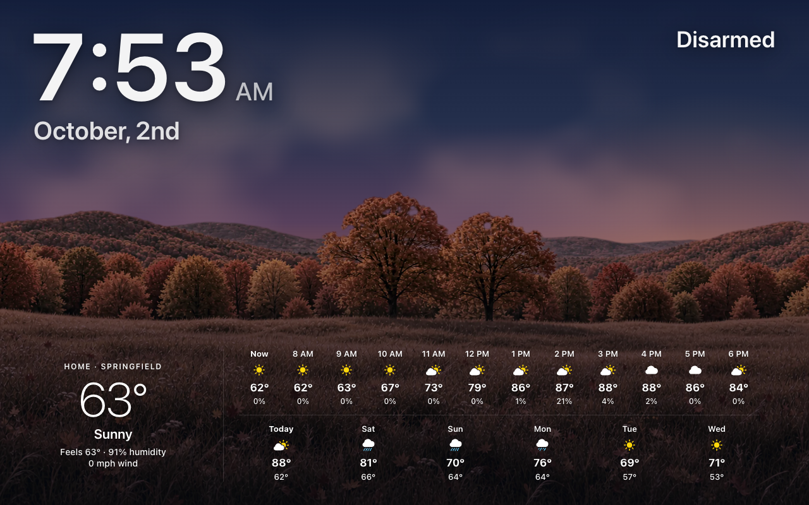 |
| The [forecast](Screensaver-and-Idle.md#no-photos-the-forecast) by day | At dusk |

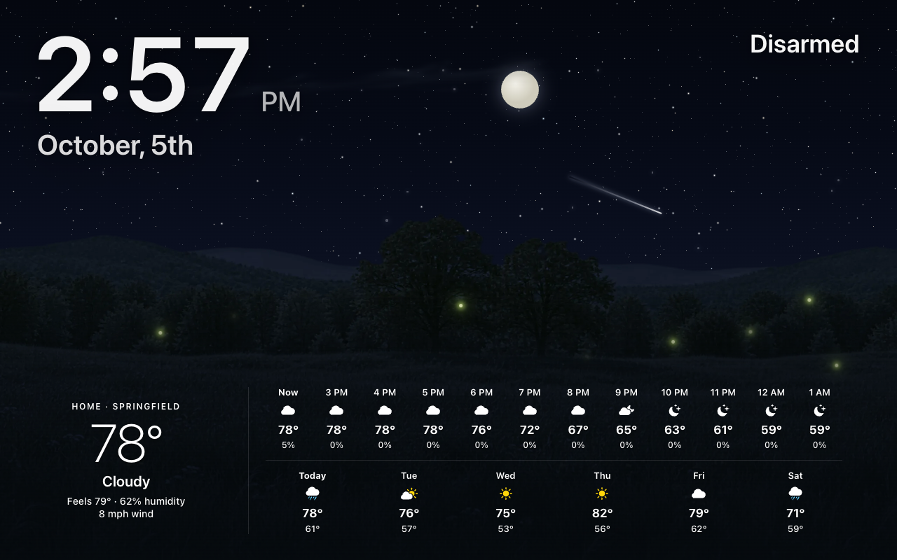

By night: a shooting star, and fireflies in summer.

| | |
|---|---|
|  |  |
| [Halloween](Seasonal-Decorations.md#on-the-forecast-screensaver) | Christmas |
|  |  |
| The Fourth of July | A birthday |

The [calendar pane](Screensaver-and-Idle.md#the-calendar-pane) beside the photo (sample events).

## Climate summaries and lists

These Climate screenshots use fictional rooms, devices and readings.

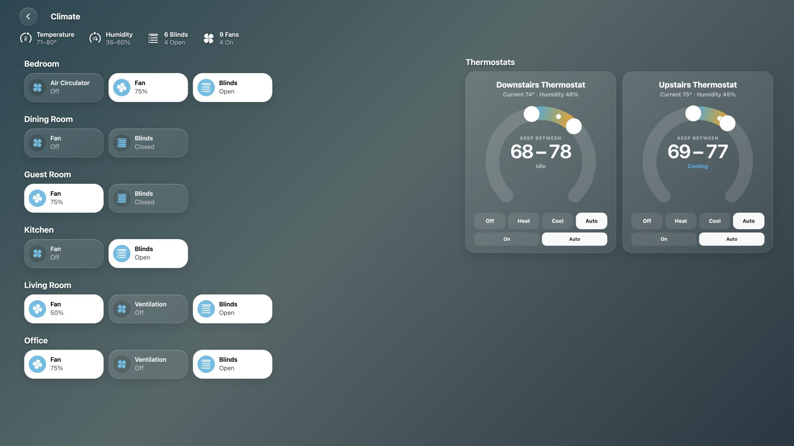

| | |
|---|---|
|  | 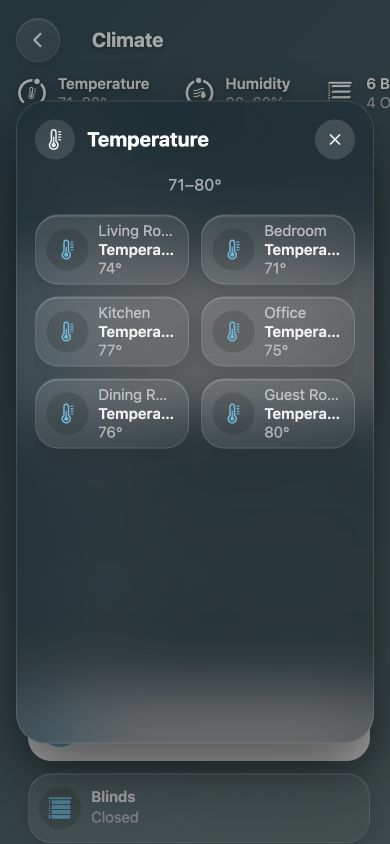 |
| Room-labelled sources | The same list on a phone |

Source selection and exclusions: [Climate](Climate.md).

## A computer, an iPad and a phone

| | | |
|---|---|---|
|  | 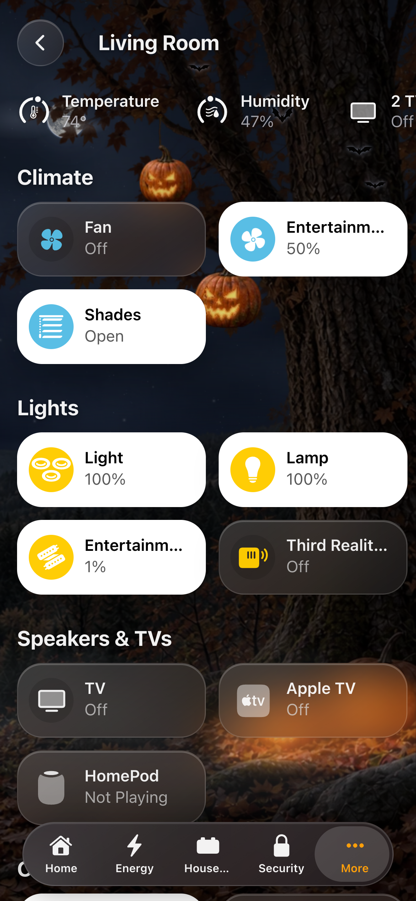 | 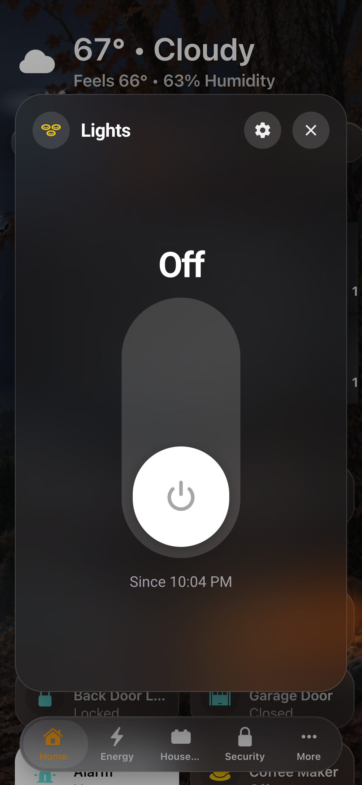 |
| Home | A room | A detail sheet |

The [tab bar](Tab-Bar.md): More holds the pages that don't fit and every room;
scrolled, the bar folds into one small button.

| | |
|---|---|
|  | 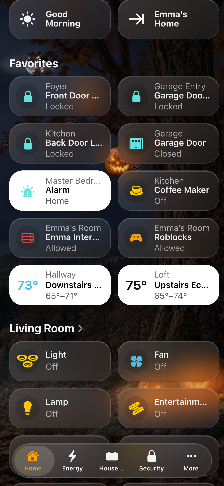 |
| More | Folded while scrolling |

## Detail sheets and pop-ups

| | |
|---|---|
|  |  |
| Light | Thermostat |
|  |  |
| Lock | Garage door |
|  |  |
| Alarm keypad | Doorbell |
| 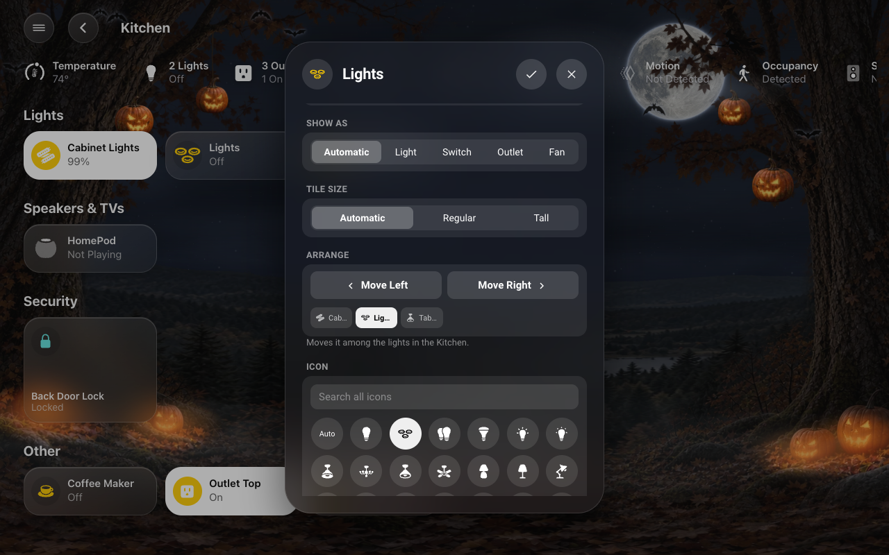 | 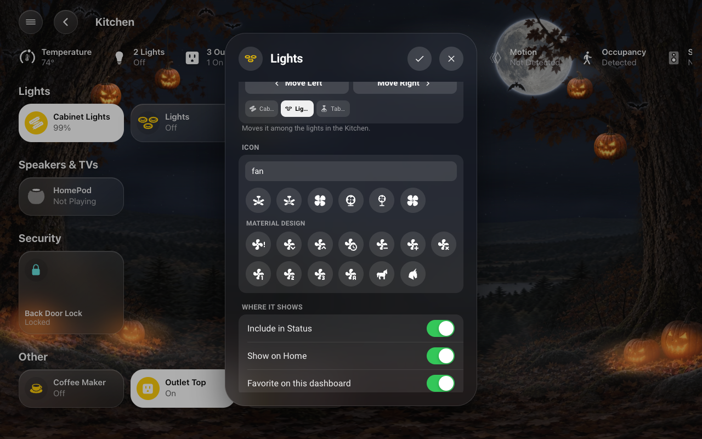 |
| Arrange | Search all icons |

## The sky

| | |
|---|---|
|  |  |
| A clear day | Night |
|  |  |
| Rain | Snow |

[Realistic clouds](Live-Sky.md#realistic-clouds-in-every-weather) (every weather is on the Live Sky page):

| | |
|---|---|
|  |  |
| A partly cloudy afternoon | Near sunset |

[New Decorations](Seasonal-Decorations.md), woodland scenery for the seasons and holidays:

| | |
|---|---|
|  |  |
| Halloween | Christmas |
|  |  |
| Autumn | A birthday |

More: [Live Sky](Live-Sky.md).

## HK Settings

| | |
|---|---|
|  |  |
| Overview | Setup Assistant |
|  |  |
| A screen | Status chips |
|  |  |
| The preview at phone size | Accessories |
|  |  |
| Custom chips | Pop-ups |
|  |  |
| Custom pages | Status & Chips |
|  |  |
| Weather | Sky |
|  |  |
| A decoration’s preview | Appearance |
|  |  |
| Music | Live TV |
|  |  |
| Clean Areas | Alarm PIN |
|  |  |
| Screensaver Options | Menu Tab Size |
| 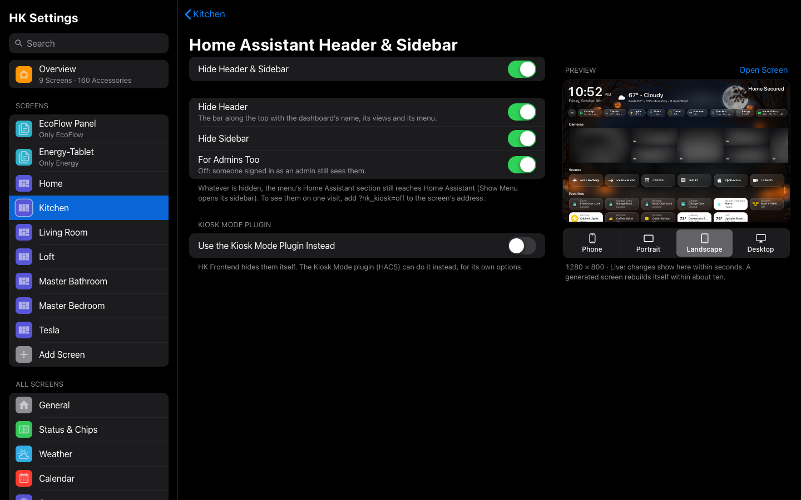 |  |
| Home Assistant Header & Sidebar | Your Own Dashboards |
|  |  |
| Rooms | A room |
|  |  |
| A screen’s Rooms | Arrange |
| 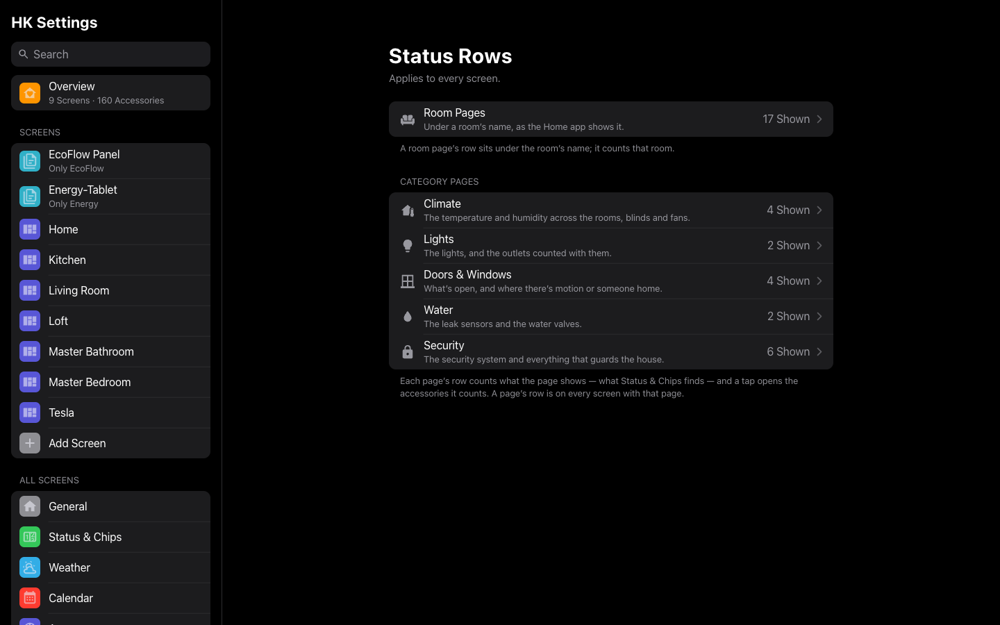 | 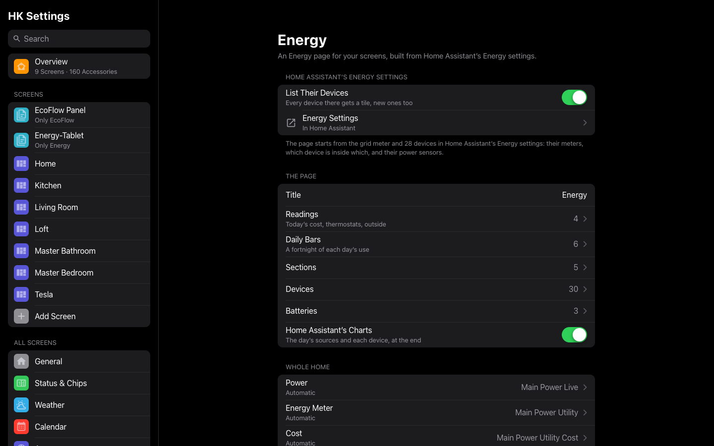 |
| Status Rows | Energy |
| 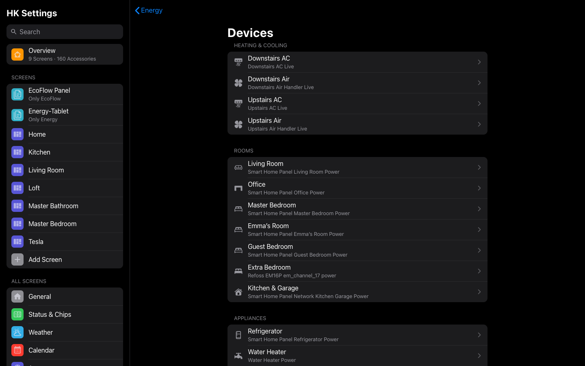 |  |
| Energy’s devices | The menu |
|  |  |
| [Sleep Screen](Sleep-Screen.md) | A bedroom’s Sleep Screen |
|  | 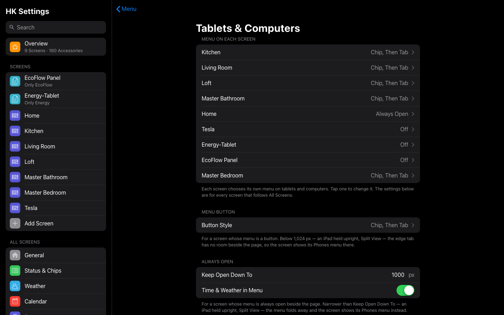 |
| [Cameras](Cameras.md), for all screens | The menu by device |

More: [HK Settings](HK-Settings.md).
