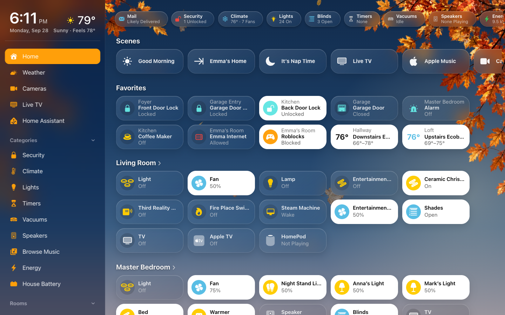
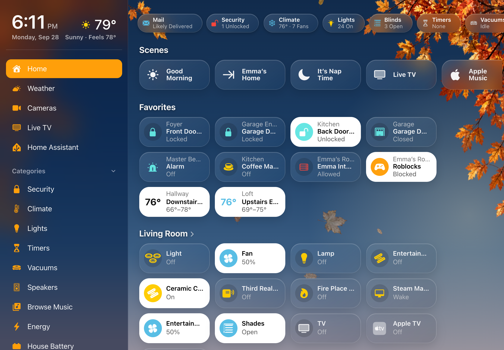
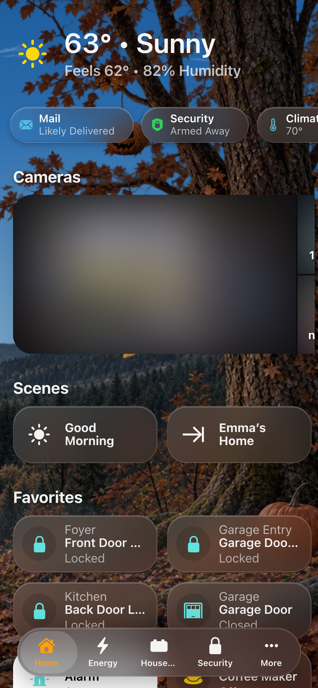
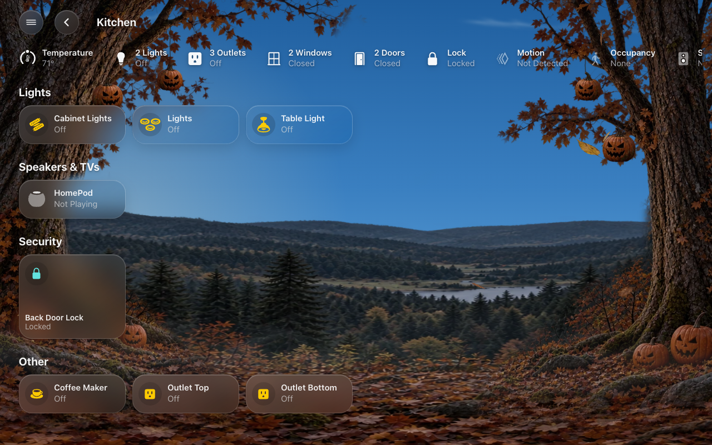

# Home Page

What a generated screen’s Home page shows, and how to change each part. The
[status chips](Status-Chips.md) and the [camera strip](Cameras.md) have pages
of their own.

A generated screen’s Home page shows, from the top:

1. **The header**: the time and date, the weather (tap it for the Weather
   page), and a security line: *Home Secured* when the alarm is armed and
   everything is shut, locked and reporting, otherwise what isn’t
   (“2 Doors Open”). On a screen whose menu shows the time and weather, the
   header moves into the menu and the status chips move up.
2. **Status chips**: a row of small summaries (Lights, Security, Climate, …).
3. **The camera strip**: one live camera and snapshots of the others.
4. **Scenes**: a row of scene pills, and pills that open a page.
5. **Favorites**, when you have picked some.
6. **Rooms**: a section for each room, with a tile for each accessory.
7. **More**: things you added under Also Shown that have no room.

**On a phone** the tiles reflow to two columns. The screen’s **On Phones**
setting (Home Page group) picks what sits at the top under 640 px: the clock
and weather header, or a one-line **Weather Strip**.

## Home Page settings

| Setting | Default | What it does |
|---|---|---|
| Status Chips | Automatic | Opens [Status Chips](Status-Chips.md). |
| Cameras | Automatic | Opens [Cameras](Cameras.md#cameras-settings). |
| Scenes | Automatic | Opens [Scenes](#scenes-settings). |
| Favorites | None | *Generated.* Opens [Favorites](#favorites). |
| On Phones | Clock and Weather | *Generated.* What the top of Home shows under 640 px: **Clock and Weather** (the header) or **Weather Strip** (one line of weather). |
| Rooms | Automatic | Opens [Rooms](#rooms). |

A YAML screen draws its own Home page. These settings reach it where it uses
the cards that read them: the status chips (`custom:hk-chips-card`), the scenes
row (`custom:hk-scenes-card`), the camera strip (`custom:hk-camera-mosaic-card`)
and the room order.

## Scenes and page pills

The scenes row runs a scene or script, or presses a button, with one tap. A
button has no on or off, so its pill lights for a moment when you tap it, to
show the press went through.
Automatic shows every scene, A to Z. To choose, open **Scenes**, turn
**Automatic** off, and use **Add Scene or Shortcut…**. A scene’s name, icon and
color come from its [accessory settings](Accessories.md).

**Page pills** open a page instead of running anything: a Play Music pill, a
Cameras pill. Add them from **More** on the Scenes page. Tap a page pill’s row
to change its name, icon and color; that look is the same on every screen.

### Scenes settings

| Setting | Default | What it does |
|---|---|---|
| Show Scenes Row | On | The row of scene pills. |
| Automatic | On | A generated screen: every scene, A to Z. A YAML screen: the scenes its YAML lists. Then any page pills. |
| Shown | — | Scenes, scripts and buttons, in order. Choosing here replaces a YAML screen’s own list. A scene’s row opens its accessory settings (its name, icon and color). |
| More | — | Page pills: a pill that opens a page (Weather, Cameras, Live TV, Security, Doors & Windows, Climate, Lights, Timers, Vacuums, Play Music, Water) instead of running something. A page the screen doesn’t have gets no pill. |
| Add Scene or Shortcut… | — | Any scene, script, button or input button. |

A page pill’s own page:

| Setting | Default | What it does |
|---|---|---|
| Name | The page’s name | The pill’s name on every screen that shows it (for example “Apple Music” for Play Music). |
| Icon | The page’s icon | An `mdi:` or `hk:` icon. |
| Color | The page’s color | White, Yellow, Orange, Red, Pink, Purple, Blue, Teal, Mint or Green. |

## Favorites

*Generated screens.* A Favorites section above the rooms, for the things you
use most. Each favorite shows its room above its name, as the Home app does.

- Open **Screens → (the screen) → Favorites** and select **Add Favorite…**, or
- open an accessory’s detail sheet on that screen, tap the gear, and turn on
  **Favorite on this dashboard**.

A favorite can have its own name, room line and glyph, and can control several
lights together (“Main + Table Lights”). See
[As a favorite](Accessories.md#as-a-favorite).

### Favorites settings

*Generated screens.* A Favorites section above the rooms.

| Setting | Default | What it does |
|---|---|---|
| Favorites | None | The favorites, in order. None: no Favorites section. |
| Add Favorite… | — | A light, switch, fan, cover, lock, thermostat, media player, alarm panel, vacuum, valve, water heater, humidifier, input boolean, scene or script. |

A favorite’s name, room line and icon as a favorite are in its
[accessory settings](Accessories.md).

## Rooms

A generated screen has a section on Home for every area with something in it,
floor by floor (in your floors’ order), then A to Z. Only things that are in an
area get a tile; to show something with no area, add it to
**Accessories → Also Shown** and it appears under **More**.

A room heading with a › opens the room’s own page (see [Room pages](Pages.md#room-pages)).

To change the rooms, open **Screens → (the screen) → Rooms**:

- Turn **Automatic** off, then drag the rooms into the order you want. This is
  the screen’s **room order**.
- Move a room to **Not on Home** to leave it off Home. It keeps its room page
  and its place in the menu.
- **Rooms on Pages** (generated screens): whether the Lights, Climate, Water and
  other pages group rooms **By Floor** or in the **Room Order**.

Two settings live with each room in **HK Settings → Library → Accessories →
(the room)**, and apply on every generated screen:

- **Show As Part Of**: show a room inside another (a deck inside the
  backyard).
- **Tile Order**: the order of the room’s tiles, on Home and on its room page.

### Rooms settings

| Setting | Default | What it does |
|---|---|---|
| Automatic | On | Home shows its rooms as the screen lists them: on a generated screen, floor by floor (in your floors’ order), then A to Z. |
| On Home | — | Your areas, in order. This is the **room order**, also used by Rooms in Menu and Rooms on Pages. |
| Not on Home | — | Rooms left off Home. Each keeps its room page and its row in the menu. |
| Rooms on Pages | By Floor | *Generated.* How the Lights, Climate, Water and other pages group rooms: **By Floor** (floor by floor, A to Z) or **Room Order**. |
