# Live Sky

Behind HK Frontend’s screens is a sky that follows the real one: the sun’s
height and direction, the moon at its actual phase, the clouds you have, and
rain or snow when it is falling. On some days it also dresses up for a season,
a holiday or a birthday: [Seasonal Decorations](Seasonal-Decorations.md).

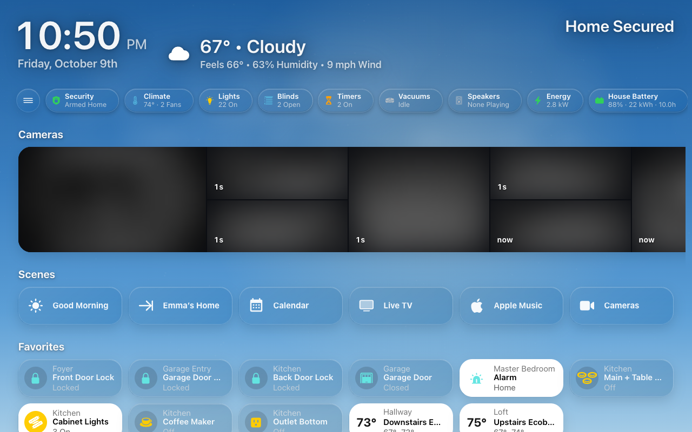

## What it shows

| | What the sky does |
|---|---|
| **Time of day** | The colors follow the sun’s elevation, from a bright midday blue through sunset to night. The sun’s glow sits where the sun is. **Daytime Sky** below sets how bright the midday blue runs. |
| **Night** | Stars, and the moon drawn at its real phase. |
| **Clouds** | As many as the weather says (its cloud coverage, or a guess from the condition when there is none). At sunset they are lit warm from below. **Clouds** below chooses their look: Classic or Realistic. |
| **Rain and snow** | Falling while the weather is rainy, pouring, hailing or snowy; lightning in a thunderstorm; a haze in fog. |

Glass tiles and white text on top of the sky stay readable, even at noon:
when the sky gets bright, a soft shade comes in behind the cards.

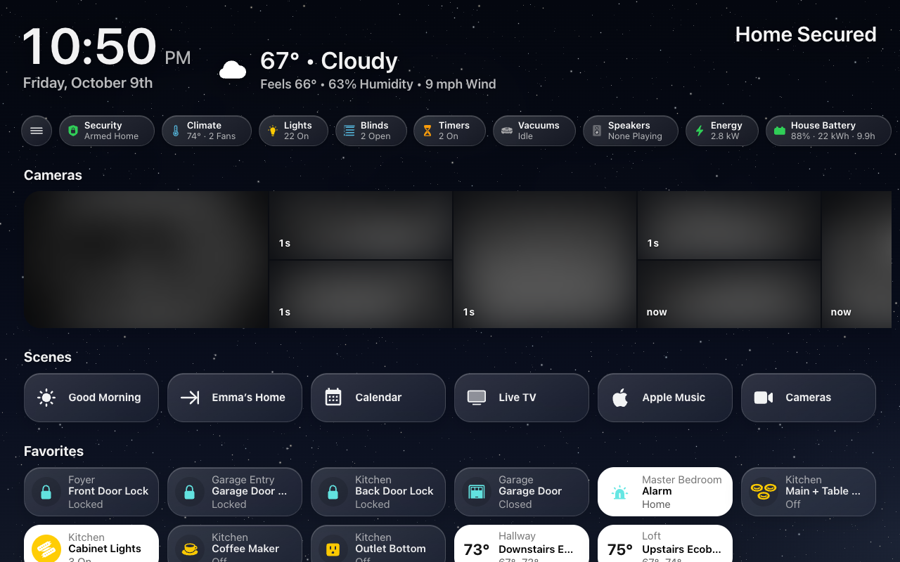

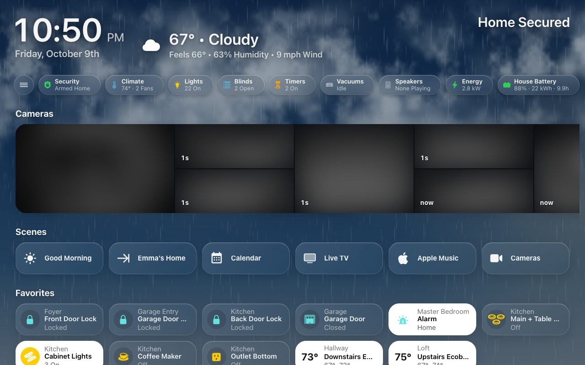

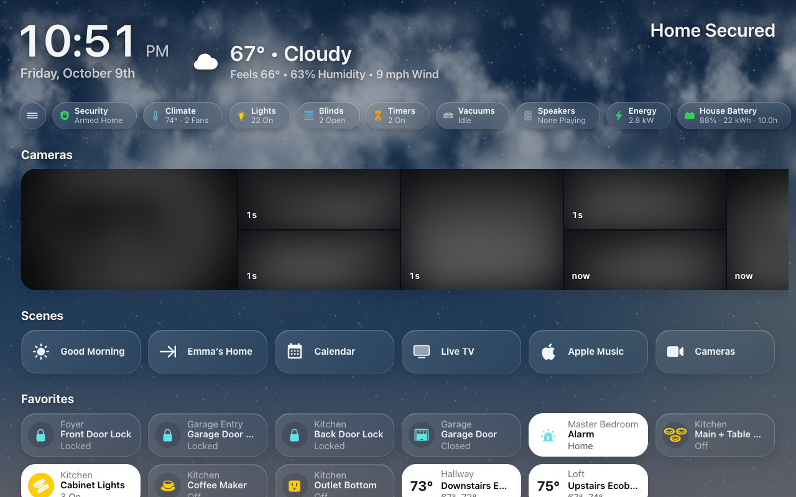

It reads:

- `sun.sun`, for where the sun is;
- the weather entity chosen under **HK Settings → All Screens → Weather**
  (without one, the first weather entity it finds);
- the moon’s phase, worked out from the date (or a sensor you choose; see
  [Advanced](Seasonal-Decorations.md#advanced)).

### Where it appears

On a generated screen, the live sky is behind **Home**, **Weather**,
**Calendar** and the room pages. The category pages (Lights, Climate, Doors &
Windows, Security, Timers, Vacuums, Water, Cameras, Live TV, Play Music and
Browse Music, and Energy) each have a still wash of their own color instead,
matching the chip that opens them. A custom page shows the live sky when its
YAML says `sky: true`. Decorations appear only on the live sky.

Any page can change this under [Page Backgrounds](#page-backgrounds).

When the tablet is behind a screensaver, or its browser tab is hidden, the sky
stops moving.

The [forecast screensaver](Screensaver-and-Idle.md#no-photos-the-forecast)
draws this same sky over a landscape, and livelier: its clouds drift faster,
the brighter stars twinkle, a clear night has the odd shooting star, a summer
night has fireflies, and on the holidays the landscape itself is decorated
([Seasonal Decorations](Seasonal-Decorations.md#on-the-forecast-screensaver)).

## Turn it on or off

**Every generated screen at once:** pick an input boolean or switch as the
**Sky Switch** under **HK Settings → All Screens → Sky / Background → Live Sky**. While it
is off, no generated screen shows the live sky. With none chosen, the sky is
always on.

**One screen:** HK Settings → the screen → **Appearance → Sky / Background**,
whose first row is the screen’s **Live Sky** switch (the row reads **Off**
while it is off). A generated screen’s sky also follows the Sky Switch; a YAML
screen’s sky comes from its YAML, and this switch can only turn it off.

**A dashboard you write in YAML:** the dashboard opts in with a `sky:` block,
and each view that wants the sky says `sky: true`:

```yaml
sky:
  enable: input_boolean.live_sky                          # optional: off hides the sky
  sleep: input_boolean.kitchen_photos                     # optional: on pauses it
views:
  - title: Home
    path: home
    type: custom:hk-grid-view
    sky: true
    cards: []
```

`sky: {}` on its own is enough to opt in. A view can instead take one of the
still washes with `sky_variant:` (`lights`, `climate`, `doors`, `timers`,
`vacuums`, `water`, `cameras`, `playmusic`, `energy` or `ecoflow`).

## On phones and narrow screens

The decorations are drawn for a landscape screen. On a screen taller than it
is wide, each one is drawn as its left and right edges, blended through the
middle, so the branches and garlands still reach in from both sides.

## If the sky stands still

A browser that asks pages for **reduced motion** gets a still sky. On an
Android tablet, Android’s **Remove animations**, some power-saving modes and
the developer animation settings all turn that on, and the browser can keep
reporting it until the tablet restarts. If the sky is frozen on one tablet and
moving everywhere else, check those settings and restart the tablet. More in
[Troubleshooting](Troubleshooting.md).


## Choose its look

**HK Settings → All Screens → Sky / Background** sets the defaults. Each
screen can choose its own under **Appearance → Sky / Background**, below its
**Live Sky** switch:

| Setting | What it changes |
|---|---|
| **Animations** | Off stops the sky's animated layers, including clouds, precipitation, lightning, decorations and forecast landscape effects. The sky still follows the sun and updates its appearance. |
| **Weather** | Off removes clouds, rain, snow, lightning and fog, including decorative snow and Halloween fog. The sun, moon and stars remain. |
| **Seasonal Decorations** | Off removes seasonal and surprise scenes. On uses the shared dates, themes and optional extra gate. |
| **Clouds** | **Classic** is the drifting haze the sky has always had. **Realistic** draws photographic clouds instead — fair-weather cumulus, broken sheets, high wisps, a storm tower on the horizon, an overcast lid with darker masses drifting under it — chosen from the weather's cloud cover and condition, lit by the sun (gold at sunset, pink at dusk, moonlit at night), across the whole sky down to the horizon, behind New Decorations' trees. They sit in perspective: near clouds big and high, far ones small, many and softer toward the horizon, with long cirrus streaks above and, as it clouds over, the overcast's ceiling receding behind them. Each cloud crosses once and comes back as another, so nothing repeats. A fair or partly cloudy day keeps the sky as bright and blue as Classic's; the overcast's faint ceiling only comes in as the sky clouds over. A screen can choose its own. |
| **Daytime Sky** | How bright the midday blue runs. **Natural** (the default) is a real midday sky. **Deep** is the darker, dusky blue the sky had before; **Balanced** is in between. The shade behind the cards rises with it, so all three stay readable. Sunrise, sunset, dusk and night look the same in all three. A screen can choose its own. |
| **Backdrop** | Live Sky follows the sun's colors. Dusk, Midnight, Fjord, Dune, Graphite, Plum, Ember and Mist use curated day/night gradients. Custom provides two sets of four colors, top to horizon. Day applies above the horizon, Night at or below it. |

**To try a look before choosing it,** open **Sky Lab** (`/hk/pages/skylab.html`):
set the time of day, the weather, the clouds and the daytime brightness by hand,
over the sky alone or over one of your own dashboards (preview only — nothing
in your home switches). See [Tools → Sky Lab](Tools.md#sky-lab).

A fixed backdrop changes the gradient; the other switches still apply. For a
quiet gradient, turn Animations, Weather and Seasonal Decorations off. The usual
luminance scrim keeps glass and text readable over custom colors.

Per-screen flags follow All Screens until you change them: each reads **Same
as All Screens**, then **Just This Screen**, and **Reset to All Screens (On)**
follows All Screens again. A screen’s Decoration Style, Clouds and Daytime Sky
are the same tabs as All Screens’, showing All Screens’ choice, until changed. **Same as All Screens** in the Backdrop picker follows the
global palette and its custom colors; an explicit **Live Sky** overrides a
fixed global backdrop. Selecting Custom starts with Dusk (or, for a screen,
the global custom colors if available). An own Custom palette keeps its colors
when you change the global palette.

These settings apply wherever the live sky is shown, including the forecast
screensaver and any page set to Live Sky or a backdrop (below). A page that
keeps its own color shows none of them. The Live Sky switch continues to
control whether the background is present.

### Realistic clouds in every weather

What **Clouds → Realistic** draws for each weather, the sky alone (on a
screen, your cards sit over it). The mix comes from the weather entity's
condition and cloud cover; the lighting from the sun.

| | |
|---|---|
| 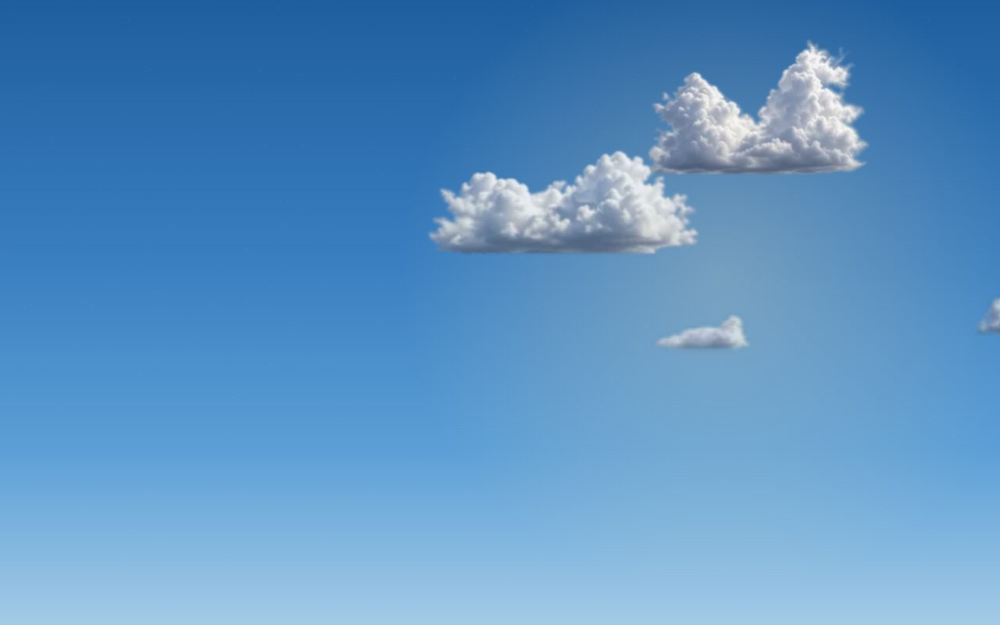 |  |
| **Sunny** — a few far cumulus, low on the horizon | **Partly cloudy** — cumulus near and far, now and then a high wisp |
|  | 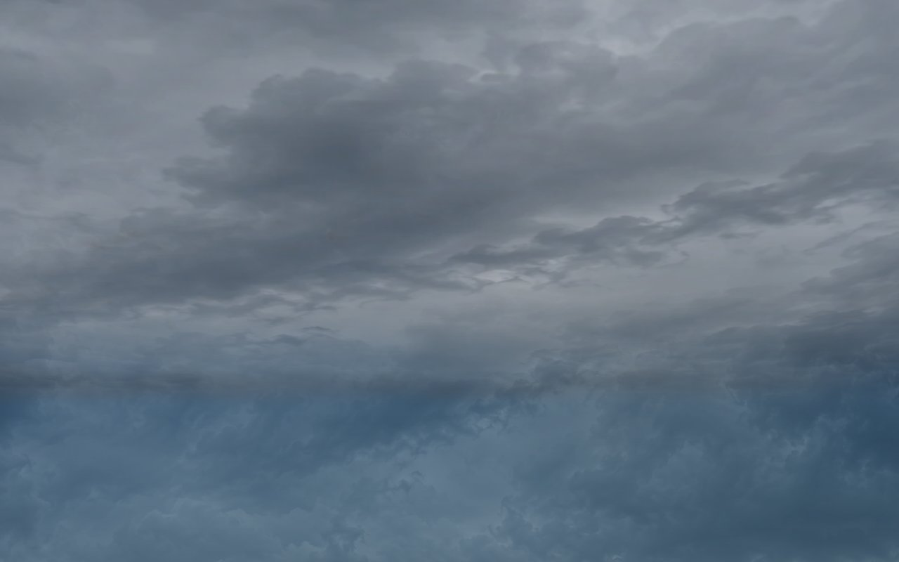 |
| **Mostly cloudy** — big cumulus, broken sheets and a haze along the horizon | **Overcast** (85% cover or more) — one photographic deck, drifting to and fro |
|  | 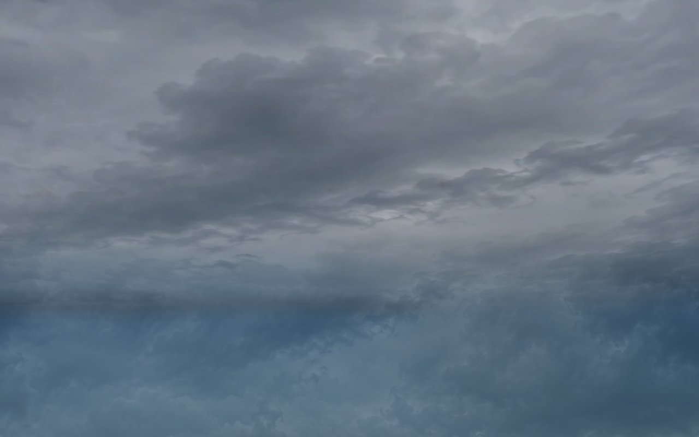 |
| **Rain** — the grey deck, with the rain falling in front | **Thunderstorm** — the grey storm deck, whatever cover is reported, lightning flashing in it |
| 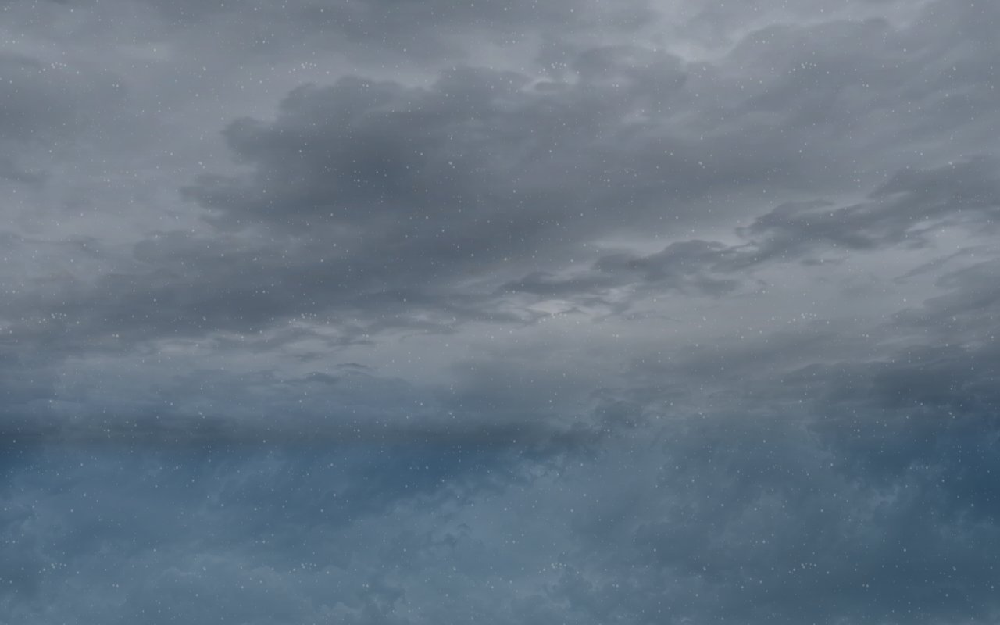 |  |
| **Snow** — the grey deck, with the snow falling | **Classic**, the same partly cloudy sky, for comparison |

The same partly cloudy sky through the day's lightings:

| | | |
|---|---|---|
|  | 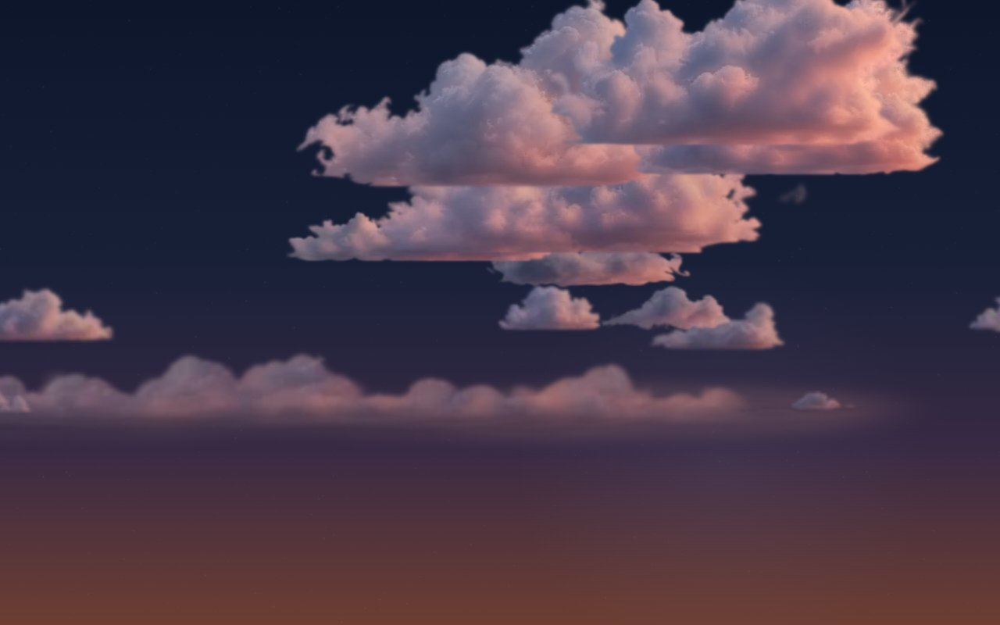 | 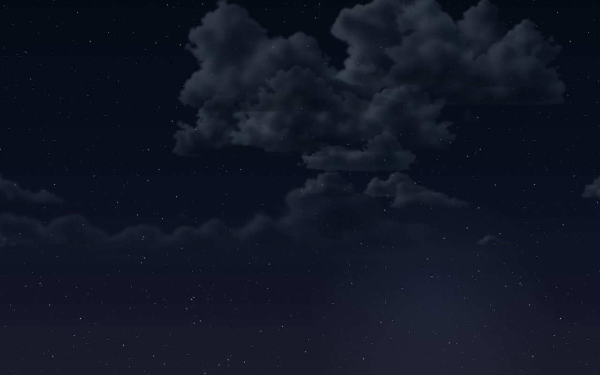 |
| **Golden hour** (the sun under 10°) | **Dusk** (just below the horizon) | **Night** |

On a dashboard:

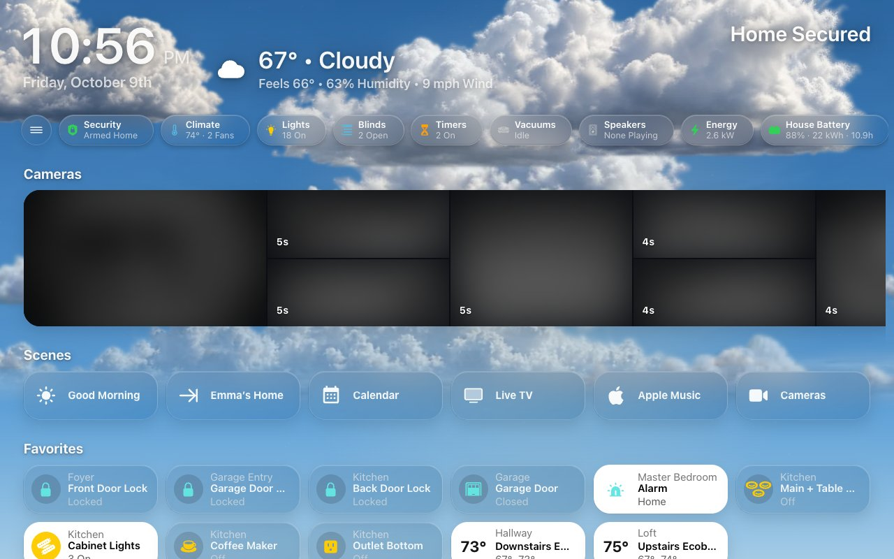

### Page backgrounds

**Sky / Background → Pages** lists every page with its background ("Energy:
Page Color", "Weather: Backdrop"). Tap a page to choose its background. It is
set under All Screens, and each screen's Sky / Background can choose its own
for any page.

On a [page screen](Pages.md#whole-screens-and-page-screens) the list is its
own pages, at the top of its Sky / Background (for example **Energy
Backdrop**). Its **Backdrop** page is those pages' backgrounds, since it has
no Home or room page for the sky's own backdrop.

| Choice | The page shows |
|---|---|
| **Automatic** | A page with a color of its own (Energy, Climate, Lights …) keeps it. Weather, Calendar and the room pages use the Backdrop. A custom page is as its YAML says. |
| **Page Color** | The page's own still wash. Play Music's is the album art. |
| **Live Sky** | The live sky, following the sun, with the screen's weather, clouds and decorations. |
| **Dusk, Midnight, Fjord … Custom** | That color as a still wash, like Page Color: no clouds, weather, sun or moon glow, or decorations. Its day colors show while the sun is up, its night colors after. |

A color picked for a page is only that color. The **Sky** backdrop (Home, the
room pages, Weather and Calendar) is different: it recolors the live sky, and
the weather and decorations still show over it.

All Screens' **Backdrop** page sets the defaults, and each screen can choose
its own. A change shows on the screens within a few seconds, with no reload.

On a page screen, **Sky / Background** starts with **This Screen's Pages**,
with each page's backdrop. When none of them uses the live sky, it says so,
because then the animations, weather and decorations settings below it don't
show anywhere. The screen's **Appearance → Sky / Background**
row shows what its pages use, for example **Page Color**.
