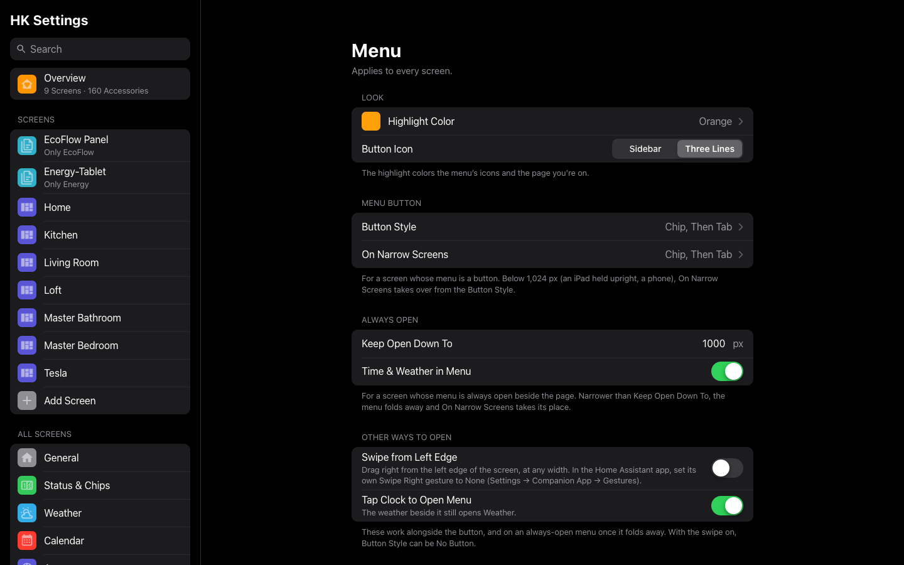
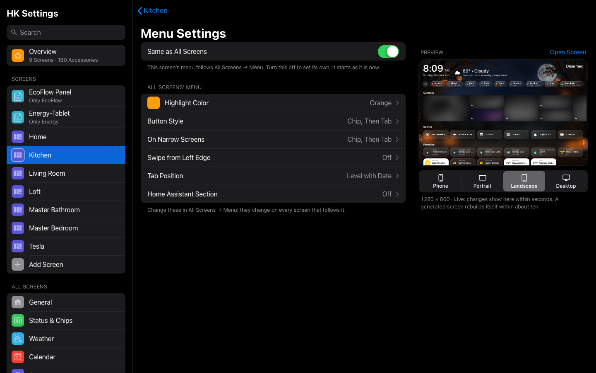
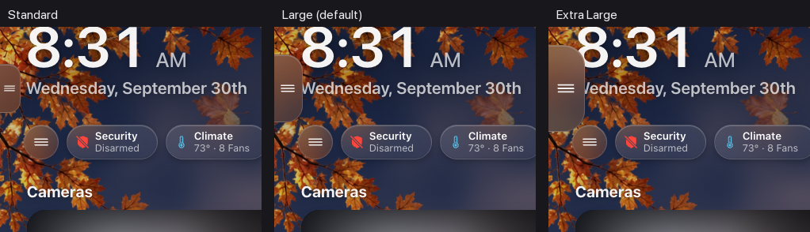

# Menu

The menu lists a screen’s pages and rooms, like the sidebar of Apple’s Home
app.

The menu lists the screen’s pages and rooms, like the sidebar of Apple’s Home
app: **Home** first, then the pages at the top, then **Categories** and
**Rooms**. The page you are on is highlighted.

Each screen chooses whether it has a menu, under **Screens → (the screen) →
Menu**. Everything else about the menu (its look, its button, the edge tab,
what’s in it) is set once for every screen in [All Screens →
Menu](#menu-settings-for-all-screens), and a screen can
[set its own](#a-screens-menu-settings):

- **Off**: no menu. Pages are reached from the chips and pills.
- **Button**: the menu is hidden until opened. **Button Style** picks how:
  - **Automatic**: the round chip when Home has a menu button, otherwise the
    edge tab.
  - **Chip**: a round button at the start of the status chips (and beside the
    back button on other pages).
  - **Chip, Then Tab**: the chip, and a slim tab slides in from the left edge
    when the chip is scrolled out of sight.
  - **Chip on Home, Tab Elsewhere**.
  - **Edge Tab**: a slim tab on the left edge, level with the date. **Tab
    Position** can move it.
  - **No Button**: nothing on the page; swipe from the left edge to open the
    menu. Offered only while **Swipe from Left Edge** is on.

  The button’s style is All Screens’ unless the screen sets its own.
- **Always Open**: the menu stays beside the page, with no button. It needs
  room: narrower than **Keep Open Down To** (1,000 px unless you change it),
  it folds away and **When Folded** stands in for it. One screen can then serve
  a computer, an iPad and a phone. With **Time & Weather in Menu**, the time,
  date and weather sit at the top of the menu and the Home page gains the
  header’s space.

**On narrow screens.** Below 1,024 px wide (an iPad held upright, a phone), a
button menu uses **On Narrow Screens** instead of its Button Style: the chip
(the default), the chip then the tab, the edge tab, or No Button.

**Other ways to open it.** These work alongside the button, each switched on
or off by itself:

- **Swipe from Left Edge**: drag right from the screen's left edge and the
  menu follows your finger, the way the Home app's sidebar does. Let go past
  a third of the way, or flick it, and it opens; otherwise it slides back. It
  works at
  every width and with every Button Style, and an always-open menu gets it
  once it folds away. Dragging up or down at the edge still scrolls the page.
  In Safari the browser's own back swipe can get there first at the very edge.
  **In the Home Assistant Companion app**, set the app's own Swipe Right
  gesture to **None** (Settings → Companion App → Gestures). By default it
  opens Home Assistant's sidebar on the same swipe. If it does, HK Frontend
  closes that sidebar again at once (the screen keeps it hidden) and says once
  what to change in the app. The same happens on any screen that hides Home
  Assistant's sidebar, with or without the swipe, so the app's gesture can
  never leave the page frozen under a sidebar you can't see.
- **Tap Clock to Open Menu**: tapping the clock opens the menu, and the
  weather beside it opens the Weather page.

The chip and the edge tab aren't separate switches, because they depend on
each other: "Chip, Then Tab" shows the tab only once the chip has scrolled out
of sight. That's why they stay one **Button Style**. With the swipe on, Button
Style can be No Button. If the swipe is turned off, a No Button screen goes
back to Automatic (the chip on narrow screens), so it always keeps a way in.

**The highlight** (the menu’s icons and the page you’re on) is Apple’s orange
unless you choose another **Highlight Color**: one of Apple’s system colors
or a color of your own. Over a pale one the page’s name turns dark.

**Top of Menu and Categories.** On a generated screen, Weather, Cameras and
Live TV sit at the top of the menu, right under Home, and every other page is
under **Categories**. To move one, open **Pages** and use the menu beside its
row: **Top of Menu**, **Categories** or **Not in Menu** (still one tap away on
its chip or pill). **Use the Automatic Menu** puts them back. Room pages are
always under **Rooms**, and Browse Music always follows Play Music.

**Rooms in the menu** are A to Z, or in the screen’s room order (**Rooms in
Menu**).

**The Home Assistant section.** **Home Assistant Section** adds Home
Assistant’s own pages to the menu, above Categories: Integrations,
Automations and Settings, Notifications, **More** (which folds out the rest
of your Home Assistant sidebar, in your order, without what you hid),
**Show Menu** (Home Assistant’s own sidebar, over the page, even where kiosk
mode hides it) and Profile. Settings shows how many updates and repairs are
waiting and Notifications how many notifications, as Home Assistant’s
sidebar does. Everything is read live from Home Assistant, and each person
sees only what they may open -- a wall tablet’s user gets Notifications,
More, Show Menu and Profile. On Home Assistant’s own pages its sidebar (or
its ☰) is the way back. Leave it off on a wall tablet everyone uses.


The menu closes itself when you choose a row, tap outside it, press Escape,
leave it untouched for a minute, or when the page changes any other way.

## The menu on your own dashboard

On a YAML dashboard, the menu is read from the dashboard itself:

- The first view is **Home**.
- A view with `area:` is a **room**, named by its title (else the area’s name)
  and pictured by the area’s icon (**Settings → Areas**).
- **Categories** are the pages Home’s status chips open, in chip order. With no
  chips, every other view with a title.

View keys adjust it:

| Key | Effect |
|---|---|
| `area: kitchen` or `area: [backyard, deck]` | The view is a room. |
| `menu: top` | Listed at the top, right under Home. |
| `menu: false` | Not listed. Hidden views, views with no title and views this user can’t see are never listed. |
| `menu_title:` | The name in the menu, when it should differ from the view’s title. |
| `menu_icon:` | The icon in the menu, when it should differ from the view’s `icon:`. |

The screen’s **Pages in Menu** overrides `menu: top` and `menu: false`, page
by page.

A room page for a YAML dashboard is built from its area every time it opens:

```yaml
- title: Kitchen
  path: room-kitchen
  subview: true
  strategy:
    type: custom:hk-room
    area: kitchen          # or a list: [backyard, deck]
```

To make a room heading on Home open it, give the heading the same area:

```yaml
- type: custom:hk-heading-card
  name: Kitchen
  area: kitchen
```

A page you lay out yourself is a room too, as long as the view has `area:`.
Give it a status row with `custom:hk-room-status-card`:

```yaml
- type: custom:hk-room-status-card
  area: kitchen
```

| Option | What it does |
|---|---|
| `area` | Required. One area or a list. |
| `items` | Which kinds show, in this order. Default: [Status Rows → Room Pages](Status-Rows.md#settings). |
| `temperature`, `humidity` | A sensor to use instead of the area’s own. |
| `entities` | The accessories on this page. Outlets, blinds, fans, locks and garage doors are then counted from this list rather than the whole area. |
| `exclude` | Entities to leave out of the counts. |
| `include` | Entities from outside the area to count too. |

Every card’s options: [Card Library](Card-Library.md).

## Menu settings

**Screens → (the screen) → Menu.**

| Setting | Default | What it does |
|---|---|---|
| Menu | Button (a YAML screen added as *Something Else*: Off) | **Off**: no menu. **Button**: the menu is hidden until you open it. **Always Open**: the menu stays beside the page, like the sidebar of the Home app on a Mac. The screen’s [preset](Screens.md#add-screen) sets this first. Always the screen’s own. |
| Menu Settings | Same as All Screens | Everything below: [All Screens’](#menu-settings-for-all-screens), or [this screen’s own](#a-screens-menu-settings). |
| Pages in Menu | Automatic | *YAML screens.* For each page: **Top of Menu** (right under Home), **Categories**, or **Not in Menu**. A generated screen sets this on its [Pages](Pages.md) instead. **Use the Automatic Menu** clears your choices. |

## Menu settings for all screens

**All Screens → Menu.** Every screen with a menu follows these, unless it sets
its own. The settings for a menu button apply to the screens with a button,
those for an always-open menu to the screens with one, so a wall tablet and a
phone can both follow them. The page ends with every screen that has a menu,
and whether it follows these. The menu’s rooms (A to Z or in the room order)
are in [Rooms](Rooms.md).

<a id="menu--rooms-settings"></a>

| Setting | Default | What it does |
|---|---|---|
| Highlight Color | Orange | The menu’s icons and the page you’re on: **Orange**, **Yellow**, **Green**, **Mint**, **Teal**, **Cyan**, **Blue**, **Indigo**, **Purple**, **Pink** or **Red** (Apple’s system colors), or **Your Own Color**. Over a pale color the page’s name turns dark. |
| Button Icon | Sidebar | The menu button’s picture: **Sidebar** or **Three Lines**. |
| Button Style | Automatic | *A menu button.* **Automatic**: a round chip at the start of the status chips when the Home page has a menu button, otherwise the edge tab. **Chip**: the round chip. **Chip, Then Tab**: the chip, and a slim tab slides in from the left edge while the chip is scrolled out of sight. **Chip on Home, Tab Elsewhere**: the chip on Home, the edge tab on every other page. **Edge Tab**: a slim tab on the left edge, level with the date. **No Button**: nothing on the page; the swipe opens it (only with Swipe from Left Edge on). |
| On Narrow Screens | Chip | *A menu button.* Below 1,024 px wide (an iPad held upright, a phone), this takes over from Button Style: **Chip**, **Chip, Then Tab**, **Edge Tab** or **No Button**. An always-open menu that folds away uses it too (its **When Folded**). |
| Swipe from Left Edge | Off | *Other ways to open.* Drag right from the screen’s left edge to pull the menu out, at any width, alongside the button. Lets Button Style be **No Button**. In the Home Assistant Companion app, set the app’s own Swipe Right gesture to None. |
| Tap Clock to Open Menu | On | *Other ways to open.* Tapping the header’s clock opens the menu. The weather beside it still opens the Weather page. |
| Keep Open Down To | 1,000 px | *Always open.* Narrower than this (700 to 3,000 px), the menu folds away and On Narrow Screens stands in for it. 1,000 keeps it open on a computer and an iPad held sideways and folds it on a small iPad held upright or a phone. |
| Time & Weather in Menu | Off | *Always open.* The time, date and weather sit at the top of the menu instead of in the Home page’s header, and the status chips move up into the space. When the menu folds away, the header comes back. A Wall Tablet screen turns it on for itself when All Screens has it off. |
| Tab Position | Level with Date | *The edge tab.* **Level with Date**: the tab’s middle lines up with the date under the clock. **Custom**: a **Distance from Top**, **Measured In** **Pixels** or **% of Screen Height**. |
| Tab Size | Large | *The edge tab.* How big it is on a tablet, an iPad or a computer: **Standard** (the slim tab that fits the margin), **Large** or **Extra Large**. A bigger tab lies over the page’s edge and stays on top of it, and its touch area reaches a little past it. |
| Tab Size on Phones | Standard | *The edge tab.* The same three sizes for a phone (narrower than 640 px). On a phone even the standard tab lies over the first column of tiles, so a bigger one covers more of it. |
| Home Assistant Section | Off | Adds a **Home Assistant** section to the menu, above Categories: Integrations, Automations, Settings (with its updates-and-repairs count), Notifications (with its count), **More** (the rest of that person’s Home Assistant sidebar, in their order), **Show Menu** (Home Assistant’s own sidebar, even where it is hidden) and Profile. Each person sees only what they may open. Leave it off on a shared wall tablet. |



### A screen’s menu settings

**Screens → (the screen) → Menu → Menu Settings.**

| Setting | Default | What it does |
|---|---|---|
| Same as All Screens | On | The screen’s menu is All Screens’. The page shows what they are, each a way to All Screens → Menu. |



Turn **Same as All Screens** off to give the screen its own: they start as
they are, then change on their own: the highlight, the icon, the clock tap,
the button (a screen with a button) or Keep Open Down To, When Folded and
Time & Weather (one always open), the edge tab and the Home Assistant section.
Turn it back on to follow All Screens again. Whether the screen has a menu at
all stays its own either way.




## Coming from 1.4

Before, each screen held its own copy of every menu setting. On the first
start after updating, each one became All Screens’ as most screens with a
menu had it (the button’s style among the screens with a button, Keep Open
Down To among the always-open ones). A screen with exactly those follows All
Screens; one that differed keeps its own (its Same as All Screens is off).
Nothing on any screen moves.
