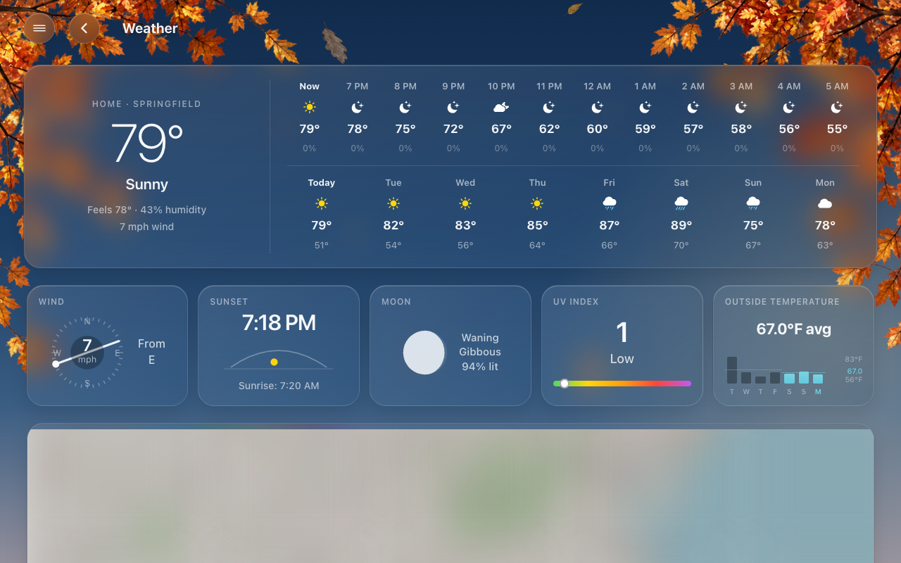
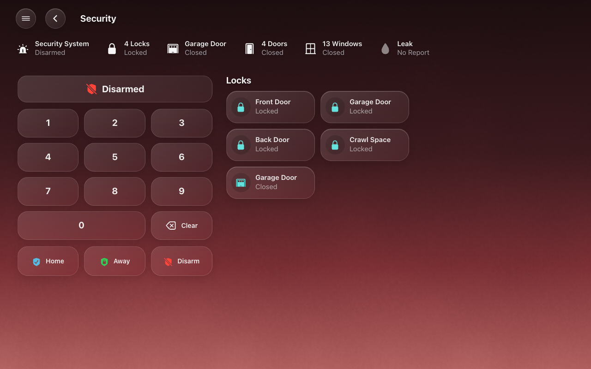
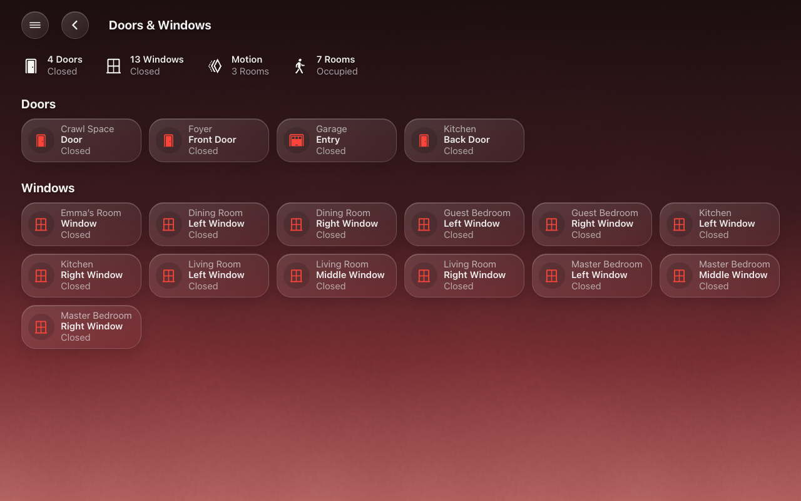
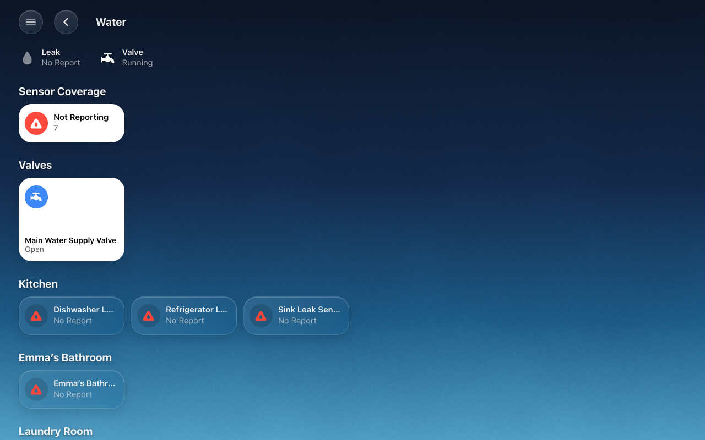
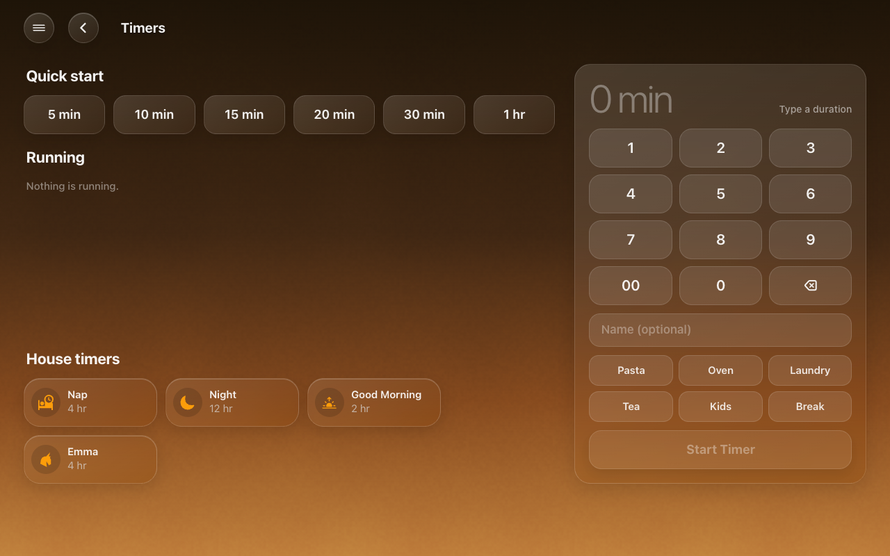
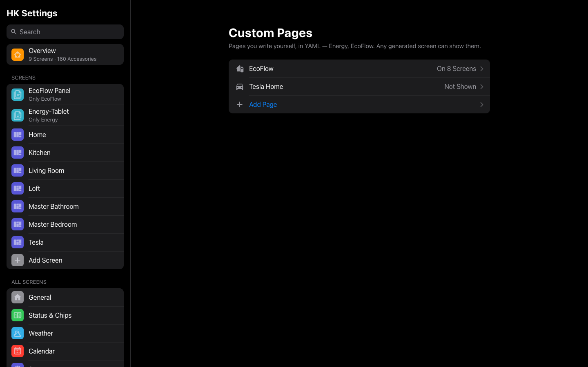

# Pages

The pages a generated screen has beyond Home: one for each kind of thing your
home has, one for every room, and your own custom pages.

A generated screen has a page for each kind of thing your home has, a page for
every room, and any custom pages you add. The status chips, the scene pills and
the menu open them; a back button returns to Home.

## Category pages

| Page | Appears when your home has | What it shows |
|---|---|---|
| Weather | A weather entity | The hours and days ahead, wind, sunrise and sunset, the moon, UV (with a UV sensor), the week’s outside temperature (with a sensor), any alerts, and a radar map (with the Weather Radar Card from HACS) |
| Calendar | A calendar | The month, the week or the day, with events to add, change and delete ([Calendar](Calendar.md)) |
| Cameras | Cameras | Every camera on the strip, live, three across |
| Live TV | The Live TV feature | The channel guide; tap a channel to watch it full screen |
| Security | An alarm panel (the one in General, else the first) | The alarm keypad, with the locks and garage doors beside it |
| Doors & Windows | Door or window contacts | The doors, then the windows, each with its room above its name |
| [Climate](Climate.md) | Thermostats, fans, blinds or temperature/humidity sources | Temperature and humidity ranges, fan and blind summaries with accessory lists, fans/humidifiers/blinds by room, and responsive thermostat dials |
| Lights | Lights | The lights by room (titled *Lights & Outlets* when Status & Chips counts an outlet as a light) |
| Timers | Timers | The running timers. With the optional quick-timer helpers (`helpers/quick_timers.yaml`), also presets, a New Timer keypad and your [House Timers](HK-Settings.md#general) |
| Vacuums | Vacuums | Each vacuum with its controls; with the Clean Areas feature, a picker to clean chosen rooms |
| Play Music, Browse Music | The Music feature, with speakers | The player and the speakers; the music library |
| Water | Leak sensors | The leak sensors by room, and a count of any that haven’t reported since Home Assistant started |
| [Energy](Energy.md) | The Energy feature | Today’s cost, the whole home live, daily bars, and a live tile for every circuit, room, appliance and outlet |

A page lists what [Status & Chips](Status-Chips.md#status--chips) counts, so the Lights
chip and the Lights page always agree. The Vacuums and Security pages list
things A to Z unless you give them an order: **Accessories → Page Order**.
The Doors & Windows page has the doors and windows only; the locks and garage
doors are on Security.

| | | |
|---|---|---|
|  |  |  |
| Weather | Security | Climate |
|  |  |  |
| Doors & Windows | Water | Timers |

Every page, on a tablet and a phone: [Gallery](Gallery.md).

## Room pages

Each room page shows the room’s name, a **status row** (its temperature and
humidity, then what is open, on or detected), its cameras as snapshots in a
row, and its accessories in groups: Climate, Lights, Speakers & TVs, Security,
Water and Other.

What the status row shows, and in what order, is set in
**All Screens → Status Rows → Room Pages** ([Status rows](Status-Rows.md)).
The temperature and humidity are the area’s own sensors: **Settings → Areas →
(the area) → Related sensors**. The Climate, Lights, Doors & Windows, Water
and Security pages have status rows of their own.

## Custom pages

A custom page is a page you write in YAML, once, that any generated screen can
show: an EcoFlow panel’s page, say. It belongs to HK Frontend, not to any one dashboard. (For an Energy page, the [Energy](Energy.md) feature builds one for you.)

1. Open **HK Settings → Library → Custom Pages → Add Page**.
2. Give it a **Name** and an **Icon**. Its **Address** is made from the name;
   change it now if you like (it can’t be changed later).
3. **Start From** a blank page, or from a page of any dashboard you already
   have (its cards are copied).
4. Select **Create Page**, then **Page Content** to write or edit its YAML.
5. On each screen that should show it, open **Pages** and add it from
   **More**.

A chip whose page has the same address opens it: the Energy chip opens a
custom page at `energy`.

## Whole screens and page screens

A generated screen is one of two kinds:

| | A whole screen | A page screen |
|---|---|---|
| What it shows | Home, your rooms, and every page your home has (or the ones you pick) | Only the pages you pick, in order. No Home page, no rooms (unless you add Room Pages) |
| Opens on | Home | Its first page |
| For | Phones, iPads, computers, most wall tablets | An Energy display, a Security panel by the door, a Cameras screen in the garage |
| In HK Settings | A plain screen glyph | Its own glyph, with what it shows under its name (“Only Energy”) |

Any page can be on a page screen: Energy, Security, Cameras, Climate, Lights,
Weather, Calendar, Play Music, Room Pages and your custom pages. Each one is
built live from your home, exactly as on a whole screen.

**Making one.** In **Add Screen**, set **Shows** to **Only Some Pages** (or
**Only the Energy Page**). The button says **Create Page Screen**, and you go
straight to picking its pages. To turn an existing screen into one, turn
**Home Page** off on its **Pages**. HK Settings asks first, and you pick the
pages next.

**Afterwards.** The screen’s page starts with **This Screen Shows**: what it
shows, **Change Pages**, and **Make It a Whole Screen**. Its Home Page
settings are hidden, because it has no Home page.

**Nothing is lost either way.** A page screen’s pages and a whole screen’s
pages are kept apart. Turning Home Page back on brings the whole screen back
as it was, and turning it off again brings back the pages you picked.

Until a page screen has a page, it still shows everything, and its settings
page says so.

## Choose and order the pages

Open **Screens → (the screen) → Pages** and turn **Automatic** off. Drag the
pages into order, remove the ones this screen doesn’t need, and add others from
**More**. The order here is also the order in the menu. Each page’s row also
says where it sits in the menu (see below).

## Pages settings

*Generated screens.* Which pages this screen has, in what order, and where each
sits in the menu.

| Setting | Default | What it does |
|---|---|---|
| Home Page | On | Off: a page screen (above). It shows only the pages listed under **This Screen Shows Only**, in order, and opens on the first. Any page or custom page can be listed. With none listed, it still shows everything. HK Settings asks before switching either way. |
| Automatic | On | Every page your home has something for, in the usual order: Weather, Cameras, Live TV, Security, Doors & Windows, Climate, Lights, Timers, Vacuums, Play Music (with Browse Music), Water, Energy, Room Pages. Custom pages you add go before Room Pages. |
| Shown / More | — | The pages, in order. The order here is the menu’s order too. Browse Music always comes with Play Music. Custom pages are marked *Custom page*. |
| (each page) in the menu | Weather, Cameras and Live TV: Top of Menu. The rest: Categories | **Top of Menu** (right under Home), **Categories**, or **Not in Menu** (still one tap away on its chip or pill). Room Pages are always under Rooms. Categories keeps at least one page. |
| Use the Automatic Menu | — | Shown once you have moved a page. Puts every page back where it was. |

## Custom Pages settings

**Library → Custom Pages.** Pages you write yourself in YAML (an Energy page, say)
that any generated screen can show. How to add one to a screen:
[Screens](#custom-pages).

**Add Page** asks for:

| Setting | Default | What it does |
|---|---|---|
| Name | — | Its title and its name in the menu. |
| Address | Made from the name | The last part of its address (`energy` in `/hk-kitchen/energy`). Lowercase letters, digits and dashes. Not an address a screen uses itself (`home`, `weather`, `cameras`, `live-tv`, `security`, `doors-windows`, `climate`, `lights`, `timers`, `vacuums`, `playmusic`, `music-browse`, `water`) or a room page’s (`room-…`). Can’t be changed once made. |
| Icon | None | Its icon in the menu. |
| Start From | A Blank Page | Or a page of any dashboard: its cards are copied, and the page is yours from then on. |

A custom page’s page:

| Setting | What it does |
|---|---|
| Name · Icon | As above. |
| Address | Shown, not changeable. |
| Shown On | The screens that show it. Add or remove it in a screen’s [Pages](Pages.md). |
| Page Content | The page in YAML, as a dashboard view without its title, address and icon: its type, layout, background and cards. Saving reaches every screen showing it within seconds. |
| Open Page | Opens it on the first screen that shows it. |
| Delete Page… | Removes it from every screen. |
