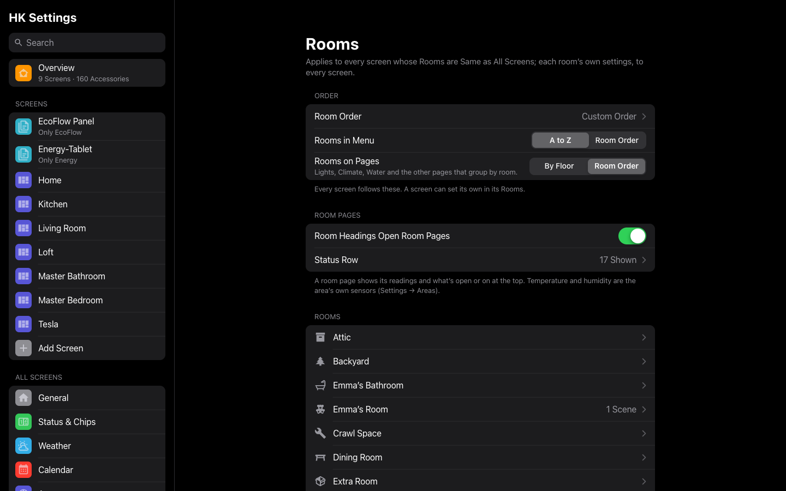
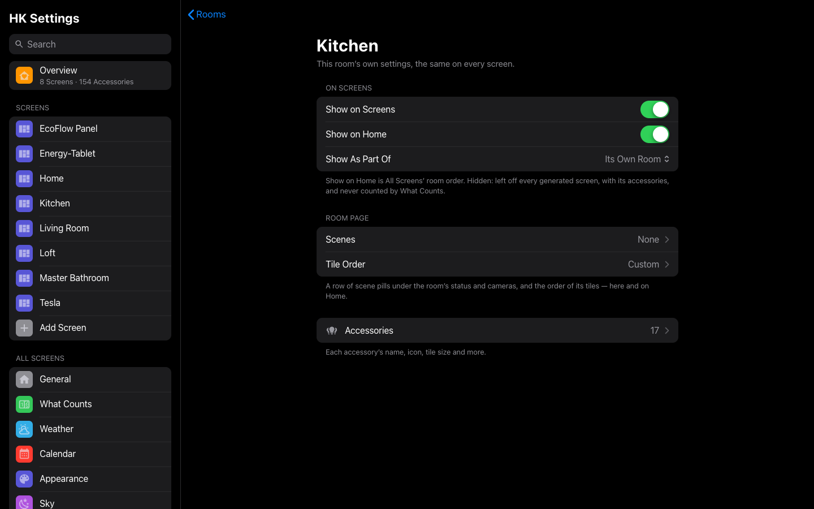
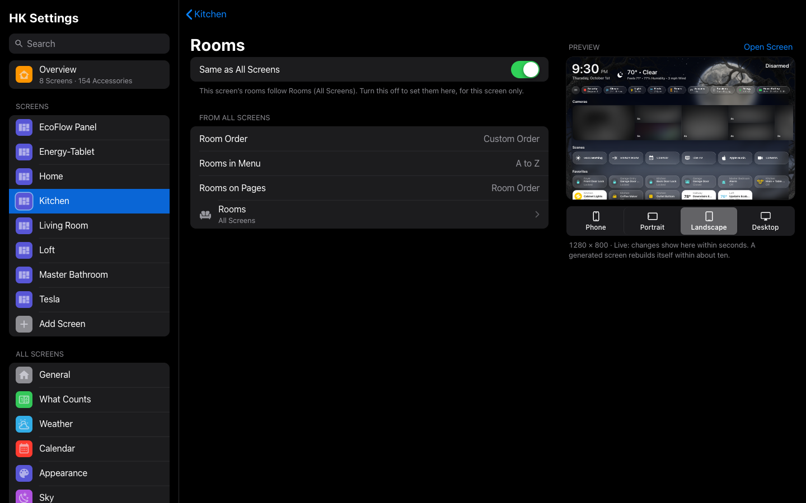

# Rooms

Everything about rooms is in one place: **HK Settings → All Screens → Rooms**.
It holds the room order every screen shares, how the menu and the pages list
rooms, what a room page shows at the top, and a page for each room with that
room’s own settings.

A screen follows these unless you give it rooms of its own (see
[A screen’s rooms](#a-screens-rooms)).

## Rooms settings

**All Screens → Rooms.**

| Setting | Default | What it does |
|---|---|---|
| Room Order | Automatic | Which rooms are on Home, and in what order. **Automatic**: every room with something in it, floor by floor (in your floors’ order), then A to Z. Turn Automatic off, then drag the rooms into the order you want; move a room to **Not on Home** to leave it off Home (it keeps its room page and its row in the menu). |
| Rooms in Menu | A to Z | The menu’s rooms **A to Z**, or in the **Room Order**. |
| Rooms on Pages | By Floor | How Lights, Climate, Water and the other pages that group by room list them: **By Floor** (floor by floor, A to Z) or in the **Room Order**. |
| Room Headings Open Room Pages | On | A room heading on Home gets a › and opens that room’s page, when the screen has one. |
| Status Row | All 12 | What a room page’s status row can show, in this order when there’s something to say: Temperature, Humidity, Outlets, Blinds, Fans, Windows, Doors, Locks, Garage Doors, Motion, Occupancy, Leaks. Temperature and humidity are the area’s own sensors (**Settings → Areas → the area → Related sensors**). |
| Rooms | — | Every room. Tap one for its own settings (below). The note beside a room says when it’s hidden, part of another room, not on Home, or has scenes. |

The order, Rooms in Menu and Rooms on Pages apply to every screen whose Rooms
are **Same as All Screens**. The page says which screens set their own.

## A room’s settings

**All Screens → Rooms → (the room).** These apply on every screen. A room
opens here from the Rooms list, and from any room order: tap a room in All
Screens’ Room Order or in a screen’s own list, and Back returns you there.

| Setting | Default | What it does |
|---|---|---|
| Show on Screens | On | Off: the room is left off every generated screen, with its accessories, and What Counts never counts them. (The same list as **Accessories → Hidden from Screens → Rooms**.) |
| Show on Home | On | Off: the room isn’t on Home. It keeps its room page and its row in the menu. This is the Room Order above, one room at a time; a screen with rooms of its own keeps its own. |
| Show As Part Of | Its Own Room | Another room this one belongs to (a deck in the backyard). Its accessories, scenes and tile order join that room’s on generated screens. |
| Scenes | Automatic | A row of scene pills on the room’s page, under its status row (and its cameras), scrolling sideways like Home’s. **Automatic**: the Home Assistant scenes in the room, A to Z — no row when there are none. Turn Automatic off to choose the room’s own scenes, scripts and buttons, in your order; remove them all for a room with no scenes row. |
| Tile Order | Automatic | The order of the room’s tiles, on Home and on its room page. |
| Accessories | — | The room’s accessories, each with its own settings: name, icon, [tile size](Accessories.md#tile-size) and more. |

**Add Scene or Shortcut…** opens a searchable list; tap **Select** to add
several at once.

## A screen’s rooms

**Screens → (the screen) → Home Page → Rooms.**

| Setting | Default | What it does |
|---|---|---|
| Same as All Screens | On | The screen’s room order, Rooms in Menu and Rooms on Pages are All Screens’. The page shows what they are, with a link to Rooms. |

Turn **Same as All Screens** off to set them for this screen only. They start
as All Screens’ are, then change on their own: the room order (with **On
Home** and **Not on Home**), **Rooms in Menu** and, on a generated screen,
**Rooms on Pages**. Turn it back on to follow All Screens again.

Tap a room in the screen’s list for [its own settings](#a-rooms-settings):
its scenes, tile order, and whether it shows. Those are the room’s, the same
on every screen; what this screen decides is only which rooms are on its Home,
and in what order.

A room’s own settings (its scenes, tile order, whether it shows) are the same
on every screen.

## Coming from 1.4

Before, each screen held its own copy of the room order and the menu’s and
pages’ room settings. On the first start after updating, the room settings
most screens had become All Screens’. Every screen with exactly those, or with
none of its own, now follows All Screens; a screen that differed keeps its own
(its Same as All Screens is off). Nothing on any screen moves.
