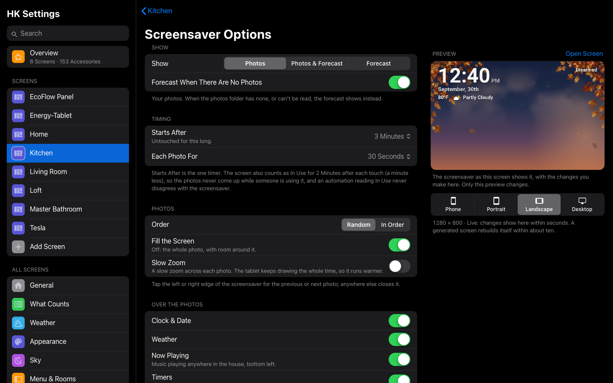

# Screens

A **screen** is a Home Assistant dashboard that HK Frontend draws and keeps
settings for: the dashboard on a wall tablet, on your phone, on your computer,
in your car. This page is what a screen is and how to make one; the pages
under **Screens** in the sidebar take each part in turn.


## Two kinds of screen

| | Generated screen | Your own YAML dashboard |
|---|---|---|
| What it is | A dashboard whose whole configuration is `strategy: type: custom:hk-dashboard` | A dashboard you write yourself, view by view, with HK Frontend’s [cards](Card-Library.md) |
| Where its content comes from | Your floors, areas, devices and entities, read every time it opens: a light you add appears by itself | Your YAML |
| How you shape it | HK Settings: its menu, Home page, pages, appearance and behavior | Your YAML, plus the HK settings its cards read |

Start with a generated screen. You can have as many as you like: one per wall
tablet, one for phones, one for a computer. They all share the
[All Screens](HK-Settings.md#general) settings and the [Library](Accessories.md#accessories-settings),
and each has its own page in HK Settings.

## Make a screen

The usual way is **HK Settings → Screens → Add Screen**:
[Your First Screen](Your-First-Screen.md#make-your-first-screen) walks through
it. What each **Shown On** choice starts with is under
[Add Screen](#add-screen) below. There are two other ways.

### Make a generated dashboard by hand

You can also make one yourself: **Settings → Dashboards → Add dashboard → New
dashboard from scratch**, then in its raw configuration editor:

```yaml
strategy:
  type: custom:hk-dashboard
```

Every option is optional:

```yaml
strategy:
  type: custom:hk-dashboard
  areas: [kitchen, living_room]        # only these areas, in this order
  exclude_areas: [garage]
  exclude_devices: [<device id>]
  exclude_entities: [switch.car_seat_heater]
  include_entities: [scene.movie_night]
  theme: HK Kiosk                      # default: HK Kiosk, when it is loaded
  sky: false                           # no live sky
  music: false                         # no Play Music or Browse Music pages
  chips: false                         # no status chips
  pages: false                         # no Lights, Climate, Doors & Windows, Timers, Vacuums or Water pages
  rooms: false                         # no room pages
```

The lists add to **HK Settings → Accessories → Hidden from Screens** and
**Also Shown**, which apply to every generated screen. Then give the dashboard
its settings as described next.

### Give an existing dashboard HK settings

1. Open **HK Settings → Screens → Add Screen**.
2. Under **Existing Dashboards**, pick the dashboard.
3. Pick what it is **Shown On**.
4. Select **Set Up Screen**.

A YAML dashboard draws its own Home page and pages, so its page in HK Settings
shows only what it can use:

| Setting | Reaches a YAML dashboard through |
|---|---|
| Menu | Every view (see [The menu on your own dashboard](Menu.md#the-menu-on-your-own-dashboard)) |
| Status Chips | `custom:hk-chips-card` |
| Scenes | `custom:hk-scenes-card` (the list you pick replaces the card’s own) |
| Cameras | `custom:hk-camera-mosaic-card` (the cameras you pick replace the card’s own) |
| Rooms (room order) | Room sections in a `custom:hk-grid-view` view: a card whose first card is an `hk-heading-card` with `area:` |
| Glass, Live Sky | Every view. Live Sky can only turn off a sky the YAML turns on. |
| Return to Home, Tablet Room, Allow Pop-ups, Car Browser | The whole dashboard |
| Hide Home Assistant Header & Sidebar | The whole dashboard, unless its YAML has `hk_kiosk:` or `kiosk_mode:` |
| Photo Screensaver, its options and Tablet User | The whole dashboard, with its switch and In Use sensor, unless its YAML has `hk_screensaver:` |

Favorites, the camera strip switch, On Phones, Pages and the now-playing bar
are for generated screens only. A YAML dashboard says those things in its own
YAML: [Your Own Dashboard](Your-Own-Dashboard.md) has everything it can write,
and so does **HK Settings → Advanced → Your Own Dashboards**.

## Add Screen

**Screens → Add Screen.**

**New Screen** makes a new generated dashboard:

| Setting | Default | What it does |
|---|---|---|
| Name | — | Its title in the sidebar. Its address is made from the name (`hk-kitchen` for Kitchen). |
| Shown On | Wall Tablet | The preset it starts from (below). |
| Copy Settings From | Nothing | Another screen to start from: after the preset, the parts you tick are copied from it (see [Copy settings from another screen](#copy-settings-from-another-screen)). |
| Only Admins Can Open It | Off | Only administrators see it in the sidebar. |

**Existing Dashboards** lists your other dashboards. Pick one, choose what it is
**Shown On**, and select **Set Up Screen** to give it HK settings.

What each preset starts with (everything else is the default, and every value
can be changed afterwards; nothing remembers the preset):

| Shown On | Starts with |
|---|---|
| Wall Tablet | Menu Always Open, Time & Weather in Menu, Return to Home When Idle, Home Assistant’s header and sidebar hidden |
| Phone or iPad | Menu as a button (Automatic), the time and weather in the header |
| Computer | Menu Always Open |
| Car | No menu, Car Browser on, Home Assistant’s header and sidebar hidden |
| Something Else | The defaults: a generated screen gets the menu as a button, a YAML one no menu |

Hiding Home Assistant’s header and sidebar and the photo screensaver are part
of HK Frontend: nothing else to install. Setting up a wall tablet end to end: [Wall Tablets](Wall-Tablets.md).

## A screen’s page in HK Settings

**Screens → (a screen).** The settings of one dashboard. A screen written in
YAML (not generated) only shows the settings its cards can read; the rows
marked *generated* are left out for it. The pages under **Screens** in the sidebar explain what
each part of a screen is.

The first line under the title says the screen’s address and whether it is
*Generated from your home* or *Written in YAML*.

**Rename a screen** with the pencil beside its name: type the new name, then
**Save** (or Return); **Cancel** (or Escape) leaves it. It renames the
dashboard itself, so the new name is the one in Home Assistant’s sidebar
too, and the screen’s Photo Screensaver and In Use device takes it. Its
address doesn’t change, so every link, tablet and automation that opens it
keeps working. A dashboard written in YAML is named in its YAML, so it has no
pencil.

Its settings come in groups, each explained on its own page:

| Group | Page |
|---|---|
| Menu | [Menu](Menu.md#menu-settings) |
| Home Page, and its Status Chips, Cameras, Scenes, Favorites and Rooms | [Home Page](Home-Page.md), [Status Chips](Status-Chips.md), [Cameras](Cameras.md) |
| Pages | [Pages](Pages.md#pages-settings) |
| Appearance | [Appearance](Appearance.md#one-screen) |
| Behavior | [below](#behavior) |

### Behavior

| Setting | Default | What it does |
|---|---|---|
| Return to Home When Idle | Off (Wall Tablet preset: on) | A page left untouched goes back to Home. For wall tablets, not for screens people sit at. How long it waits: [Wall Tablets](Screensaver-and-Idle.md#wall-tablets-settings). |
| Tablet Room | Empty | Shown when Return to Home is on (or the screen uses WallPanel). The tablet’s room, in lowercase letters, digits and underscores (`kitchen`, `living_room`). It names Return to Home’s optional helpers (see [Wall Tablets](Screensaver-and-Idle.md#wall-tablets-settings)). HK Frontend’s own screensaver doesn’t need it. |
| Allow Pop-ups | On | Your [pop-ups](Detail-Sheets-and-Popups.md#pop-ups-settings) may open over this screen. Off: never here (a car’s screen, say). |
| Car Browser | Off (Car preset: on) | Fits a car’s narrow browser to a desktop layout. Add `?vw=1000` to the address to change the width it lays out (a bigger number makes everything smaller), or `?vw=off` to turn it off in that browser. |
| Now Playing Bar | Off | *Generated.* A bar that rises from the bottom while music plays or a quick timer runs. Needs the Music feature. |
| Photo Screensaver | Off | *Generated.* A photo screensaver for the tablet’s own user (how it works: [Screensaver and Idle](Screensaver-and-Idle.md#5-add-the-photo-screensaver)). The live sky and the cards hold still behind it. |
| Screensaver Options | Default | *Generated, with Photo Screensaver on.* See below. |
| Tablet User | None | *With Photo Screensaver on.* The Home Assistant user the wall tablet signs in as. Only that user gets the screensaver, so a computer opening the same screen never does. Choosing it adds the screen’s [switch and In Use sensor](Screensaver-and-Idle.md#its-switch-and-in-use-sensor). |

#### Screensaver Options



| Setting | Default | What it does |
|---|---|---|
| Same as All Screens | On | The screensaver settings for All Screens (**Wall Tablets → Screensaver**). Off: this screen has its own, starting from those; every option below is then this screen’s. A screen set up before 1.3 keeps the options it had. |
| Show | Photos | **Photos**: your photos, and the forecast whenever there are none. **Photos & Forecast**: your photos, with the forecast as one of them every few photos. **Forecast**: always the forecast, over the live sky and the season’s landscape ([more](Screensaver-and-Idle.md#no-photos-the-forecast)). With Forecast, the photo settings are hidden. |
| Forecast | Every 5 Photos | *With Photos & Forecast.* How often the forecast comes round: every 3, 5, 10 or 20 photos. It stays for **Each Photo For**, like a photo. |
| Forecast When There Are No Photos | On | *With Show: Photos.* Off: when the folder has no photos (or can’t be read), the screen stays dark instead, as before 1.3. (Photos & Forecast always shows the forecast then.) |
| Forecast Details (Show group) | On | *Wherever the forecast can show.* On the forecast: today, the next hours and the coming days along the bottom. Off: the sky and the landscape alone. |
| Forecast Details (Over the Photos) | Off | *With Photos or Photos & Forecast.* The same details along the bottom of the photos. |
| Starts After | 3 Minutes | 1 to 30 minutes untouched. **The one timer:** the screen’s In Use sensor stays on for a minute less after each touch, so it is always off before the photos come up ([more](Screensaver-and-Idle.md#one-timer-starts-after)). |
| Each Photo For | 30 Seconds | 10 seconds to 5 minutes. |
| Order | Random | **Random** (every photo once before any repeats) or **In Order** (by name). |
| Fill the Screen | On | A landscape photo fills the screen. Off: the whole photo, with room around it. A portrait photo is always whole, over a blurred copy. |
| Slow Zoom | Off | A slow zoom across each photo. The tablet keeps drawing the whole time, so it runs warmer. |
| Over the Photos → Clock & Date, Weather, Now Playing, Timers, Home Status | On | What shows over the photos: the clock and date and the weather top left, what’s playing anywhere in the house bottom left, running timers bottom right, and the home’s status top right (Home Secured, or what’s open or unlocked). |
| Calendar Pane | Off | The coming events down the right of the screen, from the calendars in [All Screens → Calendar](Calendar.md): the photos (or the forecast) move over beside it; Home Status moves to its top, and Now Playing and Timers to its foot. A swipe on it scrolls it; a touch anywhere else closes the screensaver ([more](Screensaver-and-Idle.md#the-calendar-pane)). |
| Days | Today & Tomorrow | *With Calendar Pane.* How many days it lists: today, today and tomorrow, or up to 7 days. |
| For Automations → Photo Screensaver, In Use | — | The screen’s `switch.<screen>_photo_screensaver` and `binary_sensor.<screen>_screen_in_use`, made by HK Frontend once the screen has a Tablet User. Tap one to open it. What they do: [Screensaver and Idle](Screensaver-and-Idle.md#its-switch-and-in-use-sensor). |
| Use the Defaults… | — | Shown once anything is changed. |
| Use WallPanel Instead | Off | Shown when [WallPanel](https://github.com/j-a-n/lovelace-wallpanel) is installed from HACS: it draws this screen’s screensaver instead, with its own options page (and Options in YAML). |

The photos come from [Wall Tablets → Screensaver Photos](Screensaver-and-Idle.md#wall-tablets-settings).

### Copy settings from another screen

A screen’s page ends with **Copy Settings From…**: pick another screen, tick
what to copy, and select **Copy**. Only this screen changes.

| Part | Ticked | What it copies |
|---|---|---|
| Menu | Yes | Whether it has a menu (a button, or always open), its Menu Settings (Same as All Screens, or its own: the highlight, the button or edge tab and its size and position, and the rest), and a YAML screen’s pages in it |
| Home Page | Yes | Whether it has a Home page, the status chips and their order |
| Rooms | Yes | Same as All Screens, or its own room order, Rooms in Menu and Rooms on Pages |
| Cameras | Yes | The camera strip and which cameras, and the live camera |
| Scenes | No | The scenes row and its pills |
| Favorites | No | The favorites |
| Pages | Yes | Which pages and custom pages, in their order |
| Appearance | Yes | Glass, frost, blur, live sky |
| Behavior | Yes | Return to Home, pop-ups, car browser, kiosk, the now-playing bar |
| Screensaver | Yes | Photo Screensaver, its options (or Same as All Screens), WallPanel instead |

A screen’s **Tablet User** and **Tablet Room** are never copied: they belong
to its own tablet. **Add Screen → Copy Settings From** does the same for a
new screen.

### Removing a screen’s settings

| Button | Shown for | What it does |
|---|---|---|
| Delete Screen… | A generated screen | Deletes the dashboard and its settings. A tablet showing it will need another screen. |
| Remove HK Settings… | A YAML screen | The dashboard stays. Its menu, Home page, pages and appearance go back to the defaults. |

A dashboard with no HK settings has no menu and uses the defaults for
everything else. Its page offers **Set Up This Screen**.
