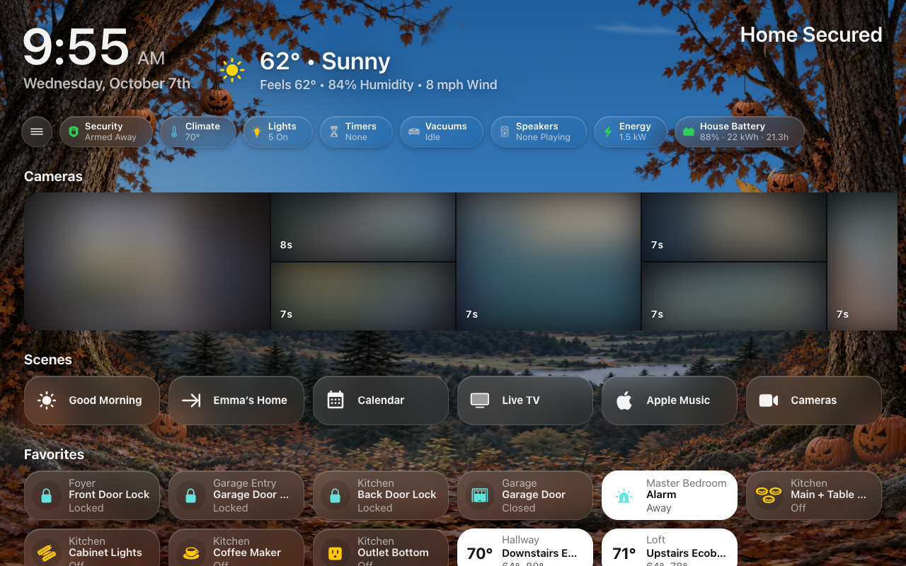

# Screens

A **screen** is a Home Assistant dashboard that HK Frontend draws and keeps
settings for: the dashboard on a wall tablet, on your phone, on your computer,
in your car. This page is what a screen is and how to make one; the pages
under **Screens** in the sidebar take each part in turn.



## Two kinds of screen

| | Generated screen | Your own YAML dashboard |
|---|---|---|
| What it is | A dashboard whose whole configuration is `strategy: type: custom:hk-dashboard` | A dashboard you write yourself, view by view, with HK Frontend’s [cards](Card-Library.md) |
| Where its content comes from | Your floors, areas, devices and entities, read every time it opens: a light you add appears by itself | Your YAML |
| How you shape it | HK Settings: its menu, Home page, pages, appearance and behavior | Your YAML, plus the HK settings its cards read |

Start with a generated screen. You can have as many as you like: one per wall
tablet, one for phones, one for a computer. They all share the
[All Screens](HK-Settings.md#general) settings and the [Library](Accessories.md#accessories-settings),
and each has its own page in HK Settings.

## Make a screen

The usual way is **HK Settings → Screens → Add Screen**:
[Your First Screen](Your-First-Screen.md#make-your-first-screen) walks through
it. What each **Shown On** choice starts with is under
[Add Screen](#add-screen) below. There are two other ways.

### Make a generated dashboard by hand

You can also make one yourself: **Settings → Dashboards → Add dashboard → New
dashboard from scratch**, then in its raw configuration editor:

```yaml
strategy:
  type: custom:hk-dashboard
```

Every option is optional:

```yaml
strategy:
  type: custom:hk-dashboard
  areas: [kitchen, living_room]        # only these areas, in this order
  exclude_areas: [garage]
  exclude_devices: [<device id>]
  exclude_entities: [switch.car_seat_heater]
  include_entities: [scene.movie_night]
  theme: HK Kiosk                      # default: HK Kiosk, when it is loaded
  sky: false                           # no live sky
  music: false                         # no Play Music or Browse Music pages
  chips: false                         # no status chips
  pages: false                         # no Lights, Climate, Doors & Windows, Timers, Vacuums or Water pages
  rooms: false                         # no room pages
```

The lists add to **HK Settings → Accessories → Hidden from Screens** and
**Also Shown**, which apply to every generated screen. Then give the dashboard
its settings as described next.

### Give an existing dashboard HK settings

1. Open **HK Settings → Screens → Add Screen**.
2. Under **Existing Dashboards**, pick the dashboard.
3. Pick what it is **Shown On**.
4. Select **Set Up Screen**.

A YAML dashboard draws its own Home page and pages, so its page in HK Settings
shows only what it can use:

| Setting | Reaches a YAML dashboard through |
|---|---|
| Menu | Every view (see [The menu on your own dashboard](Menu.md#the-menu-on-your-own-dashboard)) |
| Status Chips | `custom:hk-chips-card` |
| Scenes | `custom:hk-scenes-card` (the list you pick replaces the card’s own) |
| Cameras | `custom:hk-camera-mosaic-card` (the cameras you pick replace the card’s own) |
| Rooms (room order) | Room sections in a `custom:hk-grid-view` view: a card whose first card is an `hk-heading-card` with `area:` |
| Glass, Live Sky | Every view. Live Sky can only turn off a sky the YAML turns on. |
| Return to Home, Tablet Room, Allow Pop-ups, Car Browser | The whole dashboard |

Favorites, the camera strip switch, On Phones, Pages, hiding Home Assistant’s
header, the now-playing bar and the photo screensaver are for generated
screens only. A YAML dashboard says those things in its own YAML.

## Add Screen

**Screens → Add Screen.**

**New Screen** makes a new generated dashboard:

| Setting | Default | What it does |
|---|---|---|
| Name | — | Its title in the sidebar. Its address is made from the name (`hk-kitchen` for Kitchen). |
| Shown On | Wall Tablet | The preset it starts from (below). |
| Only Admins Can Open It | Off | Only administrators see it in the sidebar. |

**Existing Dashboards** lists your other dashboards. Pick one, choose what it is
**Shown On**, and select **Set Up Screen** to give it HK settings.

What each preset starts with (everything else is the default, and every value
can be changed afterwards; nothing remembers the preset):

| Shown On | Starts with |
|---|---|
| Wall Tablet | Menu Always Open, Time & Weather in Menu, Return to Home When Idle, Home Assistant’s header and sidebar hidden |
| Phone or iPad | Menu as a button (Automatic), the time and weather in the header |
| Computer | Menu Always Open |
| Car | No menu, Car Browser on, Home Assistant’s header and sidebar hidden |
| Something Else | The defaults: a generated screen gets the menu as a button, a YAML one no menu |

Hiding Home Assistant’s header and sidebar needs **Kiosk Mode** from HACS, and a
photo screensaver needs **WallPanel**. **Setup Check** says whether each is
installed. Setting up a wall tablet end to end: [Wall Tablets](Wall-Tablets.md).

## A screen’s page in HK Settings

**Screens → (a screen).** The settings of one dashboard. A screen written in
YAML (not generated) only shows the settings its cards can read; the rows
marked *generated* are left out for it. The pages under **Screens** in the sidebar explain what
each part of a screen is.

The first line under the title says the screen’s address and whether it is
*Generated from your home* or *Written in YAML*.

Its settings come in groups, each explained on its own page:

| Group | Page |
|---|---|
| Menu | [Menu](Menu.md#menu-settings) |
| Home Page, and its Status Chips, Cameras, Scenes, Favorites and Rooms | [Home Page](Home-Page.md), [Status Chips](Status-Chips.md), [Cameras](Cameras.md) |
| Pages | [Pages](Pages.md#pages-settings) |
| Appearance | [Appearance](Appearance.md#one-screen) |
| Behavior | [below](#behavior) |

### Behavior

| Setting | Default | What it does |
|---|---|---|
| Return to Home When Idle | Off (Wall Tablet preset: on) | A page left untouched goes back to Home. For wall tablets, not for screens people sit at. How long it waits: [Wall Tablets](Screensaver-and-Idle.md#wall-tablets-settings). |
| Tablet Room | Empty | Shown when Return to Home or Photo Screensaver is on. The tablet’s room, in lowercase letters, digits and underscores (`kitchen`, `living_room`). It names the tablet’s optional helpers (see [Wall Tablets](Screensaver-and-Idle.md#wall-tablets-settings)). |
| Allow Pop-ups | On | Your [pop-ups](Detail-Sheets-and-Popups.md#pop-ups-settings) may open over this screen. Off: never here (a car’s screen, say). |
| Car Browser | Off (Car preset: on) | Fits a car’s narrow browser to a desktop layout. Add `?vw=1000` to the address to change the width it lays out (a bigger number makes everything smaller), or `?vw=off` to turn it off in that browser. |
| Now Playing Bar | Off | *Generated.* A bar that rises from the bottom while music plays or a quick timer runs. Needs the Music feature. |
| Photo Screensaver | Off | *Generated.* A photo screensaver for the tablet’s own user. Needs WallPanel from HACS. The live sky pauses behind it. |
| Screensaver Options | Default | *Generated, with Photo Screensaver on.* See below. |
| Tablet User | None | *With Photo Screensaver on.* The Home Assistant user the wall tablet signs in as. Only that user gets the screensaver, so a computer opening the same screen never does. |

**Screensaver Options**

| Setting | Default | What it does |
|---|---|---|
| Starts After | 3 Minutes | 1 to 30 minutes untouched. |
| Each Photo For | 30 Seconds | 10 seconds to 5 minutes. |
| Order | Random | **Random** or **In Order**. |
| Slow Zoom | On | A slow zoom across each photo. |
| Fill the Screen | On | Off: the whole photo, with room around it. |
| Options in YAML | None | Any other [WallPanel](https://github.com/j-a-n/lovelace-wallpanel) option. Only what you write changes, key by key. Changing `enabled`, `profiles` or `screensaver_entity` unhooks it from the tablet’s user and the sky. |
| Use the Tuned Setup… | — | Shown once anything is changed. Clears every change. |

The photos come from [Wall Tablets → Photos](Screensaver-and-Idle.md#wall-tablets-settings). The time, the
weather, what’s playing and running timers show over them.

### Removing a screen’s settings

| Button | Shown for | What it does |
|---|---|---|
| Delete Screen… | A generated screen | Deletes the dashboard and its settings. A tablet showing it will need another screen. |
| Remove HK Settings… | A YAML screen | The dashboard stays. Its menu, Home page, pages and appearance go back to the defaults. |

A dashboard with no HK settings has no menu and uses the defaults for
everything else. Its page offers **Set Up This Screen**.
