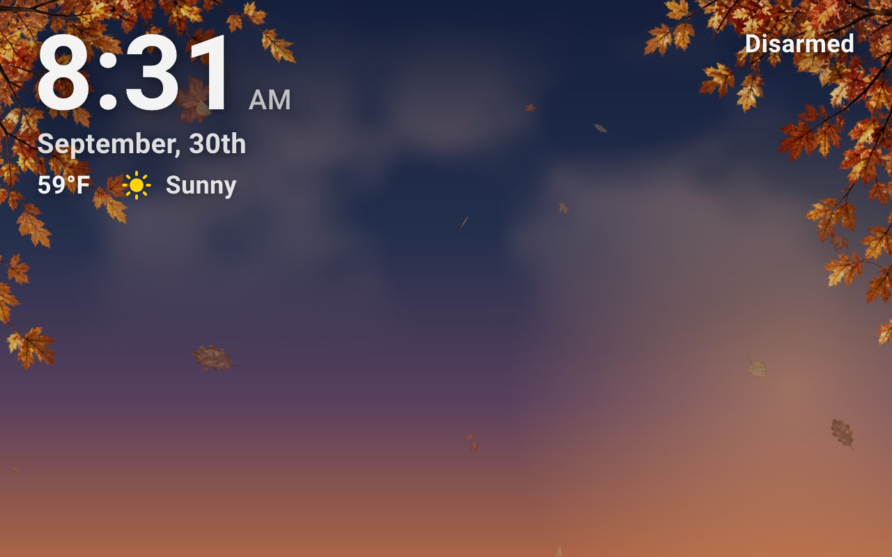
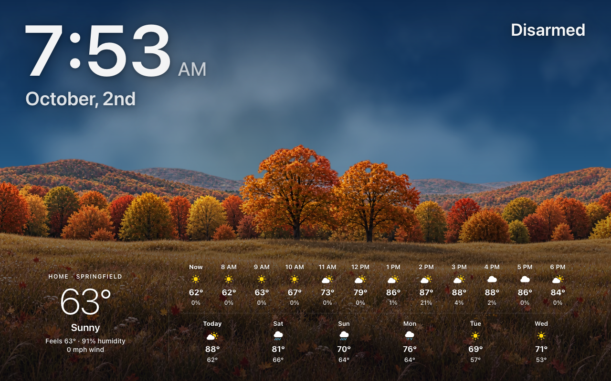
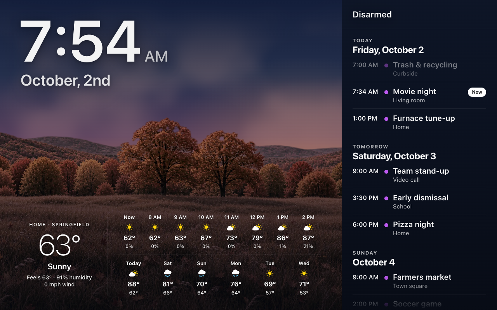

# Screensaver and Idle

The last two steps of setting up a [wall tablet](Wall-Tablets.md), and what
keeps a tablet awake.

## 5. Add the photo screensaver

The screensaver shows your photos with the time, the weather, what is playing,
any running timers and the home’s status over them. It is part of HK Frontend
(nothing to install), and it runs only for the tablet’s user.



*(The picture behind the clock is HK Frontend’s own fall sky, standing in for
one of your photos.)*

1. Put some photos in a folder of Home Assistant’s media, and tell HK
   Frontend where: **HK Settings → Wall Tablets → Screensaver Photos**. The
   default, `media-source://media_source/local/photos`, is a `photos` folder in
   your local media. Folders inside it are shown too.
2. Open the screen in HK Settings. Under **Behavior**, turn on **Photo
   Screensaver** and choose the **Tablet User**.
3. Optional: **Screensaver Options** (see [the settings](Screens.md#screensaver-options)). A
   screen uses the settings for All Screens (**Wall Tablets → Screensaver**)
   unless you turn off **Same as All Screens** and give it its own.


On this page the preview beside the settings shows the screensaver itself, as
that screen shows it, and changes as you change the options. Only the preview
changes: the tablet, its switch and its photos are left alone.

**Setup Check** counts the photos it finds, and says so when the folder is
empty or can’t be read.

### How it behaves

- It starts once the screen has been left alone for **Starts After** (3
  minutes). It never starts over an open detail sheet or while Live TV is
  playing.
- The photos cross-fade every **Each Photo For** (30 seconds). In **Random**
  order every photo is shown once before any is repeated.
- A portrait photo is shown whole, over a blurred copy of itself; a landscape
  photo fills the screen (**Fill the Screen**).
- Over the photos: the clock and date, the weather, what is playing, running
  timers, and **Home Status** top right (“Home Secured” when the alarm is set
  and everything is shut and locked; otherwise what is open or unlocked;
  nothing when there is nothing to say). Each can be turned off under **Over
  the Photos**.
- **Tap the left or right edge** for the previous or next photo. **A tap
  anywhere else closes it**, and that tap never presses anything on the
  screen behind; taps are ignored for 3 seconds after, so a second tap cannot
  either.
- Behind the photos the live sky, every animation and the live camera tile
  hold still, so the tablet does very little while it shows.

### No photos? The forecast

Without photos (none in the folder yet, or a folder that can’t be read), the
screensaver shows the **forecast** instead, and you can choose it outright:
**Screensaver Options → Show → Forecast**. Rather have a dark screen when
there are no photos? Turn off **Forecast When There Are No Photos**. Or have
both: **Show → Photos & Forecast** brings the forecast round as one of the
photos every few photos (**Forecast**: every 3, 5, 10 or 20), for as long as a
photo shows; its sky only moves while it is on screen.



- The live sky fills the screen, the same one the pages draw, following the
  real sun, clouds, rain and snow, over a landscape of the season: spring,
  summer, fall or winter, by day, at dusk and by night. It is one valley
  through the year, so the light changes around you rather than the place. Falling rain and
  snow pass in front of the hills. South of the equator the seasons are
  flipped, and snow falling makes it winter.
- It moves a little more than the pages’ sky: the clouds drift twice as
  fast, the brighter stars twinkle, a clear night brings a shooting star now
  and then (one every minute or two), and on a summer night fireflies
  blink over the meadow. The moon keeps to the right, clear of the clock.
- On the holidays the landscape dresses up, on the same days as the
  [seasonal decorations](Seasonal-Decorations.md#on-the-forecast-screensaver):
  jack-o’-lanterns at Halloween, lit trees and a snowman at Christmas,
  bunting and fireworks on the Fourth of July, and balloons on a birthday.
- Along the bottom, the forecast details: today’s conditions, the next 12
  hours and the next 6 days, from the weather set in **HK Settings →
  Weather**. **Forecast Details** turns them off, for the sky and the
  landscape alone; **Over the Photos → Forecast Details** puts them over your
  photos too.
- The clock and date, Home Status, now playing and timers stay, the last two
  above the forecast.
- While the screen is dark (Fully Kiosk Browser’s own screensaver, or the
  screen off) the sky holds still. Fully Kiosk is asked through its JavaScript
  interface (**Advanced Web Settings → Enable JavaScript Interface**); without it,
  the sky holds still only when the browser reports the page as hidden.
- A tap anywhere closes it. There are no photos to page through.

### The calendar pane



**Screensaver Options → Calendar Pane** lists the coming events down the
right of the screen: today, tomorrow and as many days after as **Days** says
(up to 7), from the calendars in [All Screens → Calendar](Calendar.md), each in
its calendar’s colour. All-day events come first; today’s past events are
dimmed, and the next one says how soon (“in 46 min”).

- The photos move over beside it, so the middle of each photo stays in view;
  behind the pane is a blurred copy of the photo. On the forecast the pane
  turns the night sky’s navy, and the forecast fits beside it: today on the
  left, the hours and the days beside it, as on the other screens.
- The pane is one column of what is going on: Home Status at its top (on as
  many lines as it needs, the list starting below it), the events, and at its
  foot what is playing and the running timers. The clock, the date and the
  weather stay over the photos.
- **A swipe on the pane scrolls it** without closing the screensaver, the one
  place a finger doesn’t. A touch anywhere else closes it, as always. Left
  alone for 45 seconds, the pane scrolls back to today.

### Its switch and In Use sensor

You create nothing. As soon as a screen has **Photo Screensaver** on and a
**Tablet User**, HK Frontend adds two entities for it, named after the screen
(a screen called Kitchen gets these):

| Entity | What it is |
|---|---|
| `switch.kitchen_photo_screensaver` | **On while the photos show.** The screensaver turns it on when it starts and off when someone taps it. Turn it **on** to start the photos now (bedtime, say); turn it **off** to close them (a doorbell automation bringing the dashboard back). It keeps its state across restarts. |
| `binary_sensor.kitchen_screen_in_use` | **On while someone is using the screen**: on at each touch, off once the screen has been left alone for its window (below). Only a real touch on the page counts. Nothing sent to the tablet from outside (a brightness change, a kiosk browser command) can turn it on. |

Both carry the same attributes: `dashboard`, `starts_after` and
`in_use_window` (seconds), and `last_touch` (when the screen was last touched).
Each screen’s pair is a device of its own, under the screen’s item in
**Settings → Devices & services → HK Frontend**. Renaming the screen renames
the device and the entities’ names; their entity ids stay as they are, so
automations keep working. The screen’s **Screensaver Options** page lists both under **For
Automations**. Tap one there to open it.

Only the tablet’s own user ever changes them: a computer opening the same
screen never gets a screensaver, never writes the switch, and never counts as
a touch.

### One timer: Starts After

**Starts After** is the only number to set. It decides when the photos come
up, and the In Use window follows it: a **minute less** (never under 15
seconds). With the default 3 minutes:

- a touch keeps the screen **In Use for 2 minutes**;
- the photos come up after **3 minutes** untouched.

So the screen has always stopped counting as In Use a minute before the
photos can start. An automation that waits for In Use to go off before doing
something (dimming the screen, say) can never race the screensaver. Change
Starts After and the window moves with it; there is no second timer to keep
in step.

### Automations

Two examples, for a screen called Kitchen.

Photos at bedtime, whether or not anyone touched the tablet:

```yaml
triggers:
  - trigger: time
    at: "22:30:00"
actions:
  - action: switch.turn_on
    target:
      entity_id: switch.kitchen_photo_screensaver
```

The dashboard back when the doorbell rings (with an
[answer pop-up](Detail-Sheets-and-Popups.md), the pop-up then shows over it):

```yaml
triggers:
  - trigger: state
    entity_id: binary_sensor.front_door_doorbell
    to: "on"
actions:
  - action: switch.turn_off
    target:
      entity_id: switch.kitchen_photo_screensaver
```

The screen off once the photos have shown for an hour, but never while
someone is using it (this example uses [Fully Kiosk Browser](https://www.home-assistant.io/integrations/fully_kiosk/)’s
screen switch; use whatever turns your tablet’s screen off):

```yaml
triggers:
  - trigger: state
    entity_id: switch.kitchen_photo_screensaver
    to: "on"
    for: "01:00:00"
conditions:
  - condition: state
    entity_id: binary_sensor.kitchen_screen_in_use
    state: "off"
actions:
  - action: switch.turn_off
    target:
      entity_id: switch.kitchen_tablet_screen
```

### Coming from 1.2 (the old helper)

Before 1.3 the switch was a Toggle helper you created,
`input_boolean.wallpanel_screensaver_<room>`, named by the screen’s **Tablet
Room**. If you have one, nothing breaks: while it exists HK Frontend keeps it
and the new switch in step both ways, so your automations keep working. Move
them to `switch.<screen>_photo_screensaver` when it suits you, then delete the
helper. The Tablet Room is no longer needed for the screensaver.

### HK Frontend’s screensaver or WallPanel?

[WallPanel](https://github.com/j-a-n/lovelace-wallpanel) is a popular,
long-standing screensaver for any Home Assistant dashboard, with a great many
options. HK Frontend’s own is narrower on purpose: it is built for HK Frontend’s
screens on a wall tablet, and set up in HK Settings rather than in YAML. Both
work, and you can choose per screen.

| | HK Frontend’s screensaver | WallPanel |
|---|---|---|
| Install | Part of HK Frontend | From HACS, then YAML in each dashboard |
| Set up | HK Settings: Photo Screensaver, Tablet User, Screensaver Options | `wallpanel:` in the dashboard’s raw configuration |
| Who gets it | Only the screen’s Tablet User | Everyone who opens the dashboard, unless a profile turns it off (per user, or per browser with Browser Mod) |
| Its switch | `switch.<screen>_photo_screensaver`, made for you | An `input_boolean` you create (`screensaver_entity`) |
| “Someone is using it” | `binary_sensor.<screen>_screen_in_use`, made for you, with its window set by Starts After | No sensor for touches (a camera motion sensor, below) |
| Photos | Images from a Home Assistant media folder | Images and videos from a media folder, Immich, Unsplash, entity pictures, or whole websites |
| Without photos | The forecast, over the live sky and a landscape of the season (or a dark screen, if you prefer) | Nothing to show until a media source has images |
| The forecast among the photos | Photos & Forecast: the full forecast every few photos | A weather card over the photos, or a weather web page among them |
| Over the photos | Clock and date, weather, now playing, timers, Home Status, drawn to match the screens | Any cards, badges or dashboard views; the box can move around; EXIF photo details, a progress bar |
| Effects | Cross-fade; Slow Zoom | Cross-fade; Ken Burns (pan and zoom), with more controls |
| While it shows | The live sky, card animations and the live camera tile hold still | Its own slideshow |
| Won’t start over | An open detail sheet, Live TV | An Assist dialog; optionally a Browser Mod pop-up |
| Beyond the screensaver | Hide Home Assistant Header & Sidebar, a setting beside it | Hides the header and sidebar, full screen, keeps the screen on, wakes on motion seen by the tablet’s camera |
| Checked by | Setup Check (photos found, Tablet User) | — |

**Choose HK Frontend’s screensaver** for a screen on a wall tablet
when you want it working with two settings, a switch and an In Use sensor that
exist without creating anything, the forecast when you have no photos, and the
least work for the tablet behind the photos.

**Choose WallPanel** if you want videos, Immich or Unsplash, a website as the
screensaver, your own cards over the photos, the tablet’s camera to wake it,
or a screensaver that isn’t tied to one tablet user.

### WallPanel instead

If you prefer [WallPanel](https://github.com/j-a-n/lovelace-wallpanel) (HACS)
and have it installed, on a generated screen **Screensaver Options → Use
WallPanel Instead** hands this screen’s
screensaver to it, with WallPanel’s own options. A screen using WallPanel gets
no switch or In Use sensor from HK Frontend: WallPanel reports through
`input_boolean.wallpanel_screensaver_<room>`, which you create, named by the
screen’s **Tablet Room**.

### On a dashboard of your own

An existing dashboard gets the photo screensaver like any screen: give it HK
settings (**Screens → Add Screen → Existing Dashboards**), then turn on
**Photo Screensaver** and choose its **Tablet User**. Its options, the
forecast, and its switch and In Use sensor are all as above, with nothing
written in its YAML.

Or write an `hk_screensaver:` block in the dashboard’s configuration; it then
wins over those settings. There is no switch made for you this way: `entity`
is optional, and can be any `input_boolean` or `switch` of yours, which the
screensaver then keeps in step the same way.

```yaml
hk_screensaver:
  user: Kitchen Tablet   # the tablet’s Home Assistant user
  entity: input_boolean.kitchen_photos   # optional: yours, kept in step
  photos: media-source://media_source/local/photos
  starts_after: 180
  each_photo: 30
  order: random        # or sorted
  fill: true
  zoom: false
  show: photos         # photos, both (Photos & Forecast) or forecast
  forecast_every: 5    # both: the forecast after this many photos
  fallback: true       # no photos: the forecast (false: a dark screen)
  band: true           # the forecast’s details on the forecast
  band_photos: false   # ...and over the photos
  calendar: false      # the calendar pane, down the right
  calendar_days: 2     # ...today and tomorrow (1 to 7 days)
  cards:
    - type: custom:hk-clock-card
    - type: custom:hk-weather-strip-card
      variant: inline
    - type: custom:hk-screensaver-now-card
      music: true
    - type: custom:hk-timer-strip-card
      entity: sensor.running_quick_timers
      fixed: true
    - type: custom:hk-screensaver-status-card
```

Everything a dashboard of your own can use is on
[Your Own Dashboard](Your-Own-Dashboard.md).

`?hk_saver=off` on a screen’s address turns the screensaver off for that one
page (a tablet you are working on, say).

## 6. Return to Home when idle

With **Return to Home When Idle** on (the screen’s **Behavior**), a page that
nobody has touched goes back to the screen’s first view: open Lights, walk
away, and the tablet is back on Home 50 seconds later. Scrolling or tapping
starts the count again.

It waits while:

- a detail sheet is open;
- a Live TV channel is playing;
- the tablet’s optional `binary_sensor.<room>_tablet_in_use` is on (below).

Turn it on for wall tablets only. On a desk, a phone or a car, a page someone
is reading should stay put.

**Finer control, per tablet (optional).** Set the screen’s **Tablet Room**
(lower-case letters, digits and underscores, like `living_room`), then create
any of these helpers for that room:

| Helper | What it does |
|---|---|
| `input_select.<room>_tablet_idle_return` | How long to wait. Its options must be exactly: `Quick 30s`, `Normal 50s`, `Relaxed 2 min (may return behind screensaver)`, `Never`, `Auto (10s before Room Idle)`. |
| `input_number.<room>_tablet_room_idle` | Seconds, for `Auto`: the page returns 10 seconds before this (never sooner than 10 seconds). |
| `binary_sensor.<room>_tablet_in_use` | While it is on, someone is using the tablet: the page stays, and is asked about again every 15 seconds. You build this one, from whatever tells you the tablet is being read. |

Without a room, or without the helpers, the wait is 50 seconds. **HK Settings
→ Wall Tablets → Default Idle Time** picks an `input_number` (or `number`)
for `Auto` to use when a room has no `_tablet_room_idle` of its own; with
none, `Auto` counts from 60 seconds.

## What keeps a tablet awake

HK Frontend never turns a screen off, so nothing in it has to be kept from
doing so. What it does is give the automations that sleep and wake your
tablets something to read:

| Entity | Use it to |
|---|---|
| `sensor.tv_viewers` (Live TV) | Keep a tablet on while it is showing a channel. The state is how many screens are watching; `users` names their signed-in users. |
| `switch.<screen>_photo_screensaver` | Know when the photo screensaver is showing, and start or stop it (made for you; see step 5). |
| `binary_sensor.<screen>_screen_in_use` | Know someone is using the screen: a real touch within its window (made for you; see step 5). |
| `binary_sensor.<room>_tablet_in_use` | Return to Home’s own optional signal (you create it; see step 6). |

For example, in the automation that turns the kitchen tablet’s screen off, a
condition that holds off while that tablet plays TV:

```yaml
conditions:
  - "{{ 'Kitchen Tablet' not in (state_attr('sensor.tv_viewers', 'users') or []) }}"
```

## When you change something

Everything HK Frontend serves is sent with `no-cache`, so a tablet picks up a
new version on its next load. The first load after an update can still come
from the browser’s own copy, so **reload twice** before deciding something
did not change. **Load start URL** on the tablet’s Fully Kiosk device reloads
it from Home Assistant. Settings you change in HK Settings reach open screens
by themselves, with no reload.

More help: [Troubleshooting](Troubleshooting.md).

## Wall Tablets settings

**All Screens → Wall Tablets.** Settings for every wall tablet. Each tablet’s
own switches (Return to Home, Tablet Room, Photo Screensaver) are on its
[screen](Screens.md#behavior). More about wall tablets: [Wall tablets](Wall-Tablets.md).

| Setting | Default | What it does |
|---|---|---|
| Default Idle Time | 60 Seconds | An input number or number entity: the room idle time for a tablet whose room has no `input_number.<room>_tablet_room_idle` of its own. Used only when the tablet’s return is set to `Auto` (below). |
| Photos | `media-source://media_source/local/photos` | The media folder a generated wall tablet’s photo screensaver shows. |
| Screensaver | Photos · 3 min | The screensaver options every screen uses unless it has its own (a screen’s **Screensaver Options → Same as All Screens**): the same options as a screen’s page, with a preview of the first screen that uses them, and which screens do. |
| Wall Tablets | — | Every screen with Return to Home or Photo Screensaver on, with its room. |

**How long Return to Home waits.** Without a Tablet Room, or without the
helpers below, a page goes back to Home after 50 seconds untouched. With a
Tablet Room, these optional helpers of yours are read when they exist:

| Helper | What it does |
|---|---|
| `input_select.<room>_tablet_idle_return` | Options `Quick 30s`, `Normal 50s`, `Relaxed 2 min (may return behind screensaver)`, `Never`, and `Auto (10s before Room Idle)`. |
| `input_number.<room>_tablet_room_idle` | Seconds, for `Auto`: the page returns 10 seconds before this (at least 10 seconds). Without it, Default Idle Time is used. |
| `binary_sensor.<room>_tablet_in_use` | While it is on, someone is reading the page: don’t return yet. |
