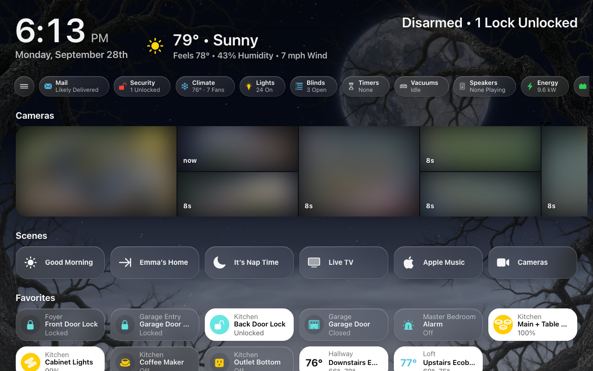
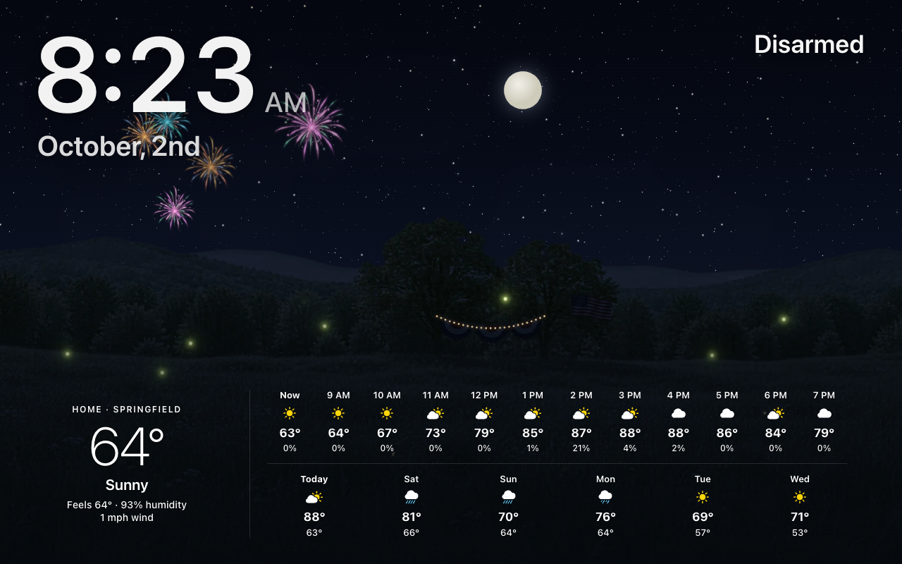
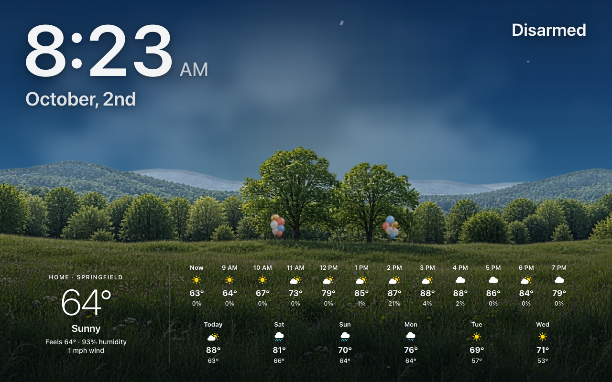
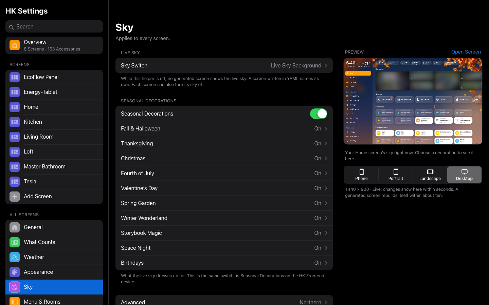
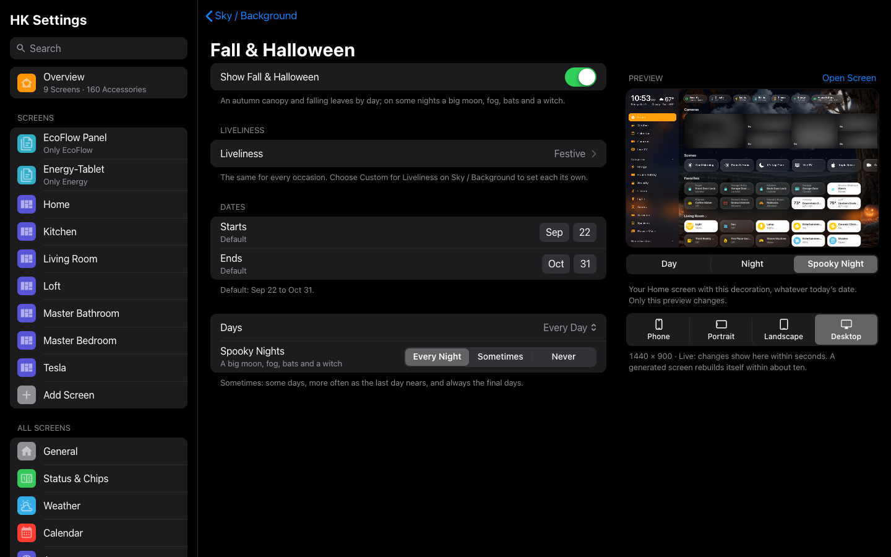

# Seasonal Decorations

On some days the sky dresses up: falling leaves in the fall, a haunted night
near Halloween, a cozy window at Christmas, and a handful of surprises through
the year.

Decorations are photographs laid over the live sky, and they never
change your lights or anything else in the house.

**Turning them all off:** the **Seasonal decorations** switch,
`switch.hk_frontend_seasonal_decorations`, on the HK Frontend device. The same
switch is **HK Settings → All Screens → Sky → Seasonal Decorations**, and an
automation can flip it like any switch.

**Turning one off:** HK Settings → Sky → the decoration → **Show**.

## The seasons

Each season has a window of dates. Inside it, the sky decorates **Sometimes**
by default: a roll of the dice each day, with the odds rising as the last day
nears, and always on the final days. You can change that to **Every Day** or
**Only the Last Days** (just the always-on days in the table below). With
dates of your own, the odds rise across your window instead.

| Season | Default dates | What it shows | Always on (with the default dates) |
|---|---|---|---|
| Fall & Halloween | Sep 22 – Oct 31 | An autumn canopy and tumbling leaves by day. On spooky nights: a big moon, fog, bare branches, bats, a cobweb and a witch crossing the moon. | Oct 28 – 31, spooky nights included |
| Thanksgiving | Nov 1 – Thanksgiving Day | The autumn canopy with heavier falling leaves. | The day before Thanksgiving, and the day |
| Christmas | Dec 7 – Dec 25 | Pine, ornaments and stockings along the top and sides, twinkling lights, drifting snow and a rare sleigh. | Dec 22 – 25 |

**Spooky nights** roll separately from the leaves, and more rarely: leaves are
the ambience, and a witch crossing the moon should be something you catch.
Under Fall & Halloween, **Spooky Nights** is **Sometimes**, **Every Night** or
**Never** (leaves only). A night is once the sun is more than 4° below the
horizon.

Thanksgiving Day is the fourth Thursday of November. Christmas starts on
December 7 rather than right after Thanksgiving, so the decoration stays a
treat rather than a month of wallpaper.

## The surprises

| Surprise | When | What it shows |
|---|---|---|
| Birthdays | On each birthday you add | Balloons and confetti. |
| Fourth of July | Every day, Jun 28 – Jul 4 | Bunting and sparkles, with a firework at night. |
| Valentine’s Day | Every day, Feb 8 – Feb 14 | Hearts and falling heart petals. |
| Spring Garden | Some days, Mar 20 – Jun 20 | Blossom and petals, with a butterfly by day. |
| Winter Wonderland | Some days, Dec 21 – Mar 19 | Frost and ice crystals. |
| Storybook Magic | One day a month | A storybook frame, sparkles and a fairy. |
| Space Night | One other day a month | Sparkles and a rocket. |

- **Spring Garden** and **Winter Wonderland** show on about one day in seven
  and one in eight. **Often** doubles that; **Rarely** halves it.
- **Storybook Magic** and **Space Night** each have their own fixed days in
  every month: **Once**, **Twice** or **Four Times a Month**. They never
  share a day.
- **Birthdays**: HK Settings → Sky → Birthdays → **Add a Birthday**, with a
  name, month and day.

**Which one wins.** Only one decoration shows on a day, in this order: a
birthday, the Fourth of July week, Valentine’s week, the season (on a day it
is decorating), Spring Garden or Winter Wonderland, Storybook Magic, then
Space Night. A birthday on December 16 replaces the Christmas decoration for
that day only.

**Every screen agrees.** The roll is made once per day on your local calendar,
so all your screens show the same thing, and nothing changes in front of you
during the day.

## On the forecast screensaver

The [forecast screensaver](Screensaver-and-Idle.md#no-photos-the-forecast)
draws its own landscape rather than the frames above, so on the same days
the landscape itself is decorated, and whatever moves (leaves, bats, the
witch, the sleigh, snow, confetti) still crosses it. Turning a decoration off,
or the **Seasonal decorations** switch, turns it off here too.

| | |
|---|---|
|  |  |
| Halloween | Christmas |
|  |  |
| The Fourth of July | A birthday |

| Decoration | On the forecast screensaver |
|---|---|
| Fall & Halloween | At dusk and by night, carved jack-o’-lanterns, corn stalks and hay bales at the foot of the trees, their candles flickering; leaves fall by day. Spooky nights add the big moon, bats and the witch. |
| Christmas | The two big trees wrapped in warm white lights, a snowman and presents, by day, at dusk and by night. After dark the lights glow and twinkle one by one, and snow drifts. On a Christmas night a big full moon rises between the clock and Home Status, and the sleigh flies across it. |
| Fourth of July | Bunting and café lights strung between the trees and a flag beside them, all day; after dark the lights glow and fireworks burst over the hills. |
| Birthdays | Two bunches of balloons staked in the grass beside the trees, swaying, with confetti. Over whatever season the birthday falls in. |
| The rest | The season’s own landscape, with the decoration’s particles and flyby (petals and a butterfly, hearts, crystals, sparkles, a rocket or a fairy) over it. |

## Dates and how often

Each decoration’s page in **HK Settings → Sky** has:

- **Starts** and **Ends**: its window (a window may run past New Year).
  Thanksgiving’s can end on **Thanksgiving Day**. **Use Default Dates** goes
  back to the built-in ones.
- **How Often**, as above.

## Advanced

**HK Settings → Sky → Advanced:**

| Setting | What it does |
|---|---|
| Hemisphere | **Southern** moves Spring Garden to Sep 22 – Dec 20 and Winter Wonderland to Jun 21 – Sep 21. The holidays keep their dates. |
| Holiday Season | Optional: a sensor whose state is `Halloween`, `Thanksgiving` or `Christmas`, if your house already keeps its own holiday calendar. It then decides which season it is; the dates still limit when the sky decorates. |
| Moon Phase | Optional: a sensor giving the moon’s phase from 0 to 1 (0 new, 0.5 full). Without one, the phase is worked out from the date. |
| Also Needs | Optional: an input boolean or switch that must also be on for decorations to show. |

## Sky settings

Beside the Sky page, a live preview shows your Home screen’s sky right now.
Open a decoration and the preview shows it on your Home screen -- whatever
today’s date, even while it is turned off -- with **Day**, **Night** and, for
Fall & Halloween, **Spooky Night** to switch between. Only the preview
changes; your screens keep today’s sky.

| Setting | Default | What it does |
|---|---|---|
| Sky Switch | None (Always On) | An input boolean or switch. While it is off, no generated screen shows the live sky. A YAML screen names its own. Each screen can also turn its sky off. |
| Seasonal Decorations | On | Pauses every decoration. The same switch as **Seasonal decorations** on the HK Frontend device. |
| (each decoration) | On | Opens its page (below). |
| Advanced | Northern | Opens the Advanced page (below). |

Each decoration’s page:

| Setting | What it does |
|---|---|
| Show (decoration) | Turns this decoration on or off. |
| Starts · Ends | Its dates. A window may run past New Year. **Use Default Dates** goes back to the built-in ones. |
| How Often | Seasons (Fall & Halloween, Thanksgiving, Christmas): **Every Day**, **Sometimes** (some days, more often as the last day nears, always the final days) or **Only the Last Days**. Spring Garden and Winter Wonderland: **Often**, **Sometimes** or **Rarely**. Storybook Magic and Space Night: **Once**, **Twice** or **Four Times a Month**. |
| Spooky Nights | *Fall & Halloween.* **Sometimes**, **Every Night** or **Never**: a big moon, fog, bats and a witch. |

| Decoration | Default dates | Default how often |
|---|---|---|
| Fall & Halloween | Sep 22 – Oct 31 | Sometimes; Spooky Nights Sometimes |
| Thanksgiving | Nov 1 – Thanksgiving Day | Sometimes |
| Christmas | Dec 7 – Dec 25 | Sometimes |
| Fourth of July | Jun 28 – Jul 4 | Every day between its dates |
| Valentine’s Day | Feb 8 – Feb 14 | Every day between its dates |
| Spring Garden | Mar 20 – Jun 20 (Southern: Sep 22 – Dec 20) | Sometimes (about one day in seven) |
| Winter Wonderland | Dec 21 – Mar 19 (Southern: Jun 21 – Sep 21) | Sometimes (about one day in eight) |
| Storybook Magic | — | Once a Month |
| Space Night | — | Once a Month |
| Birthdays | — | On the day. Add each person’s name, month and day under **Add a Birthday**. |

The Advanced page’s settings are under [Advanced](#advanced) above.
