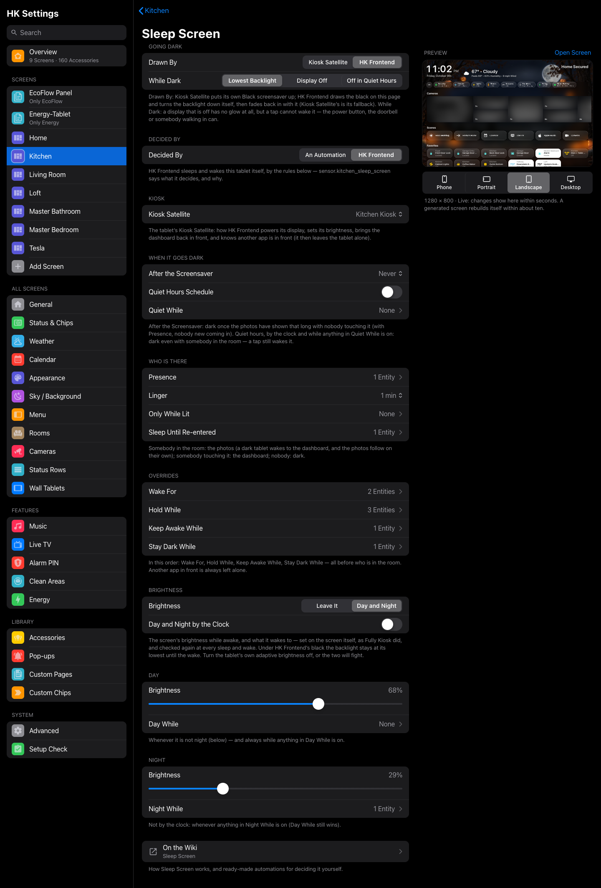
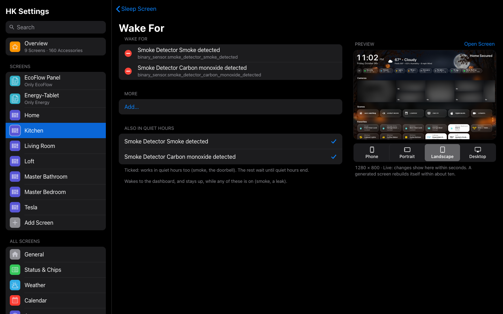
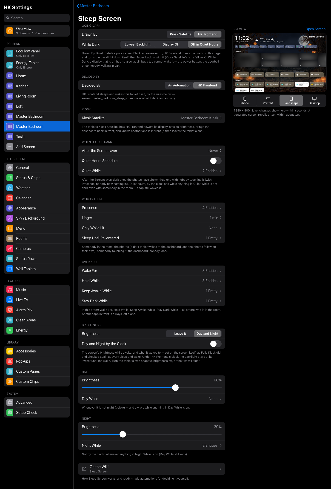

# Sleep Screen

A wall tablet should be **dark when nobody needs it** and **awake the moment
somebody does**: lit when you walk into the kitchen, dark again after you
leave, black all night in the bedroom, and up at once for the doorbell or a
smoke alarm. **Sleep Screen** is how HK Frontend does that.

You set it per screen: **HK Settings → Screens → (a screen) → When Idle →
Sleep Screen**. It answers two questions:

1. **How does the tablet go dark?** Kiosk Satellite’s own black screensaver,
   or HK Frontend’s black drawn on the page, with the backlight at its lowest
   or the display switched off.
2. **Who decides when?** Either **your automations**, which turn a switch on
   and off, or **HK Frontend itself**. In that case you tell it who is in the
   room, what should wake it, what should keep it dark and when quiet hours
   are, and it does the rest.



- [What you need](#what-you-need)
- [The four things a tablet can show](#the-four-things-a-tablet-can-show)
- [Going dark](#going-dark)
- [Decided By: An Automation](#decided-by-an-automation)
- [Decided By: HK Frontend](#decided-by-hk-frontend)
  - [The rules, in the order they win](#the-rules-in-the-order-they-win)
  - [Every setting](#every-setting)
  - [Brightness: Day and Night](#brightness-day-and-night)
  - [What HK Frontend takes care of for you](#what-hk-frontend-takes-care-of-for-you)
- [Recipes](#recipes)
- [Automations alongside HK Frontend](#automations-alongside-hk-frontend)
- [The entities](#the-entities)
- [Troubleshooting](#troubleshooting)

---

## What you need

- **A screen with a Tablet User and the Photo Screensaver** (When Idle →
  Photo Screensaver). The tablet signs in to Home Assistant as its own user,
  which tells HK Frontend which browser is the wall tablet. A computer opening
  the same screen never sleeps, never wakes and never counts as a touch. See
  [Wall Tablets](Wall-Tablets.md).
- **For HK Frontend’s own black and for HK Frontend deciding: Kiosk
  Satellite** on the tablet, with its Home Assistant integration
  ([Wall Tablets → Or Kiosk Satellite](Wall-Tablets.md#or-kiosk-satellite)). That is how HK Frontend turns the backlight down,
  switches the display off and on, sets its brightness, brings the dashboard
  back in front, and sees another app in front. Without it, An Automation and
  Kiosk Satellite’s black still work with whatever your tablet offers.
- **On the tablet:** turn the tablet’s own **adaptive brightness** off (it
  fights any brightness HK Frontend sets), and in Kiosk Satellite turn
  **Pause dashboard during screensaver** off, so the dashboard is drawn and
  ready the instant it wakes. [Wall Tablets](Wall-Tablets.md) has the full
  list of tablet settings.

## The four things a tablet can show

Everything below is about moving the tablet between these:

| | The tablet shows |
|---|---|
| **Dark** | black: HK Frontend’s or Kiosk Satellite’s, the backlight at its lowest or the display off |
| **Photos** | the [photo screensaver](Screensaver-and-Idle.md), with the time, weather and anything else it shows |
| **Dashboard** | the screen itself |
| **Hold** | whatever it is showing now, untouched: an automation or another app is in charge for the moment |

The photos come up by themselves after **Starts After** without a touch, so a
tablet that is awake on the dashboard drifts into photos on its own. Sleep
Screen only ever has to decide between **dark** and **awake**.

## Going dark

The top of the page: **Going Dark**.

### Drawn By

- **Kiosk Satellite** (the default) puts the app’s own Black screensaver up.
- **HK Frontend** draws the black on the page itself and turns the backlight
  down to its lowest through Kiosk Satellite. Waking, it fades the dashboard
  back in with the backlight coming up alongside, so you never see a flash of
  an old frame, a white camera tile or a half-drawn page. Other details:
  - A tap wakes it at once, and the tap is not passed on to whatever tile is
    under your finger.
  - A page that reloads while black (the app’s nightly restart, say) is
    covered again as soon as HK Frontend loads.
  - If the page doesn’t answer within a few seconds, Kiosk Satellite’s black
    is used instead, so the tablet always goes dark.

### While Dark

- **Lowest Backlight**: the display stays on at its dimmest, under the
  black. A tap wakes it.
- **Display Off**: no glow at all. A tap cannot wake a display that is off;
  the power button can, and so can anything that wakes it (somebody walking
  in, the doorbell) when HK Frontend decides.
- **Off in Quiet Hours**: the lowest backlight by day, the display off during
  quiet hours (a bedroom).

## Decided By: An Automation

The default. **Nothing in HK Frontend makes the tablet sleep on its own.**
Your automations turn the screen’s black screen switch on to sleep and off
to wake. Use the **Set black screen** action
(`hk_frontend.set_black_screen`), which also carries the brightness to come
back to:

| Field | |
|---|---|
| `black` | `true`: dark. `false`: awake. |
| `brightness` | 0–255, the brightness it wakes to (and stays at while awake). Optional; sent alone, it changes the wake brightness while staying dark. |

Dark at 11 PM, waking to a dim screen:

```yaml
triggers:
  - trigger: time
    at: "23:00:00"
actions:
  - action: hk_frontend.set_black_screen
    target:
      entity_id: switch.kitchen_black_screen
    data:
      black: true
      brightness: 75        # what it wakes to
```

Awake when somebody walks in; dark five minutes after the room empties:

```yaml
triggers:
  - trigger: state
    entity_id: binary_sensor.kitchen_motion
    to: "on"
    id: "in"
  - trigger: state
    entity_id: binary_sensor.kitchen_motion
    to: "off"
    for: { minutes: 5 }
    id: "out"
actions:
  - action: hk_frontend.set_black_screen
    target:
      entity_id: switch.kitchen_black_screen
    data:
      black: "{{ trigger.id == 'out' }}"
```

…but never while somebody is using it (the screen’s **In Use** sensor):

```yaml
conditions:
  - condition: state
    entity_id: binary_sensor.kitchen_screen_in_use
    state: "off"
```

Awake for the doorbell, then back to whatever it was doing two minutes later:

```yaml
triggers:
  - trigger: state
    entity_id: binary_sensor.front_door_doorbell
    to: "on"
actions:
  - action: hk_frontend.set_black_screen
    target:
      entity_id: switch.kitchen_black_screen
    data:
      black: false
  - delay: { minutes: 2 }
  - condition: state
    entity_id: binary_sensor.kitchen_screen_in_use
    state: "off"
  - action: hk_frontend.set_black_screen
    target:
      entity_id: switch.kitchen_black_screen
    data:
      black: true
```

Things worth knowing when you decide it yourself:

- **Don’t write the tablet’s brightness while it is black.** The page holds
  the backlight down and restores the brightness you gave. To change the wake
  brightness while dark, send the action with only `brightness`.
- **`confirmed`.** The switch’s `confirmed` attribute turns true once the
  page is actually black, usually within a fraction of a second. If it
  doesn’t within a few seconds (the page isn’t running, or is reloading), put
  Kiosk Satellite’s Black screensaver up instead.
- **A tap sees itself first.** A tap that wakes the screen turns its **In
  Use** sensor on in the same moment the switch goes off. An automation that
  keeps a touched tablet awake sees the touch before it sees the black gone.

## Decided By: HK Frontend

Set **Decided By** to **HK Frontend** and it sleeps and wakes the tablet
itself. You don’t write any automations. Instead you hand it entities:
presence sensors, the things that should wake it, keep it awake, keep it
dark or leave it alone. It watches them all the time and acts the moment one
changes.

It runs **inside Home Assistant**, not on the page. A tablet that is
reloading, or asleep with its display off, still wakes for the doorbell,
because Home Assistant is what notices the doorbell and tells the tablet.

Every list takes as many entities as you like. Any of them on counts:
`on`, `open`, `detected`, `playing`, `active`, `triggered` and the like, and
an `active` timer.

### The rules, in the order they win

Checked from the top whenever anything changes; the first that applies
decides.

| # | Rule | The tablet | Example |
|---|---|---|---|
| 1 | **Wake For**, ticked *Also in Quiet Hours* | wakes to the dashboard, even at 3 AM | smoke, CO, a water leak |
| 2 | **Quiet hours**: the **Schedule** (from–to), or anything in **Quiet While** on | dark, even with somebody in the room; only a tap, or what is ticked *Also in Quiet Hours* under Hold While, changes that | 10 PM–7 AM in a bedroom; a nap timer |
| 3 | **Wake For** | wakes to the dashboard, and stays up while it is on | the garage door left open |
| 4 | **Hold While** | left exactly as it is, so your automation owns it for now | the doorbell’s answer pop-up, the alarm keypad |
| 5 | Another app in front | left alone | Netflix, the camera app |
| 6 | **Keep Awake While** | the dashboard stays up | watching live TV on it, a recipe open |
| 7 | **Stay Dark While** | dark | away mode, the house empty |
| 8 | Somebody touching it (**In Use**) | the dashboard | |
| 9 | Somebody in the room (**Presence**) | awake: a dark tablet wakes to the dashboard, and the photos follow on their own | |
| 10 | Nobody | dark | |

Three gentler rules sit in the last part of the table:

- **Only While Lit**: somebody walking in wakes it only while one of its
  lights is on. In a dark room, presence alone leaves it dark (a tap still
  works).
- **Sleep Until Re-entered**: turning one of these on darkens it even with
  somebody still in the room. It stays dark until somebody comes back in
  (presence clears, then returns).
- **After the Screensaver**: once the photos have shown that long with
  nobody touching it (and, with Presence, nobody new coming in), dark.

> **A missing sensor never guesses.** If a presence sensor or the tablet’s
> In Use state is unavailable (a sensor restarting, Home Assistant starting
> up), the tablet stays as it is (*holding – an input is unavailable*)
> instead of going dark on a family in the room. Wake For still works.

### Every setting

#### Kiosk

**Kiosk Satellite**: the tablet’s Kiosk Satellite device. HK Frontend
uses it to:

- switch the display off and on;
- set the brightness;
- bring the dashboard back in front when it wakes;
- see another app in front, and then leave the tablet alone.

Choose it for everything below to work fully.

#### When It Goes Dark

- **After the Screensaver**: Never (the default), 5, 15 or 30 minutes, or 1,
  2 or 4 hours of photos with nobody touching it. With Presence, somebody new
  walking in starts it over. Without Presence, this is the only thing that
  ever darkens an occupied room. Good for a tablet with no motion sensor
  nearby.
- **Quiet Hours Schedule**: dark from **From** to **To** every day (it may
  cross midnight: 10:00 PM to 7:00 AM). Even with somebody in the room.
- **Quiet While**: quiet hours also while any of these is on, whatever the
  clock says: a Good Night timer, a nap timer, a "Do Not Disturb"
  `input_boolean`.

In quiet hours a **tap still wakes it**. It goes dark again once you stop
using it (the In Use window, a minute less than **Starts After**). With
**While Dark: Display Off** or **Off in Quiet Hours**, the display is off and
a tap can’t reach it, so the **power button** wakes it. HK Frontend treats a
display lit by the power button as a touch: the dashboard for a minute, then
dark again.

#### Who Is There

- **Presence**: as many sensors as the room has. Motion, occupancy, an mmWave
  radar, a person’s or watch’s room from Bermuda or ESPresense. Any of them on
  means somebody is there. With none, the room always counts as occupied, and
  only After the Screensaver, quiet hours and the overrides darken it.
- **Linger**: how long the room still counts as occupied after the last
  sensor clears. None, 30 seconds, or 1, 2, 5, 10, 15 or 30 minutes; 1 minute
  by default. Raise it for a motion sensor that clears quickly while somebody
  sits still.
- **Only While Lit**: lights (or switches). Somebody walking in wakes it only
  while one of them is on. A tap always works, and so does a tap made after
  the lights went off: somebody deliberately using it in the dark.
- **Sleep Until Re-entered**: anything that marks "we’ve said goodnight": a
  Good Night timer, a scene’s `input_boolean`. Turning it on darkens the
  tablet even though the room is still occupied. It wakes again when somebody
  comes back in.

#### Overrides

In this order, all before who is in the room:

- **Wake For**: wakes to the dashboard and stays up while any of these is on.
  Each entity has an **Also in Quiet Hours** tick. Ticked, it wakes even
  during quiet hours (smoke, CO, a leak); unticked, it waits until quiet hours
  end.
- **Hold While**: while any of these is on, HK Frontend leaves the tablet
  exactly as it is. Use it for anything an automation of yours controls:
  - the doorbell’s answer pop-up (a `timer` your doorbell automation starts);
  - the alarm’s keypad;
  - a tablet you are configuring.

  Each has the same **Also in Quiet Hours** tick. Tick the doorbell, and it
  still comes up at night.
- **Keep Awake While**: the dashboard stays up while any of these is on. For
  things a person is watching without touching: live TV playing on the
  tablet, a timer ringing, a recipe open.
- **Stay Dark While**: dark while any of these is on: away mode, the alarm
  armed away, a "Vacation" `input_boolean`. The three above still win, so the
  smoke alarm and the doorbell wake it even when you are away.



### Brightness: Day and Night

- **Leave It**: HK Frontend never sets the brightness. The tablet keeps its
  own.
- **Day and Night**: two levels, **Day** and **Night** (in %), and which one
  applies when:
  1. **Day While**: anything here on means the day level, even at night. In a
     bathroom: the vanity lights turned up bright.
  2. **Night While**: anything here on means the night level, whatever the
     clock says: a Good Night timer, a nap timer.
  3. **Day and Night by the Clock**: on, each starts at its own **Starts At**
     time. Off, it is day unless something in Night While is on.

HK Frontend sets it on the screen when it changes, and **checks it again at
every sleep and wake**, so a tablet that was offline at the change is put
right the next time it wakes. A black screen wakes straight to it. Under HK
Frontend’s black the backlight stays at its lowest until the wake.

Turn the tablet’s own adaptive brightness **off**, or the two will fight.



### What HK Frontend takes care of for you

- **It acts from Home Assistant.** Reloads, restarts and a display that is
  off don’t stop it waking the tablet.
- **Every change is one move.** Waking turns the display on if it is off,
  takes the black down, brings the dashboard in front, sets the brightness
  and checks that the backlight really came up (and puts it right if not).
  Sleeping puts the black up, turns the display off if asked, and falls back
  to Kiosk Satellite’s black if the page doesn’t answer.
- **It never loops.** At most six actions a minute. More than that is a
  configuration fighting itself (an automation of yours undoing it), and it
  waits.
- **It tells you why.** `sensor.<screen>_sleep_screen` says what it decided,
  and why, in words (see [The entities](#the-entities)).
- **The power button and a tap always work.** A tap wakes it at once, even
  in quiet hours. A display lit by hand counts as a touch.
- **It only starts once its entities exist,** so a Home Assistant restart
  never sees half the sensors and makes a wrong call.

## Recipes

Each of these is just settings on the page: no automations.

### A kitchen: awake while anyone is in it

- **Presence**: the kitchen’s occupancy or motion sensors
- **Linger**: 2 minutes
- **Wake For**: smoke and CO, both ticked *Also in Quiet Hours*
- **Hold While**: your doorbell automation’s timer (ticked), the alarm
- **Stay Dark While**: away mode
- **Brightness**: Day and Night, with **Night While** your Good Night timer

### A bathroom: only when the lights are on

- **Presence**: the bathroom’s motion sensors
- **Only While Lit**: the vanity, the shower light, the toilet light. Walking
  in at night with the lights off doesn’t light the tablet in your face.
- **Brightness**: Day and Night. **Night While** is the Good Night timer and
  **Day While** is "vanity turned up bright" (a template binary sensor, below),
  so at night it is dim unless you’ve turned the lights up.

```yaml
template:
  - binary_sensor:
      - name: Master Bathroom Vanity Bright
        state: >-
          
          {{ is_state('light.master_bathroom_vanity', 'on') and (b is none or b | int(0) > 191) }}
```

### A bedroom: black all night, but never for the doorbell to miss

- **Quiet Hours Schedule**: 10:00 PM to 7:00 AM, and **Quiet While** the nap
  timer as well
- **While Dark**: Off in Quiet Hours (no glow at night)
- **Wake For**: smoke and CO, ticked
- **Hold While**: the doorbell’s timer, **ticked** (it comes up at night),
  and the alarm, unticked (it waits for morning)
- At night, the power button wakes it to the dashboard for a minute.

### A living room: awake while the TV is on it

Something a person watches without touching goes in **Keep Awake While**.
If what you have isn’t an on/off entity (a list of who is watching, say),
make it one with a template binary sensor:

```yaml
template:
  - binary_sensor:
      - name: Living Room Tablet Watching TV
        state: "{{ 'livingroom' in (state_attr('sensor.tv_viewers', 'users') or []) }}"
```

### No motion sensor nearby

Leave **Presence** empty and set **After the Screensaver** to 30 minutes. The
tablet shows photos after Starts After, goes dark after half an hour of
photos, and wakes on a tap. Add a **Quiet Hours Schedule** for the night.

### Good Night

Put your Good Night timer (or the `input_boolean` your goodnight scene turns
on) in **Sleep Until Re-entered**. Saying goodnight darkens every tablet,
even in rooms you are still in, and each one wakes again the next time
somebody walks into its room.

## Automations alongside HK Frontend

HK Frontend deciding doesn’t mean your automations stop. They work best by
**changing what it watches, not by fighting it**:

- **Give it a helper.** Create an `input_boolean` (Settings → Devices &
  Services → Helpers) and put it in the right list. Then any automation, a
  dashboard button or a voice command can flip it:

  | Put the helper in | and turning it on |
  |---|---|
  | Wake For | wakes the tablet and keeps it up (a notification you want seen) |
  | Keep Awake While | keeps it up (a cooking timer, a party) |
  | Stay Dark While | keeps it dark (movie night) |
  | Hold While | hands the tablet to your automation for as long as it is on |
  | Quiet While | quiet hours now |
  | Sleep Until Re-entered | dark until somebody comes back in |

  Example: wake the kitchen tablet for five minutes when the washer finishes.

  ```yaml
  triggers:
    - trigger: state
      entity_id: sensor.washer_status
      to: "done"
  actions:
    - action: input_boolean.turn_on
      target:
        entity_id: input_boolean.kitchen_tablet_wake
    - delay: { minutes: 5 }
    - action: input_boolean.turn_off
      target:
        entity_id: input_boolean.kitchen_tablet_wake
  ```

- **Take the tablet for a while: Hold While.** Your doorbell automation
  starts a `timer`, shows its pop-up, and turns the screen on. While that
  timer is in Hold While, HK Frontend keeps its hands off. When it finishes,
  HK Frontend picks up again from whoever is in the room.

  ```yaml
  triggers:
    - trigger: state
      entity_id: binary_sensor.front_door_doorbell
      to: "on"
  actions:
    - action: timer.start
      target:
        entity_id: timer.doorbell_tablet_hold      # in Hold While (ticked)
      data:
        duration: "00:02:00"
    - action: hk_frontend.set_black_screen
      target:
        entity_id: switch.kitchen_black_screen
      data:
        black: false
    - action: hk_frontend.show_popup
      data:
        popup: doorbell
  ```

- **React to what it decides.** `sensor.kitchen_sleep_screen` is a normal
  sensor. Trigger on it going `dark` to turn off a lamp, or on `dashboard` to
  announce something.
- **Don’t turn its switches yourself while HK Frontend decides,** except
  while one of your Hold While entities is on (as the doorbell above). It sees
  the tablet change and puts it back as its rules say. Use a helper in one of
  the lists instead.

Moving over from your own automations: set Decided By to HK Frontend on one
screen, turn off that screen’s old sleep/wake automations, and watch
`sensor.<screen>_sleep_screen` for a day. Its `reason` explains every move.

## The entities

For a screen called Kitchen:

| Entity | |
|---|---|
| `switch.kitchen_black_screen` | On while the tablet is dark under HK Frontend’s black. Attributes: `black_screen` (who draws it: `kiosk` or `hk`), `brightness` (what it wakes to), `confirmed` (the page really went black). Turn it with `hk_frontend.set_black_screen`. |
| `switch.kitchen_photo_screensaver` | On while the photos show. |
| `binary_sensor.kitchen_screen_in_use` | On while somebody touched it within the In Use window (a minute less than Starts After). |
| `sensor.kitchen_sleep_screen` | What Sleep Screen decides, while HK Frontend decides: `dark`, `photos`, `dashboard` or `hold`. `automation` while your automations decide. |

`sensor.kitchen_sleep_screen`’s attributes:

| Attribute | |
|---|---|
| `reason` | why, in words: *somebody is in the room*, *quiet hours*, *Smoke Detector is on*, *nobody here*, *the room’s lights are off*, *holding – an input is unavailable*… |
| `actual` | what the tablet shows right now (`dark`, `photos`, `dashboard`) |
| `present` | somebody in the room, after Linger |
| `in_use` | somebody touching it |
| `quiet` | quiet hours now |
| `last_touch` | the last touch |
| `after_saver_at` | when After the Screensaver will darken it |
| `target_brightness` | the brightness it wants now (0–255) |
| `last_action` | the last thing it did, and when |
| `decided_by` | `hk` or `automation` |

## Troubleshooting

**It goes dark with somebody in the room.** Look at `sensor.<screen>_sleep_screen`:
- `present` false: your presence sensor cleared. Add another sensor, or raise
  **Linger**.
- `reason` "the room’s lights are off": that is **Only While Lit**.
- `reason` "quiet hours": the schedule, or something in Quiet While.

**It won’t go dark.** The `reason` says what keeps it up: a Keep Awake While or
Wake For entity still on, `in_use` (somebody touched it), or `hold` (Hold While,
or another app in front).

**A tap doesn’t wake it at night.** **While Dark** is Display Off (or Off in
Quiet Hours) and the display is off. Use the power button, or choose Lowest
Backlight.

**The brightness jumps around.** The tablet’s own adaptive brightness is on.
Turn it off in the tablet’s Display settings.

**It woke but showed an old picture, a white tile or a half-drawn page for a
moment.** Use **Drawn By: HK Frontend**, and turn Kiosk Satellite’s **Pause
dashboard during screensaver** off ([Wall Tablets](Wall-Tablets.md)).

**"holding – an input is unavailable".** A presence sensor or the tablet’s own
entities are unavailable. It waits rather than guessing. Check the sensor.

**Nothing happens at all.** Check that Decided By is HK Frontend, that a
**Kiosk Satellite** is chosen, and that the screen has a **Tablet User** and
the Photo Screensaver on. `sensor.<screen>_sleep_screen` says `automation`
when HK Frontend isn’t deciding.

See also: [Screensaver & Idle](Screensaver-and-Idle.md) ·
[Wall Tablets](Wall-Tablets.md) · [Screens](Screens.md)
