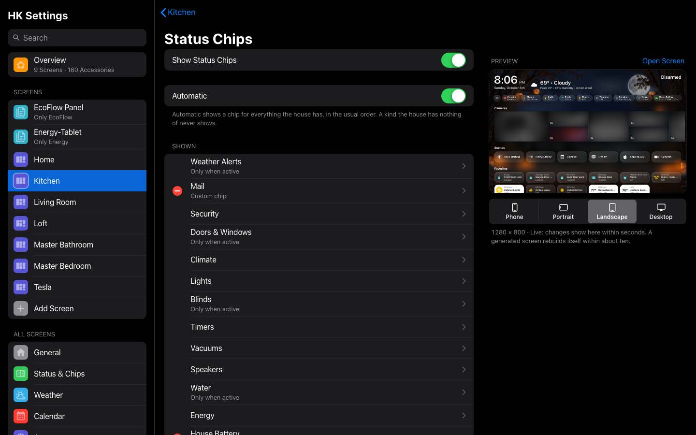
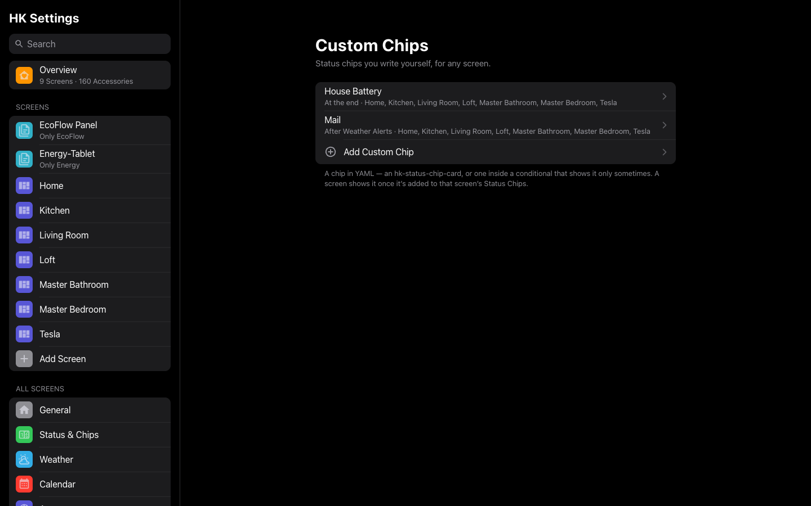
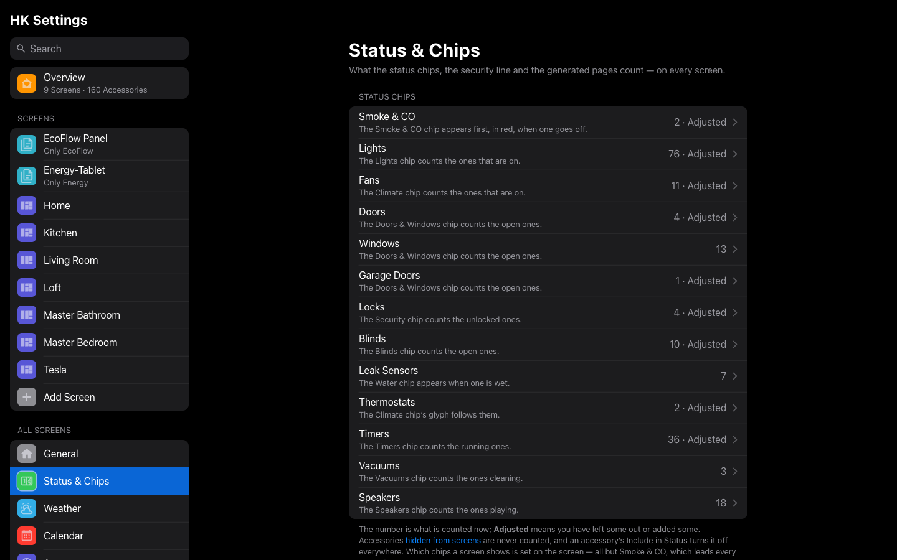

# Status Chips

The row of small summaries under the header: Lights, Security, Climate and the
rest. Each opens its own page.

Each chip summarizes one kind of thing and opens its page:

| Chip | Shows | Opens |
|---|---|---|
| Smoke & CO | *Smoke Detected* or *CO Detected*, in red, while an alarm is going off | Nothing |
| Weather Alerts | The current alert, while there is one | Weather |
| Security | The alarm’s state, or how many locks are unlocked | Security |
| Doors & Windows | How many doors, windows and garage doors are open | Doors & Windows |
| Climate | The indoor temperature and how many fans are on; its glyph shows heating or cooling | Climate |
| Lights | How many lights are on | Lights |
| Blinds | How many blinds are open | Climate |
| Timers | How many timers are running | Timers |
| Vacuums | How many vacuums are running | Vacuums |
| Speakers | How many speakers are playing | Play Music |
| Water | Whether a leak sensor is wet | Water |
| Energy | Power use, in kW | A [custom page](Pages.md#custom-pages) with the address `energy`, if the screen has one |

What each chip counts is the same on every screen, and is set in
[Status & Chips](#status--chips). The alarm, indoor temperature and power
sensor are in [General](HK-Settings.md#general); the alerts sensor is in
[Weather](Weather.md). A kind your home has nothing of never shows a
chip.

**Smoke & CO is on every screen.** In a home with a smoke or carbon monoxide
alarm, the Smoke & CO chip leads every screen’s chip row, before the chips the
screen chooses, and appears only while an alarm is going off. A screen can’t
remove or move it; turn the whole row off (**Show Status Chips**) and it goes
with it. Which alarms set it off is set in [Status & Chips](#status--chips).



**Only when there’s something to report.** Some chips are *quiet*: they appear
only while something is on, open, running or wet, so the row carries news
rather than a permanent “All Closed”. Weather Alerts, Doors & Windows, Blinds
and Water start quiet. To change one:

1. Open **HK Settings → Screens → (the screen) → Status Chips**.
2. Tap the chip’s row.
3. Set **Show** to **When Active** (quiet) or **Always**.

**Choose and order the chips.** On the same page, turn **Automatic** off. Drag
the chips into order, remove the ones you don’t want, and add others back from
**More**.

**An accessory as a chip.** Any entity can be a chip of its own: select **Add
Accessory Chip…** and pick it. The chip shows its name and state. In its
[accessory settings](Accessories.md) you can give it a color, show it
only in one state (a mail sensor only when its state is “Delivered”), show one
of its attributes instead of its state, or give it a label.

**Custom chips.** For a chip you design yourself (several values, its own tap
action, a chip that appears only sometimes), write it once in the Library and
add it to any screen:

1. Open **HK Settings → Library → Custom Chips → Add Custom Chip**.
2. Give it a **Name**, and choose where it **Sits**: at the start, after a kind
   of chip, or at the end.
3. Write the chip in YAML: an `hk-status-chip-card`, or one inside a
   `conditional` card. There is an example on the page.
4. Select **Add Chip**.
5. On each screen that should show it, open **Status Chips** and add it from
   **More**.



A custom chip’s minus on a screen takes it off that screen only. **Delete
Chip** in the Library removes it everywhere.

## Status Chips settings

| Setting | Default | What it does |
|---|---|---|
| Show Status Chips | On | Off: no chip row on this screen. |
| Automatic | On | A chip for every kind your home has, in the usual order: Weather Alerts, Security, Doors & Windows, Climate, Lights, Blinds, Timers, Vacuums, Speakers, Water, Energy. A kind your home has nothing of never shows. |
| Shown | — | The chips, in order. A kind’s row opens its own page (below). |
| More | — | Kinds you took off, and your [custom chips](#custom-chips). |
| Add Accessory Chip… | — | Any entity as a chip of its own: its name and state. Its look is set in its [accessory settings](Accessories.md). |

Each kind’s page:

| Setting | Default | What it does |
|---|---|---|
| Show | When Active for Weather Alerts, Doors & Windows, Blinds and Water; Always for the rest | **When Active**: the chip appears only while something is on, open, running or wet. **Always**: it is always there. |
| What It Counts | — | Links to the [Status & Chips](#status--chips) kinds, and to the single settings the chip reads (Alarm Panel, Indoor Temperature, Power Use, Weather Alerts). The same on every screen. |

## The pages’ status rows

The [Climate](Climate.md), Lights, Doors & Windows, Water and Security pages
have a room-style status row under their titles: *3 Lights · 2 On*, *Motion ·
Emma’s Room*, *Valve · Running*. Each counts what Status & Chips finds; tap
an item for its room-labelled accessory list. Choose what each row shows, its
order and the rooms it leaves out in **All Screens → Status Rows** ([Status
rows](Status-Rows.md)).

## Status & Chips

**All Screens → Status & Chips.** What each status chip, the header’s security
line and the generated pages count. Every kind finds its own entities; you only
adjust. The Lights chip and the Lights page count the same lights, so they can’t
disagree. The page lists every kind under **Status Chips**, and the kinds that
feed only the pages’ status rows — temperature, humidity, motion, occupancy and
valves — under **Status Rows**; the number is what is counted now, and
*Adjusted* means you have left some out or added some.



| Kind | Found automatically | The chip counts |
|---|---|---|
| Smoke & CO | Binary sensors of class smoke or carbon monoxide | Going off (the Smoke & CO chip appears). Add a gas detector with **Also Count**; leave out a camera that only hears the alarm. |
| Temperature | An area’s designated temperature sensor, else its thermostat’s current temperature | Range on the Climate page |
| Humidity | An area’s designated humidity sensor, else its thermostat’s current humidity | Range on the Climate page |
| Lights | Every light | On (Lights chip) |
| Fans | Every fan | On (Climate chip) |
| Doors | Binary sensors of class door | Open (Doors & Windows chip) |
| Windows | Binary sensors of class window | Open (Doors & Windows chip) |
| Garage Doors | Covers of class garage or gate, binary sensors of class garage door | Open (Doors & Windows chip); the Security page lists the covers |
| Locks | Every lock | Unlocked (Security chip) |
| Blinds | Covers of class awning, blind, curtain, shade, shutter or window, or with no class | Open (Blinds chip) |
| Leak Sensors | Binary sensors of class moisture | Wet (the Water chip appears) |
| Thermostats | Every climate entity | Heating or cooling (the Climate chip’s glyph) |
| Timers | Every timer helper | Running (Timers chip) |
| Vacuums | Every vacuum | Cleaning, returning, paused or in error (Vacuums chip) |
| Speakers | Media players that aren’t TVs or receivers | Playing (Speakers chip). With the Music feature, its speakers are counted instead. |

Never found: hidden or disabled entities, configuration and diagnostic
entities, groups of other entities (a light group would count its lights
twice), and anything [Hidden from Screens](Accessories.md#accessories-settings). An accessory with
**Include in Status** off, or shown as something else (a switch **Shown as** a
light), is counted as its [accessory settings](Accessories.md)
say.

Each kind’s page:

| Setting | What it does |
|---|---|
| Found Automatically | How many the kind finds by itself. |
| Counted | Everything it counts now, with each one’s room. |
| Left Out · Leave Out… | Found, but not wanted: a car’s windows, a second copy of a blind. |
| Also Counted · Also Count… | Not found, but wanted: an outlet you think of as a light, a switch that runs a fan. |
| Reset to Automatic… | Clears both lists. |

A kind you never touch stays automatic, so a light you add tomorrow is counted
tomorrow. The category pages of a generated screen (Lights, Doors & Windows, …)
list what Status & Chips counts.

## Custom Chips

**Library → Custom Chips.** Status chips you write yourself in YAML: an
`hk-status-chip-card`, or one inside a `conditional` card that shows it only
sometimes. A screen shows one once it is added to that screen’s
[Status Chips](Status-Chips.md).

| Setting | Default | What it does |
|---|---|---|
| Name | — | Its name in the lists. |
| Sits | At the End | **At the Start**, **After** a kind (After Weather Alerts, After Security, …), or **At the End**. A screen that orders its chips itself places it where you drag it. |
| The chip (YAML) | — | One card, with a `type`. **Add Chip** or **Save Chip** saves it. |
| Delete Chip | — | Removes it from every screen that shows it. |

For example:

```yaml
type: custom:hk-status-chip-card
entity: sensor.house_battery
name: House Battery
icon: hk:home-battery
icon_color: green
tap_action:
  action: navigate
  navigation_path: ./energy
```
