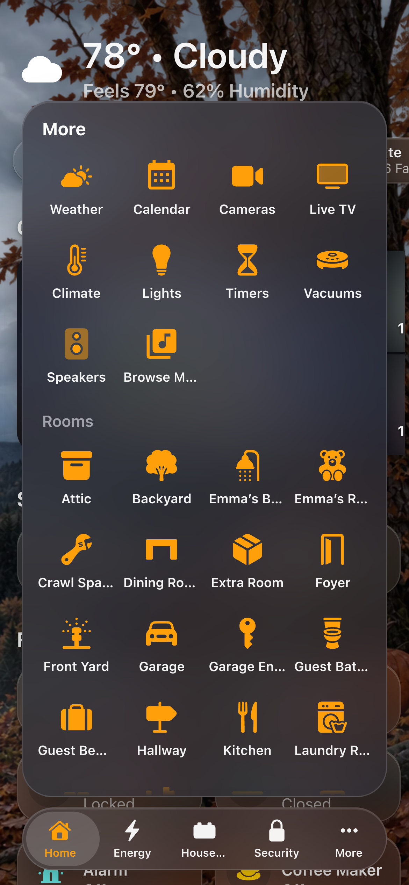

# Tab Bar

The tab bar is a row of tabs that floats near the bottom of the screen, like
the one in iOS apps. It is a second way around a screen, next to the
[menu](Menu.md). A screen can have the menu, the tab bar, both, or neither.

- **The tabs:** **Home**, then the menu's **Categories** in the menu's order.
  Nothing has to be set up.
- **More:** the pages that don't fit the screen's width, plus the pages at the
  top of the menu (Weather, Cameras, Live TV on a generated screen). A wider
  screen shows up to eight tabs.
- **Rooms:** every room, in the menu's room order, as icons like the pages.
  By default the rooms are a section of More, under its pages. A phone
  shows five, as Apple Music does: Home, three more tabs and More.

With the screen's **Home Assistant Section** on, More has it too, after the pages and above Rooms:
Integrations, Automations and Settings (for admins), Notifications, **Show
Menu** (Home Assistant's own sidebar, over the page) and Profile.

Opening More, the bar widens and the menu grows up out of it, as one piece; closing, it folds back into the bar. (With Rooms as their own button, More opens as a separate sheet.)

More is as tall as it needs to be. It scrolls past that, always leaving a
strip of the page above it to tap to close. On a room page the More tab is
highlighted.

| | |
|---|---|
|  |  |
| The tab bar | More |

The tab for the page you are on is highlighted in the menu's
**Highlight Color**. Choosing a page, tapping outside a sheet or pressing
Escape closes the sheet.

## Where it shows

The tab bar is part of the menu: a screen shows one or the other, never both.
Choose it under **Screens → (the screen) → Menu**:

- **Menu: Tab Bar** shows the tab bar at every width, with no side menu.
- **On Narrow Screens: Tab Bar** (for a menu that is a **Button**) keeps the
  menu button from 1,024 px up. Narrower than that (phones, an iPad held
  upright), the tab bar takes its place.
- **When Folded: Tab Bar** (for a menu that is **Always Open**) keeps the menu
  open beside the page where it fits. Where it would fold, the tab bar
  shows instead.

Wherever the tab bar shows, the side menu is off: no chip, no edge tab, no
swipe from the edge and no tap on the clock. It also hides in Home
Assistant's edit mode.

## Position

**Tab Bar Position** (All Screens → Menu → Tab Bar, or a screen's own Menu
Settings) puts the bar:

- **Bottom** (the default) or **Top**: across the screen. At the top, More
  drops down out of the bar and the page starts below it.
- **Left** or **Right**: a rail down that side of the screen, the tabs
  stacked, each icon over its name. With Shrink or Hide, while the rail is
  full the dashboard eases slightly smaller, away from it, so the time and
  Home Status stay clear, and back to full size as the rail folds or hides.
  With Stay the page keeps a strip of room beside it. More slides
  out sideways from it (about
  640 px of icons, or 380 px as a list).
  Rooms are always in More on a rail. On a
  phone, where a rail would take too much of the width, the bar stays at the
  bottom.

## While scrolling

- **Shrink** (the default): scrolling down folds the bar into one small
  round button showing the page you're on, so it's always in reach.
  **Shrinks To** picks where that button sits: the bar's **Left** or
  **Right** at the bottom or the top, or the rail's **Top** or **Bottom** on
  the left or the right. **Start Small** has the bar rest as that button:
  a tap opens the bar, and scrolling down or changing pages folds it again.
- **Hide:** scrolling down slides the bar off its edge: down, up, or out to
  the side for a rail.
- **Stay:** the bar never moves.

With Shrink or Hide, the full bar comes back when you:

- scroll up a little, anywhere on the page;
- reach the top or the end of the page;
- change pages;
- tap the small button (Shrink).

A page too short to scroll keeps the bar.

## Look

- **Rooms:**
  - **In More** (the default): a section of More.
  - **Own Button:** a round button beside the tabs, with a sheet of its own.
    The More and Rooms sheets are then the same height, and Rooms scrolls.
    There, each room's icon sits in a round plate.
  - **Off:** the rooms are left out of the tab bar.
- **More Style** and **More Style on Phones** (under 640 px), each
  **Icons**, a grid that uses a tablet's width, or **List**, rows like the
  side menu's, about a phone's width. Out of the box a phone gets the list
  and a tablet or computer the icons.
- **Glass:**
  - **Screen's Glass** follows the screen's
    [Glass Style](Appearance.md). Frosted stays frosted; any other style is
    one blur.
  - **Blur:** one blur behind the bar.
  - **Frosted:** a milky plate with no blur.
  - **Tinted:** a near-solid bar with no blur, the lightest choice for a
    slow tablet.

  The bar is never see-through, because a clear bar can't be read over the
  tiles.

These are menu settings, under **All Screens → Menu → Tab Bar**. A screen
that sets its own **Menu Settings** has its own copy of them.

## Around it

- The page gets extra space at the bottom, so its last row scrolls clear of
  the bar.
- On a wall tablet, the now-playing bar sits above the tab bar, the way iOS
  stacks its mini player.
- Pop-ups, detail sheets and the open menu cover the tab bar.
