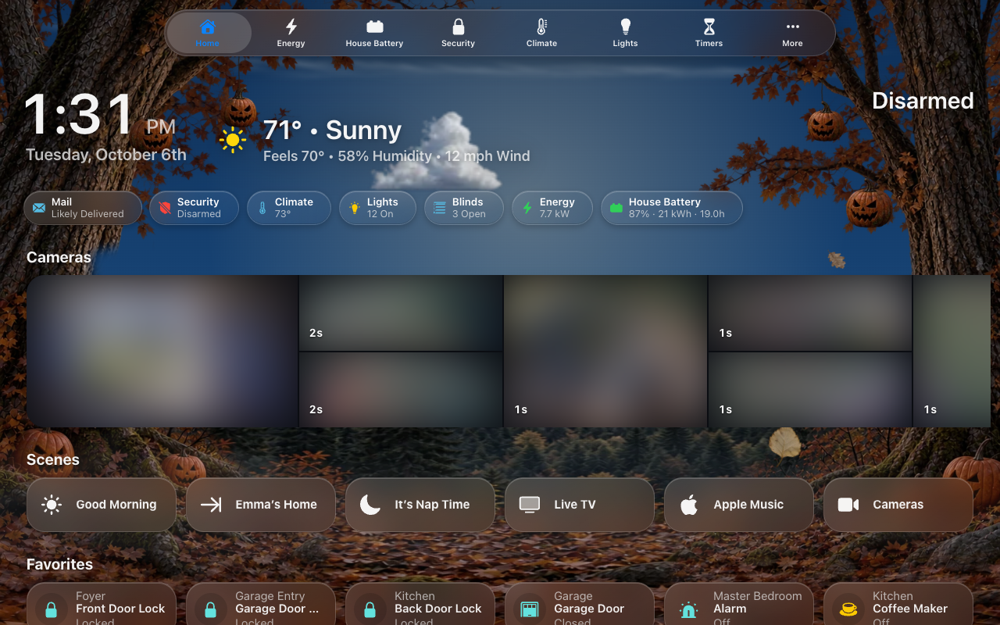
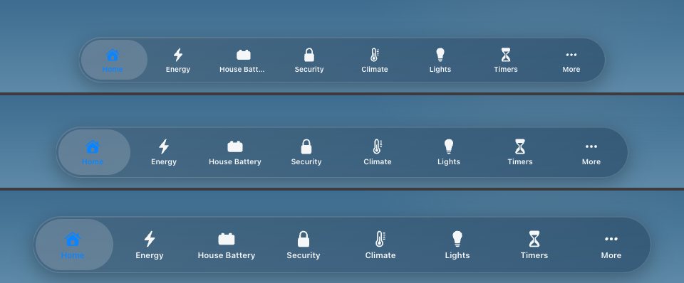

# Tab Bar

The tab bar is a row of tabs that floats near the bottom of the screen, like
the one in iOS apps. It is a second way around a screen, next to the
[menu](Menu.md). A screen can have the menu, the tab bar, both, or neither.

- **The tabs:** **Home**, then the menu's **Categories** in the menu's order.
  Nothing has to be set up.
- **More:** the pages that don't fit the screen's width, plus the pages at the
  top of the menu (Weather, Cameras, Live TV on a generated screen). A wider
  screen shows up to eight tabs.
- **Rooms:** every room, in the menu's room order, as icons like the pages.
  By default the rooms are a section of More, under its pages. A phone
  shows five, as Apple Music does: Home, three more tabs and More.

With the screen's **Home Assistant Section** on, More has it too, after the pages and above Rooms:
Integrations, Automations and Settings (for admins), Notifications, **Show
Menu** (Home Assistant's own sidebar, over the page) and Profile. Its **Placement** (Menu settings) decides where in More it sits.

Opening More, the bar widens and the menu grows up out of it, as one piece; closing, it folds back into the bar. (With Rooms as their own button, More opens as a separate sheet.)

More is as tall as it needs to be. It scrolls past that, always leaving a
strip of the page above it to tap to close. On a room page the More tab is
highlighted.

| | |
|---|---|
|  |  |
| The tab bar | More |

The tab for the page you are on is highlighted in the menu's
**Highlight Color**. Choosing another page slides the highlight over to it, as
iOS does: along the bar, or down the rail (not with the system's Reduce
Motion on). Choosing a page, tapping outside a sheet or pressing Escape closes
the sheet.

## Where it shows

The tab bar is part of the menu: a screen shows one or the other, never both.
Choose it under **Screens → (the screen) → Menu**, for each kind of device
([phones and tablets](Menu.md#phones-and-tablets)):

- **Phones: Tab Bar** shows the tab bar on a phone, held either way up,
  whatever tablets and computers have.
- **Tablets & Computers: Tab Bar** shows the tab bar on every tablet and
  computer, with no side menu.
- Where a tablet’s own menu doesn’t fit (an always-open menu narrower than
  Keep Open Down To, a button below 1,024 px: an iPad held upright, Split
  View), the screen shows its Phones menu — so **Phones: Tab Bar** shows the
  bar there too, while the menu stays beside the page where it fits.

Wherever the tab bar shows, the side menu is off: no chip, no edge tab, no
swipe from the edge and no tap on the clock. It also hides in Home
Assistant's edit mode.

## Position

**Tab Bar Position** (All Screens → Menu → Tab Bar, or a screen's own Menu
Settings) puts the bar:

- **Bottom** (the default) or **Top**: across the screen. At the top, More
  drops down out of the bar.
- **Left** or **Right**: a rail down that side of the screen, the tabs
  stacked, each icon over its name (see Adjust Content below for how the
  page makes room). More slides
  out sideways from it (about
  640 px of icons, or 380 px as a list).
  Rooms are always in More on a rail. On a
  phone, where a rail would take too much of the width, the bar stays at the
  bottom.

| | |
|---|---|
|  |  |
| Right, More open as a list | Top |

**Tabs in Bar** (along the bottom or the top) and **Tabs in Rail** (down
the left or the right) set how many pages get a tab of their own: 2 to 8,
6 unless you choose. Home and More always have theirs and aren't counted.
A phone shows Home, 3 pages and More at most, and a short window fits
fewer down a rail. The bar is only as big as its tabs; opening More grows
it into More's size in the same motion (a rail stretches to the screen's
height), and closing shrinks it back.

## Size

**Size** makes the whole bar smaller or larger: its thickness (a rail's
width), its icons and its names together.

| | Small | Medium (default) | Large |
|---|---|---|---|
| Phone bar | 52 px | 60 px | 68 px |
| Tablet bar or rail | 64 px | 72 px | 80 px |
| Icons | 22 px | 24 px | 26 px |
| Names | 10 px | 10.5 px | 11.5 px (10.5 on a phone) |

A phone's names stay Medium's at Large: its bar already spans the screen,
so bigger names would only be cut shorter.

The gaps inside the bar grow with it: the highlight's gap from the bar's
edge and ends, the space between tabs, and a rail's the same, are always the
bar's thickness ÷ 15 -- 4 px on a phone's Medium bar (as Apple Music's), 4.8
px on a tablet's, about 4.3 and 5.3 px at Small and Large. Everything around the bar follows the size too:
the small button it shrinks to, the Rooms button, where More opens, the
room Adjust Content makes, and the now-playing bar beside a rail.

## Adjust Content

**Adjust Content** (on by default) moves the page clear of the open bar:

- **Top**, with Shrink or Hide: at the top of the page the page slides down
  below the bar, and back up as the bar folds or hides. Further down the page
  the bar sits over the content. With Start Small there's no gap at all
  until you open the bar.
- **Left / Right**, with Shrink or Hide: the dashboard eases slightly
  smaller, away from the open rail, and back to full width as it folds.
- **Bottom**: room at the very end of the page, so the last row scrolls clear.
- **Stay**, any position: a fixed strip of room on the bar's side.

Turned off, the bar floats over the page everywhere.

## While scrolling

- **Shrink** (the default): scrolling down folds the bar into one small
  round button showing the page you're on, so it's always in reach.
  **Shrinks To** picks where that button sits: the bar's **Left** or
  **Right** at the bottom or the top, or the rail's **Top** or **Bottom** on
  the left or the right. **Start Small** has the bar rest as that button:
  a tap opens the bar, and scrolling down or changing pages folds it again.
- **Hide:** scrolling down slides the bar off its edge: down, up, or out to
  the side for a rail.
- **Stay:** the bar never moves.

**While Scrolling** is each device's own: under **Menu Settings → Tablets &
Computers** and **Menu Settings → Phones**. Each is its own: Shrink unless you
pick Hide or Stay.

With Shrink or Hide, the full bar comes back when you:

- scroll up a little, anywhere on the page;
- reach the top or the end of the page;
- change pages;
- tap the small button (Shrink).

A page too short to scroll keeps the bar.

## Look

- **Rooms:**
  - **In More** (the default): a section of More.
  - **Own Button:** a round button beside the tabs, with a sheet of its own.
    The More and Rooms sheets are then the same height, and Rooms scrolls.
    There, each room's icon sits in a round plate.
  - **Off:** the rooms are left out of the tab bar.

  Each device has its own (Menu Settings → Phones → More → Rooms for phones).
- **More Style**, each device's own (Tablets & Computers, and Phones), each
  **Icons**, a grid that uses a tablet's width, or **List**, rows like the
  side menu's, about a phone's width. Out of the box a phone gets the list
  and a tablet or computer the icons.
- **Glass:**
  - **Same as Screen** follows the screen's
    [Glass Style](Appearance.md). Frosted stays frosted; any other style is
    one blur.
  - **Blur:** one blur behind the bar.
  - **Frosted:** a milky plate with no blur.
  - **Tinted:** a near-solid bar with no blur, the lightest choice for a
    slow tablet.

  The bar is never see-through, because a clear bar can't be read over the
  tiles.

These are menu settings, under **All Screens → Menu → Tab Bar**. A screen
that sets its own **Menu Settings** has its own copy of them.

## Around it

- The page gets extra space at the bottom, so its last row scrolls clear of
  the bar.
- On a wall tablet, the now-playing bar sits above the tab bar, the way iOS
  stacks its mini player.
- Pop-ups, detail sheets and the open menu cover the tab bar.
