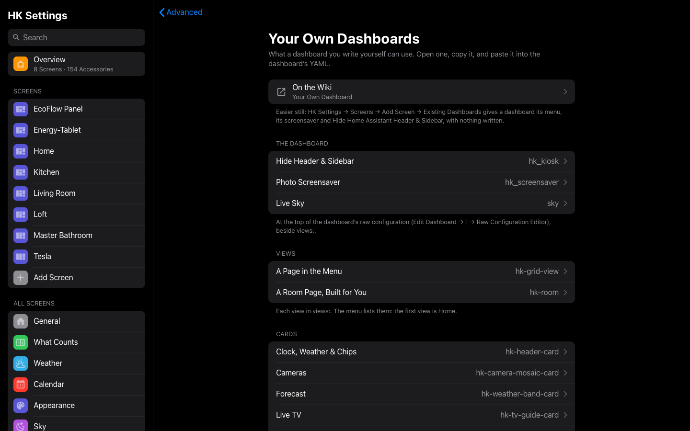
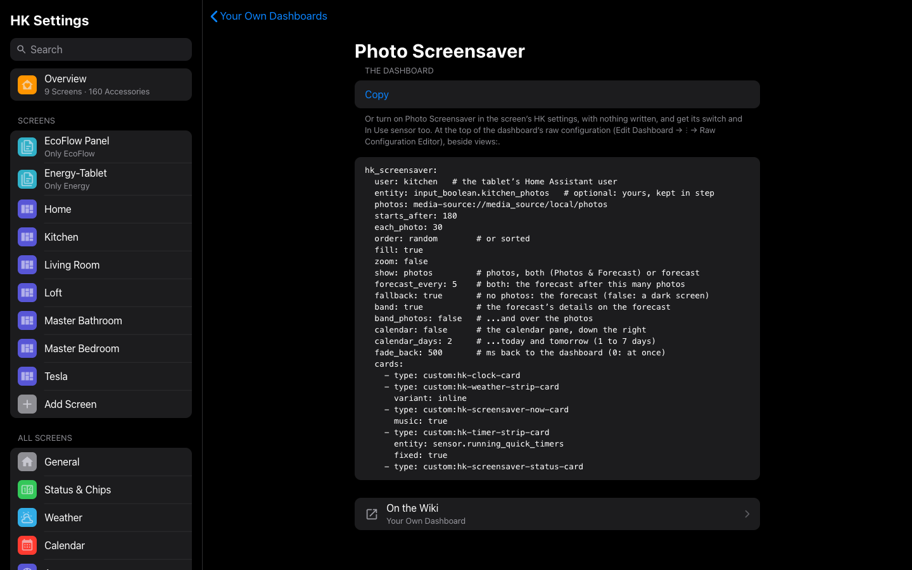

# Your own dashboard

HK Frontend’s features aren’t only for the screens it builds. A dashboard you
made yourself, in Home Assistant’s editor or in YAML, can have them too, in
three ways, easiest first:

1. **Its HK settings, with nothing written.** HK Settings → Screens → Add
   Screen → **Existing Dashboards** gives it a page of settings like any
   screen’s: the menu, Hide Home Assistant Header & Sidebar, the photo
   screensaver and more (the table below).
2. **A few lines at the top of its YAML**, for what its settings don’t reach.
3. **HK cards in its views.** Every card is in the card picker too, with a
   visual editor ([Card library](Card-Library.md)).

Everything on this page is also in HK Settings, under **Advanced → Your Own
Dashboards → YAML Reference**, ready to copy, and a dashboard of your own has
a link to it at the bottom of its page in HK Settings.



Each snippet opens on a page of its own, filled in from your home (your
weather, a tablet user of yours), with **Copy**:



**Where the YAML goes.** For a dashboard made in Home Assistant’s editor:
open it, then **Edit dashboard → ⋮ → Raw configuration editor**. A dashboard
in YAML mode: its file. The blocks under [The dashboard](#the-dashboard) go at
the top, beside `views:`.

## What reaches it, and how

| Feature | From its HK settings | In its YAML |
|---|---|---|
| Hide Home Assistant’s header and sidebar | Hide Home Assistant Header & Sidebar | [`hk_kiosk:`](#hide-home-assistants-header-and-sidebar) |
| Photo screensaver (and the forecast) | Photo Screensaver, its options, and its switch and In Use sensor | [`hk_screensaver:`](#photo-screensaver) |
| Live sky | Live Sky can turn it off | [`sky:`](#live-sky) |
| The menu | The menu’s settings | [Views](#a-page-in-the-menu) say what it lists |
| Status chips, scenes, cameras, room order | The lists the cards read | [The cards](#clock-weather-and-chips) |
| Return to Home, Tablet Room, pop-ups, car browser, glass | Yes | — |
| Live TV, Clean Areas, Music, Timers, the forecast | — | [Their cards](#live-tv) |
| Favorites, generated pages, the now-playing bar | — (generated screens only) | Build them from cards |

**Which wins.** A block in the dashboard’s own YAML wins over its HK settings:
with `hk_screensaver:` written, the Photo Screensaver settings don’t apply to
it, and `hk_kiosk:` likewise. A `kiosk_mode:` block (the Kiosk Mode plugin’s,
from HACS) wins over both: that plugin hides the header and sidebar, and HK
Frontend leaves them alone.

## The dashboard

### Hide Home Assistant’s header and sidebar

```yaml
hk_kiosk:
  header: true        # Home Assistant’s header
  sidebar: true       # ...and its sidebar
  admins: true        # false: an admin still sees them
```

`hk_kiosk: true` hides both. An admin gets them hidden too unless
`admins: false`. Whatever is hidden, the menu’s **Home Assistant** section
still reaches Home Assistant. To see them on one visit, see
[For one visit](#for-one-visit).

HK Frontend does this itself, since 1.3: the Kiosk Mode plugin isn’t needed.
Leaving the dashboard (for Settings, say) always brings them back.

### Photo screensaver

```yaml
hk_screensaver:
  user: Kitchen Tablet   # the tablet’s Home Assistant user
  entity: input_boolean.kitchen_photos   # optional: yours, kept in step
  photos: media-source://media_source/local/photos
  starts_after: 180
  each_photo: 30
  order: random        # or sorted
  fill: true
  zoom: false
  show: photos         # photos, both (Photos & Forecast) or forecast
  forecast_every: 5    # both: the forecast after this many photos
  fallback: true       # no photos: the forecast (false: a dark screen)
  band: true           # the forecast’s details on the forecast
  band_photos: false   # ...and over the photos
  calendar: false      # the calendar pane, down the right
  calendar_days: 2     # ...today and tomorrow (1 to 7 days)
  cards:
    - type: custom:hk-clock-card
    - type: custom:hk-weather-strip-card
      variant: inline
    - type: custom:hk-screensaver-now-card
      music: true
    - type: custom:hk-timer-strip-card
      entity: sensor.running_quick_timers
      fixed: true
    - type: custom:hk-screensaver-status-card
```

Only `user` is needed: the screensaver runs only in a browser signed in as
that user, so a desk opening the same dashboard never gets it. `entity` is
optional: an `input_boolean` or `switch` of yours, turned on while the photos
show and off when someone taps them; turning it on starts them. `cards` are
what shows over the photos. Everything else is as on
[Screensaver & idle](Screensaver-and-Idle.md).

With Photo Screensaver on in the dashboard’s HK settings instead, there is
nothing to write, and HK Frontend makes its switch and In Use sensor for your
automations, as for any screen.

### Live sky

```yaml
sky:
  enable: input_boolean.live_sky   # optional: off hides the sky
views:
  - title: Home
    path: home
    type: custom:hk-grid-view
    sky: true
    cards: []
```

`sky: {}` on its own is enough to opt in. A view can instead take one of the
still washes with `sky_variant:` (see [The live sky](Live-Sky.md)).

## Views

### A page in the menu

```yaml
- title: Kitchen
  path: kitchen
  type: custom:hk-grid-view
  area: kitchen       # a room, in the menu’s Rooms
  menu: top           # right under Home (false: not listed)
  cards: []
```

`area:` makes the view a room, named by its title and pictured by the area’s
icon; `menu:` places it. All the menu’s view keys are on
[The menu](Menu.md#the-menu-on-your-own-dashboard).

### A room page, built for you

```yaml
- title: Kitchen
  path: room-kitchen
  subview: true
  strategy:
    type: custom:hk-room
    area: kitchen
```

To make a room heading on Home open it, give an `hk-heading-card` the same
`area:`.

## Cards

In a view’s `cards:`. A card with no entity of its own reads what HK Settings
chose (the weather, the alarm), so one card works on every dashboard.

### Clock, weather and chips

```yaml
- type: custom:hk-header-card
- type: custom:hk-chips-card
- type: custom:hk-scenes-card
```

The chips, and the scenes, follow the lists in the dashboard’s HK settings;
without any, every kind the house has.

### Cameras

```yaml
- type: custom:hk-camera-mosaic-card
```

### Forecast

```yaml
- type: custom:hk-weather-band-card
  entity: weather.home
```

### Live TV

```yaml
- type: custom:hk-tv-guide-card
  title: Live TV
```

Needs the [Live TV](Live-TV.md) feature.

### Clean Areas

```yaml
- type: custom:hk-area-select-card
```

Needs the [Clean Areas](Clean-Areas.md) feature.

### Music

```yaml
- type: custom:hk-now-playing-card
  music: true
- type: custom:hk-speaker-picker-card
- type: custom:hk-library-card
  music: true
```

Needs the [Music](Music.md) feature.

### Timers

```yaml
- type: custom:hk-timers-page-card
```

## Automations

### Clean some rooms

```yaml
action: hk_frontend.clean_areas
data:
  areas:
    - kitchen
    - dining_room
```

Each vacuum cleans the rooms on its own map. `dry_run: true` only answers with
the plan ([Clean Areas](Clean-Areas.md#action-hk_frontendclean_areas)).

### Start or stop the photos

```yaml
action: switch.turn_on
target:
  entity_id: switch.kitchen_photo_screensaver
```

The switch HK Frontend makes for a screen whose Photo Screensaver is set in HK
Settings: on starts the photos (bedtime, say), off closes them (the
doorbell). Its In Use sensor is beside it. With an `hk_screensaver:` block of
your own, turn your own `entity` on and off instead.

## The address

### For one visit

```
/dashboard-kitchen/0?hk_kiosk=off   # the header and sidebar, until a reload
/dashboard-kitchen/0?hk_saver=off   # no screensaver on this page
```

Either lasts until the page is reloaded, so a tablet you are working on keeps
Home Assistant’s header and sidebar while you move around it, and a reload
(Fully Kiosk Browser’s **Load Start URL**, say) is the screen as set again.
`?hk_kiosk=on` does the opposite: both hidden, whatever the screen says.
