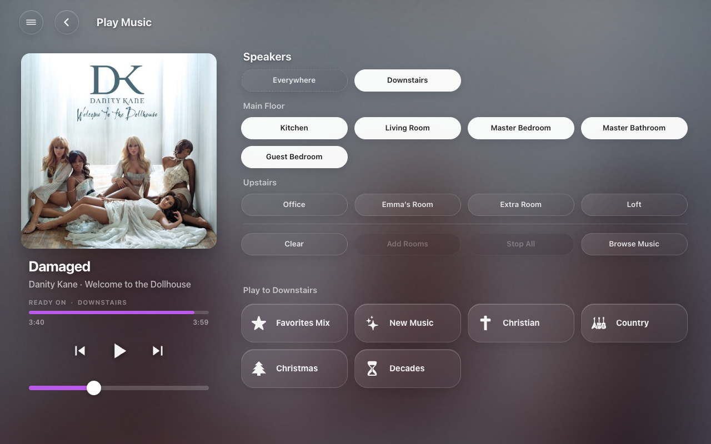
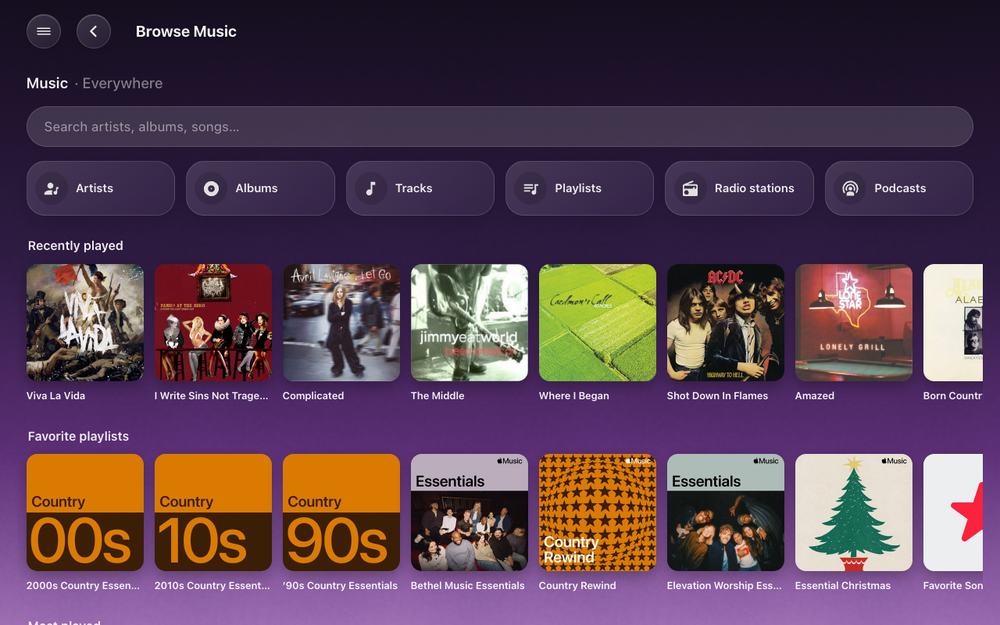
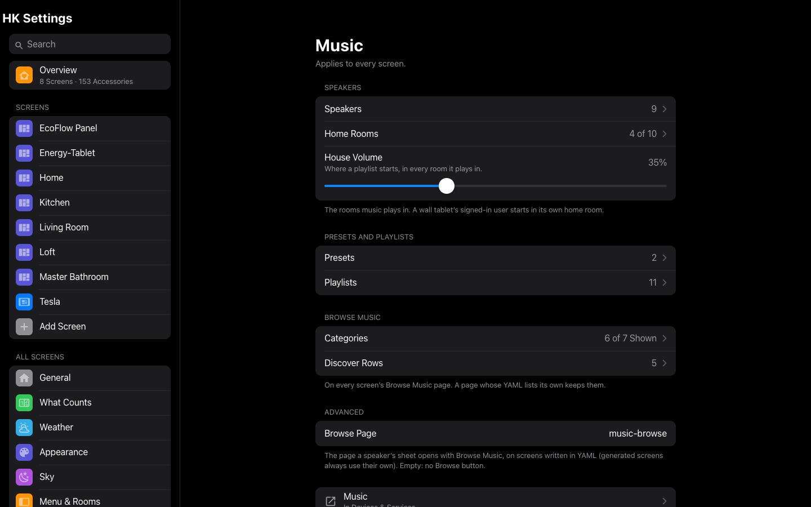
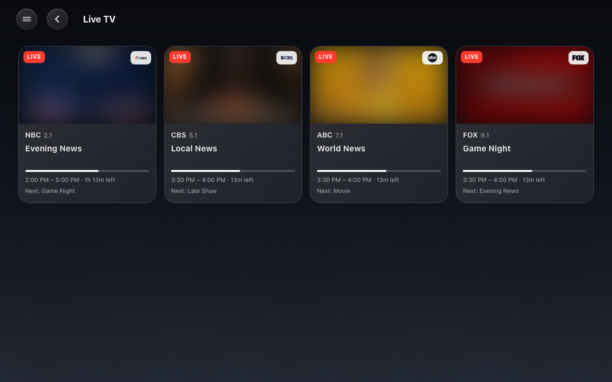
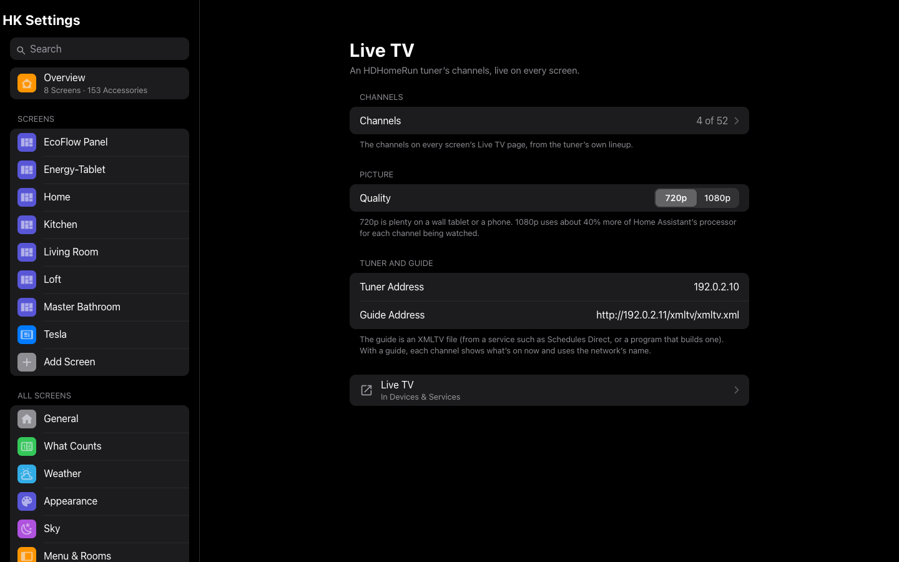
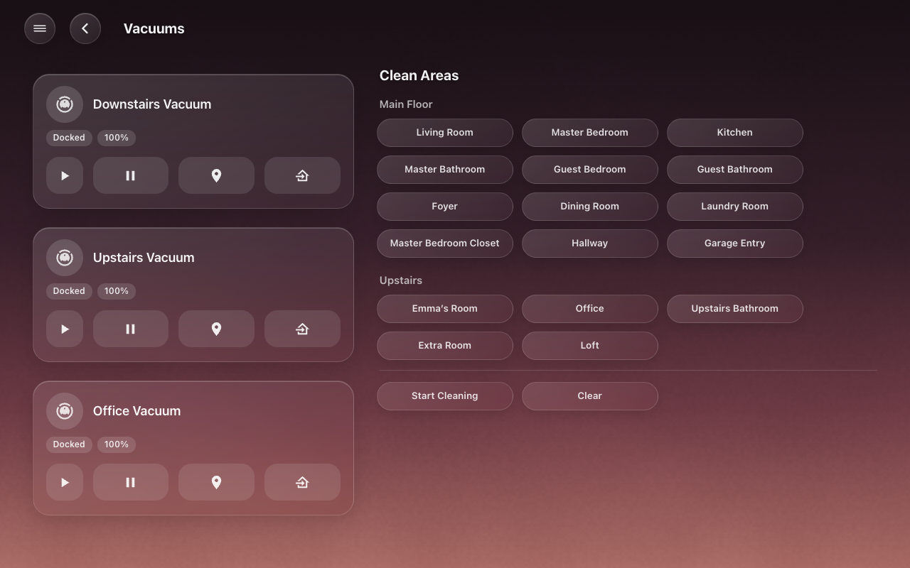
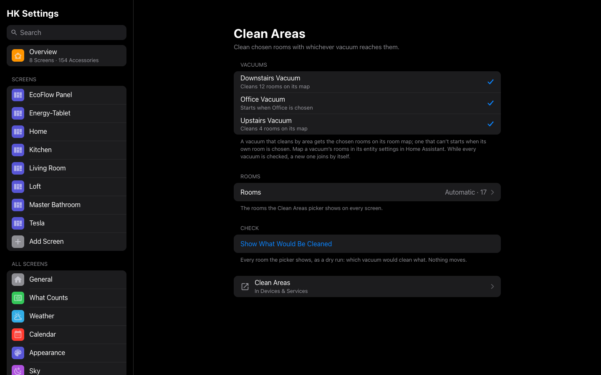
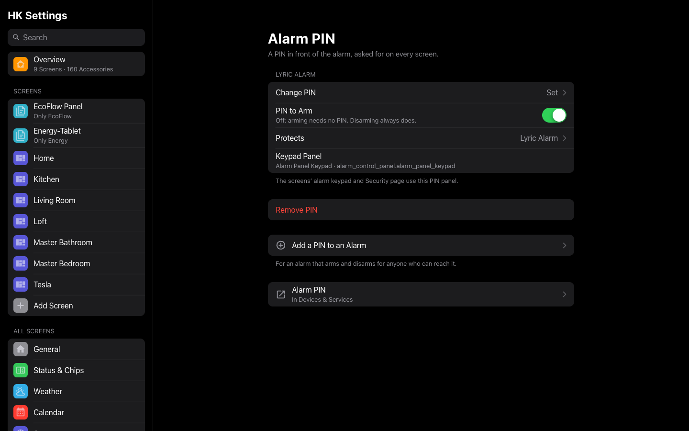

# Features

HK Frontend has four optional features. Each one is added on its own, can be
removed on its own, and none of them changes your dashboards when it is not
there.

| Feature | What it does | What it needs |
|---|---|---|
| [Music](#music) | Whole-home music: pick rooms, tap a playlist, move music between rooms | Music Assistant |
| [Live TV](#live-tv) | An HDHomeRun tuner’s channels, live with sound on your screens, with a guide | An HDHomeRun, ffmpeg on the Home Assistant host |
| [Clean Areas](#clean-areas) | “Clean these rooms,” sent to whichever vacuums reach them | Vacuums, with room maps for those that clean by area |
| [Alarm PIN](#alarm-pin) | A PIN in front of an alarm panel that takes no code of its own | An alarm panel |

This page also covers [`hk_frontend.show_popup`](#show-a-pop-up), the action
that opens a pop-up on your screens from an automation.

## Adding a feature

Every feature is added the same way. HK Frontend itself must be set up first
(see [Getting started](getting-started.md)).

1. Go to **Settings → Devices & services → HK Frontend**.
2. Select **Add feature**, the first button at the top of the page.
3. Pick the feature. The menu lists only the features you have not added yet;
   Alarm PIN can be added once for each alarm you protect.
4. Answer its form (below, under each feature).

The feature appears in the list on HK Frontend’s page, under the HK Frontend
entry, marked **Feature**. From there:

- Its **gear** changes its settings.
- Its **⋮** menu → **Delete** removes it. The dashboards stay; whatever the
  feature drew (a Play Music page, the Live TV guide, the vacuum area picker)
  goes away or says it is not set up. Its entities go with it.

Once a feature is added, its settings are also on the HK Settings page (in
the sidebar) under **Features**. That page offers everything its gear does,
and a little more, one change at a time.

HK Frontend is a single entry. Its features, like your screens’ settings,
pop-ups, pages and chips, are items of that entry, so every **Add** button at
the top of its page opens its own form.

---

## Music

Whole-home music through Music Assistant. Choose one or more rooms on a
screen, tap a playlist, and it plays there, grouped and in step. Music can be
moved to other rooms, added to more rooms, or stopped everywhere.



### What you need

- The **Music Assistant** integration, with its players in Home Assistant.
- Each speaker in an **area**. The area names its pill on the screens
  (“Kitchen,” not “Kitchen HomePod”), and the area’s **floor** groups the
  pills. Rename an area and every screen follows.
- Optional: **sync groups** made in Music Assistant, for rooms that should
  always play together (say, the whole downstairs).

### Set it up

1. Add the feature: **HK Frontend → Add feature → Music**. It asks nothing.
2. Select the gear on the new **Music** item:
   - **Speakers (rooms)**: the Music Assistant players, one per room. Leave
     sync groups out here; they are presets (next step).
   - **House playlist volume**: the volume every room is set to when a
     playlist starts (default 35%).
   - Then **Each tablet’s room**: one dropdown per person who signs in. A wall
     tablet signs in as its own user, so this is how a tablet knows the room
     it hangs in. Its Play Music page starts on that room.
3. Optional: select **Add music preset** at the top of HK Frontend’s page for
   each sync group.
   Give it a name, pick the Music Assistant sync group player, and tick the
   rooms it plays in. Home Assistant cannot read a sync group’s rooms from
   Music Assistant, so you pick them here.
4. Select **Add music playlist** for each pill you want on the Play Music page:
   - **Name** and **Icon** (default `mdi:playlist-music`).
   - **Playlists**: one or more playlists from your Music Assistant library.
     They play as one shuffled queue.
   - **Chooser** (optional): playlists with the same chooser name become one
     pill that asks which, for example a “Decades” pill for six decade
     playlists.
   - **Order**: lower comes first.

Every change reaches open screens right away, with no reload.

### What you see

On generated screens (see [Screens](screens.md)), once Music has at least one
speaker:

- **Play Music**: what is playing, with artwork, controls, progress and
  volume, and beside it the speakers by floor and the playlist pills. Pick
  rooms, then tap a playlist. **Move Music** moves what is playing to the
  rooms you picked (it reads **Add Rooms** when you are adding to it), **Stop
  All** stops everything, and **Clear** clears your selection. When the rooms
  you pick are exactly a preset’s rooms, the music plays through that sync
  group.
- **Browse Music**: your Music Assistant library (playlists, albums, artists,
  radio and more), played on the room the screen is showing.
- The **Speakers** status chip, and the optional **now-playing bar** on a
  screen (see [Wall tablets](wall-tablets.md#the-now-playing-bar)).



### Settings on the HK Settings page

**HK Settings → Features → Music** has the same settings as its gear and the
two Add buttons:

| Setting | What it does |
|---|---|
| Speakers | The rooms, named by area and grouped by floor. Drag them into order within a floor. |
| Home Rooms | Each user’s starting room (a wall tablet’s user is the tablet). |
| House Volume | Where a playlist starts, in every room it plays in. |
| Presets | Add, edit or delete a sync group and its rooms. Deleting a preset leaves the group in Music Assistant. |
| Playlists | Add, edit, reorder or delete the pills. Deleting one leaves the playlists in your library. |
| Browse Music → Categories | Which categories the top of Browse Music shows. |
| Browse Music → Discover Rows | The rows of albums and playlists on its first page. |



### Actions

The Play Music page uses these actions, and your automations and scripts can
too. Every one **answers**: call it with a response variable and read
`ok: true` (with `leader`, the player now leading the group) or `ok: false`
with a `message` written for a person. Called without a response variable, a
failure raises an error with that same message, so an automation never fails
silently.

A request for rooms that another request is still working on waits its turn.
When a newer request replaces it, it answers `superseded: true` and does
nothing. `hk_frontend.music_stop` cancels whatever is still running for its
rooms.

#### `hk_frontend.music_play`

Plays one of your playlist pills on a set of rooms: each room is set to the
house volume, shuffle is turned on, and the rooms are grouped. If the rooms
are exactly a preset’s rooms, it plays through the preset’s sync group.

| Field | Required | Description |
|---|---|---|
| `rooms` | yes | Room players: the speakers chosen under Speakers (not a preset’s group). |
| `playlist` | yes | The playlist’s id (below). |

```yaml
action: hk_frontend.music_play
data:
  rooms:
    - media_player.kitchen
    - media_player.living_room
  playlist: 01JC3Z7Q4M8V2R6N0D5K9T1XWB
response_variable: result
```

**Finding a playlist’s id.** Each playlist pill is an item of HK Frontend’s
entry. On HK Frontend’s integration page, open the entry’s ⋮ menu →
**Download diagnostics**; under `features` → Music → `subentries` the file
lists every preset and playlist, each with its `subentry_id` and `title`. That
`subentry_id` is the playlist’s id.

A playlist whose library playlist has since been removed is refused rather
than played (Music Assistant would otherwise play a search result).

#### `hk_frontend.music_transfer`

Moves what is playing to a set of rooms, or adds rooms to it, keeping the
queue and the position in the track.

| Field | Required | Description |
|---|---|---|
| `rooms` | yes | Where the music should be. |
| `source` | yes | The player the music is on now: a room or a preset’s sync group. |

```yaml
action: hk_frontend.music_transfer
data:
  source: media_player.kitchen
  rooms:
    - media_player.kitchen
    - media_player.patio
```

#### `hk_frontend.music_stop`

Stops and ungroups rooms. With no rooms, it stops the whole house, including
every preset’s sync group.

| Field | Required | Description |
|---|---|---|
| `rooms` | no | The rooms to stop. Leave it out for the whole house. |

```yaml
action: hk_frontend.music_stop
data: {}
```

#### `hk_frontend.music_transport`

Play/pause, skip, stop or change the volume on one player.

| Field | Required | Description |
|---|---|---|
| `player` | yes | A room, or a preset’s sync group. |
| `command` | yes | `play_pause`, `next`, `previous`, `stop`, `volume_up`, `volume_down` or `volume_set`. |
| `level` | for `volume_set` | 0 to 1. |

```yaml
action: hk_frontend.music_transport
data:
  player: media_player.living_room
  command: volume_set
  level: 0.3
```

#### `hk_frontend.music_play_media`

Plays one item from the Music Assistant library on a player, the way Browse
Music does. It does not group rooms or set the house volume. It answers once
the item is actually playing.

| Field | Required | Description |
|---|---|---|
| `player` | yes | A room, or a preset’s sync group. |
| `media_content_id` | yes | A library URI, for example `library://album/42`. |
| `media_content_type` | yes | The media type, for example `album`, `playlist`, `track` or `radio`. |

```yaml
action: hk_frontend.music_play_media
data:
  player: media_player.office
  media_content_id: library://playlist/12
  media_content_type: playlist
```

### Notes

- **Failures people should know about** (a group that would not form, a
  playlist that did not start or is no longer in the library, a move that did
  not arrive, a Stop All that left something playing) also appear as a
  notification in Home Assistant, so a screen that did not make the request
  still hears about it.
- **Presets are not checked against Music Assistant.** If you change a sync
  group’s rooms in Music Assistant, edit the preset too.
- **Every request is logged** in one line: who, what, where and how long. To
  see them all, turn on debug logging:

  ```yaml
  logger:
    logs:
      custom_components.hk_frontend.features.music: debug
  ```

---

## Live TV

An HDHomeRun tuner’s channels, live with sound on your screens, with an
optional guide.



An HDHomeRun sends MPEG-2 video with AC-3 audio, which no browser can play,
and the tuner cannot convert it. So each channel you pick becomes a camera
entity whose stream is converted by ffmpeg on your Home Assistant host (to
H.264 video and AAC audio) and played through Home Assistant’s own go2rtc,
the same way any camera is.

### What you need

- An **HDHomeRun** tuner on your network, with a **channel scan** already run
  (in its own app or web page). You need its IP address.
- **ffmpeg** on the Home Assistant host. Home Assistant OS and the Home
  Assistant container include it.
- Home Assistant’s **go2rtc** integration, which `default_config` loads.
- Some processor to spare: one 720p channel uses about 0.8 of one core; 1080p
  uses about 40% more. Screens watching the same channel share one stream.
- Optional: an **XMLTV guide** file at an address Home Assistant can read
  (from a guide service or a grabber you run). Without one, the channels
  still play; they just have no “what’s on.”

### Set it up

1. **HK Frontend → Add feature → Live TV**.
2. Enter the **HDHomeRun address** (its IP address) and, optionally, the
   **Guide (XMLTV) address**.
3. Pick the **Channels** to show and the **Picture quality**: 720p
   (recommended) or 1080p.

A channel named by its station (“WXYZ-DT”) takes its network’s name
(“NBC”) when the guide says which network it is.

### What you get

| Entity | What it is |
|---|---|
| `camera.tv_<channel name>` | The channel, live. Its still picture is the current program’s artwork (or the channel logo), never a frame, so a thumbnail never ties up a tuner. |
| `sensor.tv_<channel name>_now` | What is on now (the state is the title; “Live” without a guide). Attributes: `channel`, `network`, `name`, `logo`, `camera`, and from the guide `subtitle`, `description`, `start`, `end`, `image`, `next_title`, `next_start`, `next_image`. |
| `sensor.tv_viewers` | How many screens are watching now. Attributes: `users` (the signed-in user on each) and `channels`. |

On generated screens, a **Live TV** page lists the channels with what is on
and how far through it is. Tap a channel and it plays full screen with sound;
close it to go back. The first picture arrives about six seconds after the
tap. Each channel being watched holds one of the tuner’s tuners, and the
tuner is freed about five seconds after the last screen stops watching.

While a channel plays, the screen reports itself as a viewer about once a
minute, and it stays on its page (Return to Home waits). A screen that stops
reporting drops out of `sensor.tv_viewers` after about two and a half
minutes.

### Settings

The **gear** on the Live TV item adds or removes channels, changes the
picture quality, and sets or clears the guide address. The tuner must be
reachable to open it.

**HK Settings → Features → Live TV** has the same settings, plus two that
the gear does not:

| Setting | What it does |
|---|---|
| Channels | Add or remove channels from the tuner’s lineup. Tap a channel to **rename** it (up to 40 characters), or to use its network’s or station’s name. |
| Quality | 720p or 1080p. |
| Tuner Address | The HDHomeRun’s address, if it moves. The new address is checked before it is saved. |
| Guide Address | The XMLTV file’s address (`http://` or `https://`), or empty for no guide. |



Saving restarts the feature, the way its gear does. A channel you take off the
list takes its camera and “now” sensor with it.

### Keeping a tablet awake while someone watches

HK Frontend never turns a screen off. If you sleep your wall tablets with an
automation, add a condition so it leaves them on while TV is playing:

```yaml
conditions:
  - condition: numeric_state
    entity_id: sensor.tv_viewers
    below: 1
```

To keep only the tablet that is watching awake, test its user instead:
`"{{ 'Kitchen Tablet' not in state_attr('sensor.tv_viewers', 'users') }}"`.

### Notes

- **A channel that will not start**: check **Settings → System → Logs** for
  lines starting `channel <number>:`. An HTTP 503 from the tuner means all its
  tuners are busy (another app, or other channels).
- The guide is read every 30 minutes.

---

## Clean Areas

Clean chosen rooms with whichever vacuums reach them. One action,
`hk_frontend.clean_areas`, works out which robot cleans what, from Home
Assistant’s own room maps. The Vacuums page’s area picker uses it, and so can
your automations and voice sentences.



### How vacuums are chosen

For the areas you ask for:

- A vacuum that **cleans by area** and has a **room map** gets one
  `vacuum.clean_area` with all of the chosen areas on its map. The room map
  is Home Assistant’s: in the vacuum entity’s settings, each of the robot’s
  own rooms is matched to one of your areas.
- A vacuum that **cannot clean by area** starts when **its own area** (the
  entity’s area, or its device’s) is chosen. A robot that cannot leave one
  room cleans that room by starting.
- A vacuum that can clean by area but has **no room map** is skipped. This is
  typically a second integration’s copy of the same robot.
- An unavailable vacuum sits it out, and one robot failing does not stop the
  others.

### Set it up

1. Map each vacuum’s rooms in its entity settings in Home Assistant (for the
   vacuums that clean by area).
2. **HK Frontend → Add feature → Clean Areas**.
3. Pick the **Vacuums** that take part, or leave it empty for every vacuum.

On generated screens, the **Vacuums** page gets a **Clean by Area** picker
beside the vacuums: tick rooms, floor by floor, and start.

### Settings

The **gear** on the Clean Areas item:

| Setting | Default | What it does |
|---|---|---|
| Vacuums | every vacuum | Which vacuums take part. |
| Areas | automatic | Which areas the picker offers. Empty: every area a vacuum that takes part can reach (by its room map, or its own area for one that only starts). |

**HK Settings → Features → Clean Areas** has the same two settings, with more
detail:

- **Vacuums**: each one, with what it does with a chosen room (“Cleans 4
  rooms on its map,” “Starts when Kitchen is chosen,” “Can clean by area, but
  has no room map yet”). While every vacuum is ticked, a new vacuum joins by
  itself.
- **Rooms**: automatic, or the rooms you choose. Under each room, the vacuums
  that reach it. Rooms no vacuum reaches are listed separately.
- **Check → Show What Would Be Cleaned**: a dry run of every room the picker
  shows. Nothing moves.



An offline robot still counts by its room map, so its rooms do not vanish from
the picker while it charges off the network.

### Action: `hk_frontend.clean_areas`

| Field | Required | Description |
|---|---|---|
| `areas` | yes | The areas to clean (area ids). |
| `dry_run` | no | `true`: only answer with the plan; start nothing. |

```yaml
action: hk_frontend.clean_areas
data:
  areas:
    - kitchen
    - dining_room
  dry_run: true
response_variable: plan
```

The answer:

```yaml
ok: true
dry_run: true
plan:
  - vacuum: vacuum.downstairs
    action: clean_area
    areas: [kitchen, dining_room]
unreachable: []
```

`action` is `clean_area` or `start`. `unreachable` lists chosen areas no
vacuum reaches. When some vacuums failed to start, the answer has `ok: false`,
a `failed` list (`vacuum` and `error`) and a `message`. When no vacuum reaches
any of the areas, it is `ok: false` with a `message`. Called without a
response variable, a refusal raises an error instead.

To try a plan without moving a robot, run the action from **Developer tools →
Actions** with `dry_run: true` and read its response.

**Your own script instead.** If a script of yours already knows how to clean
rooms, pick it under **HK Settings → Advanced → Vacuums → Clean-Areas
Script**. The picker then starts that script with the chosen rooms as
`areas` (a list of area ids), instead of calling Clean Areas.

---

## Alarm PIN

A PIN in front of an alarm that takes none.

Some alarm integrations arm and disarm for anyone who can call them: their
panel asks for no code (for example Honeywell Lyric). Alarm PIN adds a second
alarm panel that mirrors that alarm (its state, its availability, its arming
modes) and arms or disarms it **only with the right PIN**. A wrong PIN is
refused with Home Assistant’s own error, so every keypad says “Wrong code”:
HK Frontend’s keypad, Home Assistant’s alarm card, the companion app, and
voice.


### Set it up

1. **HK Frontend → Add feature → Alarm PIN**.
2. Fill in the form:

   | Field | Notes |
   |---|---|
   | Alarm to protect | Any alarm panel. Its own settings should take no code. |
   | PIN, PIN again | At least 4 characters, typed twice so a slip cannot be saved. Digits only gives keypads a number pad. |
   | Require the PIN to arm | On (default): arming needs the PIN too. Off: arming needs none, but a PIN that is given must still be right. Disarming always needs it. |

3. A new alarm panel appears, on a device named after the alarm with “PIN”
   added. For an alarm called “Home Alarm” it is
   `alarm_control_panel.home_alarm_pin`. Its `protects` attribute names the
   alarm it stands in front of.
4. Point your keypads at the **PIN panel**, not the alarm:
   - HK Frontend’s screens: **HK Settings → General → Alarm Panel** (the
     Alarm PIN page under Features has a button that does the same).
   - Home Assistant’s own alarm cards and your voice assistants.

Add Alarm PIN again to protect another alarm, with its own PIN.

**Automations can keep using the alarm itself.** It is unchanged, which also
means anything that calls it directly still arms and disarms it with no PIN.
Keep it off your dashboards and out of what you expose to voice assistants.

### Settings

The **gear** on an Alarm PIN item (“Front Door Alarm PIN”):

| Setting | What it does |
|---|---|
| Alarm to protect | Choose another alarm to move the PIN and its panel to it. The PIN and the arm rule stay the same. |
| New PIN, New PIN again | Type a new PIN twice to change it. Leave both empty to keep the current one. |
| Require the PIN to arm | As above. |

**HK Settings → Features → Alarm PIN** lists every protected alarm, each with
**Change PIN**, **PIN to Arm**, **Protects** (move it to another alarm), its
**Keypad Panel**, and **Remove PIN**. **Add a PIN to an Alarm** protects
another one.



### The PIN is never stored

Only a salted hash of the PIN (PBKDF2-SHA256) is kept, and diagnostics leave
even that out. Nothing can show the PIN again, so a forgotten PIN is replaced,
not recovered: set a new one with its gear or on the HK Settings page. The PIN
is passed on to the protected alarm only if that alarm asks for a code of its
own.

---

## Show a pop-up

`hk_frontend.show_popup` opens one of your pop-ups (set up under **HK
Settings → Library → Pop-ups**; see
[Screens](screens.md#detail-sheets-and-pop-ups)) on the screens showing a
dashboard. It opens in place: it does not wake a sleeping tablet or change the
page it is on. A screen that is hidden when the action runs (behind a
screensaver, say) opens the pop-up when it is shown again, if that is within
the pop-up’s **Close After** time.

| Field | Required | Description |
|---|---|---|
| `popup` | yes | The pop-up’s hash, for example `front-door` (the `#` is optional). |
| `dashboards` | no | Only screens showing these dashboards (their URL paths, for example `hk-kitchen`). Empty: any dashboard. |
| `users` | no | Only screens signed in as these users (user ids). Empty: anyone. |

A screen answers only if its **Allow Pop-ups** is on (HK Settings → the
screen → Behavior) and the pop-up is set to show on that dashboard. Asking for
a pop-up that is not set up fails with the list of those that are.

```yaml
automation:
  - alias: Doorbell on the screens
    triggers:
      - trigger: state
        entity_id: binary_sensor.front_door_doorbell
        to: "on"
    actions:
      - action: hk_frontend.show_popup
        data:
          popup: front-door
```

To also wake a wall tablet and bring it to the dashboard, load the dashboard
with the pop-up’s hash on the end, through the Fully Kiosk Browser
integration, instead:

```yaml
action: fully_kiosk.load_url
data:
  device_id: 0123456789abcdef0123456789abcdef   # the tablet's device
  url: https://homeassistant.local:8123/hk-kitchen/0#front-door
```

Any dashboard address that ends in a pop-up’s hash opens that pop-up, on any
screen where it is set to show.
