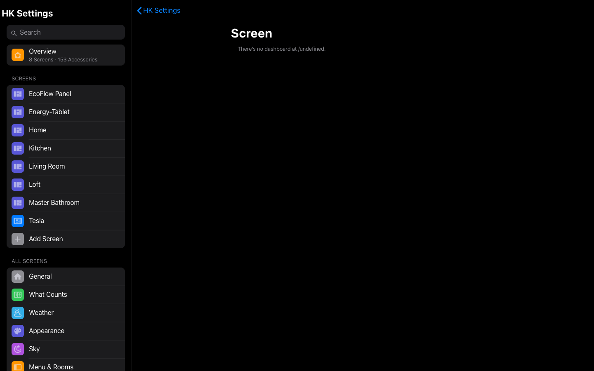

# Gallery

Every screen of HK Frontend, as it looks in one home. The screenshots are of a
home that has added Apple’s font and glyphs ([Your files](your-files.md));
camera pictures are blurred on purpose.

## A wall tablet

| | |
|---|---|
|  |  |
| A room | Lights |
|  |  |
| Climate | Security |
|  |  |
| Doors & Windows | Water |
|  |  |
| Timers | Vacuums |
|  |  |
| Weather | Cameras |
|  |  |
| Play Music ([Music](features.md#music)) | Browse Music |
|  |  |
| Live TV ([Live TV](features.md#live-tv)) | A [custom page](screens.md#custom-pages) |

## A computer, an iPad and a phone

| | | |
|---|---|---|
|  |  |  |
| Home | A room | A detail sheet |

## Detail sheets and pop-ups

| | |
|---|---|
|  |  |
| Light | Thermostat |
|  |  |
| Lock | Garage door |
|  |  |
| Alarm keypad | Doorbell |

## The sky

| | |
|---|---|
|  |  |
| A clear day | Night |
|  |  |
| Rain | Snow |

More: [Sky](sky.md).

## HK Settings

| | |
|---|---|
|  |  |
| Overview | Setup Assistant |
|  |  |
| Screens | A screen |
|  |  |
| Status chips | The preview at phone size |
|  |  |
| Accessories | Custom chips |
|  |  |
| Pop-ups | Custom pages |
|  |  |
| What Counts | Weather |
|  |  |
| Sky | Appearance |
|  |  |
| Music | Live TV |
|  |  |
| Clean Areas | Alarm PIN |

More: [Settings](settings.md).
