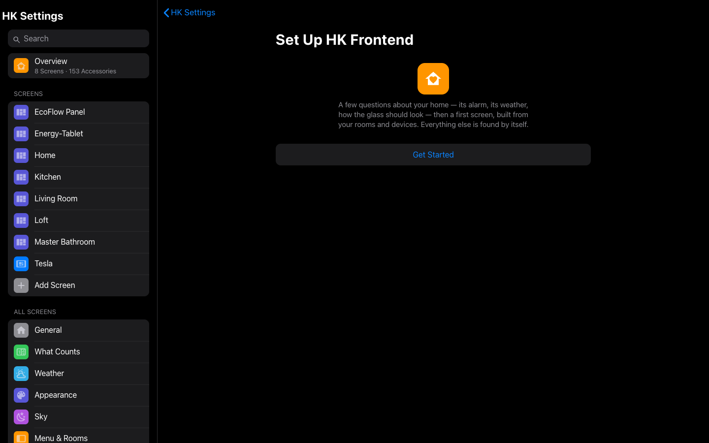

# Getting started

This guide takes you from a Home Assistant without HK Frontend to a working screen built from your own rooms and devices. It takes about 15 minutes.

At the end you’ll have:

- the HK Frontend integration, with **HK Settings** in the sidebar;
- the **HK Kiosk** theme, which the integration loads by itself;
- a first screen: a dashboard that builds itself from your floors, areas and devices.

Apple’s font and glyphs, the optional features and wall tablets can all be added afterwards. Everything works without them.

## Before you start

You need:

- **Home Assistant 2026.8 or newer**, any installation type.
- **[HACS](https://hacs.xyz)**, installed and set up.
- An admin account. HK Settings is for admins only.
- **Your devices assigned to areas.** Generated screens, room pages and the menu are built from your areas. A device with no area still shows up, but in a section called **More** instead of in a room, and on no room page. You can fix this at any time, and the screen follows.

It also helps to have given each area an icon and, under the area’s *Related sensors*, a temperature and a humidity sensor. The menu shows the icon, and a room page’s status line shows the readings.

## 1. Install with HACS

HK Frontend is installed as a custom repository in HACS.

1. Open **HACS**, then **⋮** (top right) → **Custom repositories**.
2. In **Repository**, enter `https://github.com/jazzphone/hk-frontend`.
3. In **Type**, choose **Integration**, then select **Add**. Close the dialog.
4. Search HACS for **HK Frontend**, open it and select **Download**. Confirm the download.
5. Restart Home Assistant: **Settings** → **System** → **⋮** → **Restart Home Assistant** (or use the *Restart required* entry HACS adds to **Settings** → **Repairs**).

## 2. Add the integration

1. Go to **Settings** → **Devices & services** and select **Add integration**.
2. Search for **HK Frontend** and select it.
3. The dialog explains what HK Frontend adds and asks nothing. Select **Submit**.

You should now see **HK Settings** in the sidebar (admins only).

Adding the integration also loads its theme, which gives the screens their colors, font and glass look: **HK Kiosk**, and **HK Kiosk Camera**, a variant for picture cards. You’ll find both under **Theme** in your profile, but you don’t need to pick one: a generated screen uses HK Kiosk by itself.

HK Frontend is set up once per Home Assistant, and there is nothing to add to `configuration.yaml`.

## 3. The card resources

HK Frontend’s cards are dashboard resources: 18 JavaScript modules under `/hk/cards/` and two stylesheets (`/hk/fonts/sf-pro.css` and `/hk/css/hk-responsive.css`).

**Most homes: nothing to do.** With dashboard resources in storage mode (the default), HK Frontend adds any that are missing once Home Assistant has started. It only ever adds: it never edits, reorders or removes a resource, and a resource you already added with a `?v=` on the end counts as present. You can see them under **Settings** → **Dashboards** → **⋮** → **Resources** (visible with *Advanced mode* turned on in your profile).

**Resources in YAML mode.** If your `configuration.yaml` has `lovelace: resource_mode: yaml`, HK Frontend can’t add to your list. Add them yourself — for version 1.0:

```yaml
lovelace:
  resource_mode: yaml
  resources:
    - url: /hk/fonts/sf-pro.css
      type: css
    - url: /hk/css/hk-responsive.css
      type: css
    - url: /hk/cards/hk-base.js
      type: module
    - url: /hk/cards/hk-cameras.js
      type: module
    - url: /hk/cards/hk-chip.js
      type: module
    - url: /hk/cards/hk-control.js
      type: module
    - url: /hk/cards/hk-detail.js
      type: module
    - url: /hk/cards/hk-energy.js
      type: module
    - url: /hk/cards/hk-home.js
      type: module
    - url: /hk/cards/hk-layout.js
      type: module
    - url: /hk/cards/hk-library.js
      type: module
    - url: /hk/cards/hk-media.js
      type: module
    - url: /hk/cards/hk-popup.js
      type: module
    - url: /hk/cards/hk-room.js
      type: module
    - url: /hk/cards/hk-row.js
      type: module
    - url: /hk/cards/hk-security.js
      type: module
    - url: /hk/cards/hk-stat.js
      type: module
    - url: /hk/cards/hk-strategy.js
      type: module
    - url: /hk/cards/hk-tile.js
      type: module
    - url: /hk/cards/hk-weather.js
      type: module
```

A later version may add a card file. **Setup Check** (step 6) always lists exactly the ones you are missing.

## 4. Run the Setup Assistant

Open **HK Settings** in the sidebar. The first time you open it — before any screen has HK Frontend settings — the **Setup Assistant** starts by itself. You can run it again at any time from **Overview** → **Setup Assistant**.



It asks a few questions about your home, then makes your first screen. Every control saves as you change it, and everything can be changed later from the list in HK Settings. Where a step links to another page (for example the radar map’s options), **Back** returns you to the step.

| Step | What it asks |
|---|---|
| **Welcome** | Nothing. Select **Get Started**. |
| **General** | **Alarm Panel** — the alarm the header, the Security chip and page, and the keypad use. If you have one, a button offers it. **Indoor Temperature** (default: the first thermostat’s reading) for the Climate chip. **Power Use**, a power sensor for the Energy chip. **House Timers** — timer helpers offered as one-tap timers on the Timers page. |
| **Weather** | **Weather Service** (default: the first weather entity), and **Place**, the name shown above the temperature (default: your home’s name). Optionally, **Sensors** that replace the weather service’s own readings, and the **Radar Map** (needs Weather Radar Card from HACS). |
| **Appearance** | **Glass Style** for tiles, pills and chips: *Clear* (the default), *Frosted*, *Blur* or *Blur Each Card* — the last is too heavy for a wall tablet. **Frost** or **Blur** amount for the style you picked. A switch for the **detail sheets** that open when you tap an accessory (on by default; off uses Home Assistant’s own dialog). |
| **Features** | The four optional features. One you have added links to its settings; one you haven’t shows **Set Up** and a line about what it does. You can also add them later — see [What next](#what-next). |
| **First Screen** | Your first screen — see the next step. **Skip** leaves it for later. |
| **Done** | A link to open the screen you made, and **Done**. |

## 5. Make your first screen

A **screen** is a Home Assistant dashboard that HK Frontend has settings for. There are two ways to get one, both in the **First Screen** step or, later, from **Add Screen** in the HK Settings list.

### A new generated screen (recommended)

Under **New Screen**:

1. **Name** — for example `Kitchen`. It becomes the dashboard’s title in the sidebar.
2. **Shown On** — what the screen is for. It sets the starting values, and every one can be changed afterwards:

   | Shown On | Starts with |
   |---|---|
   | **Wall Tablet** | The menu always open with the time and weather in it, back to Home when idle, no Home Assistant header (needs [Kiosk Mode](wall-tablets.md)). |
   | **Phone or iPad** | The menu behind a button, the time and weather in the header. |
   | **Computer** | The menu open beside the page. |
   | **Car** | No menu, sized for a car’s browser. |
   | **Something Else** | The defaults. |

3. **Only Admins Can Open It** — off, unless the screen is for admins only.
4. Select **Create Screen**.

HK Frontend creates a new dashboard (its address is `/hk-` followed by the name, for example `/hk-kitchen`), adds it to the sidebar, and gives it its settings. The dashboard’s whole configuration is one line:

```yaml
strategy:
  type: custom:hk-dashboard
```

That line asks HK Frontend to build the screen every time it opens, from your floors, areas and devices. When you move a device to another area or rename an area, an open screen rebuilds itself.

**What you should see:** open the screen (from the Setup Assistant’s last step, or from the sidebar). The Home page shows the time and weather (in the header, or in the menu on a wall tablet), a row of status chips, and a section of tiles for each room, ordered by floor and then by name. Tapping a chip opens its page — Lights, Climate, Doors & Windows and so on — and tapping a room’s heading opens that room’s page.


### An existing dashboard

Under **Existing Dashboards**, HK Settings lists the dashboards that don’t have HK Frontend settings yet. Pick one, choose what it’s **Shown On**, and select **Set Up Screen**.

The dashboard itself isn’t changed: it gets a page in HK Settings for its menu, appearance and behavior. To look the part, its views should use cards from the [card library](cards.md) and the HK Kiosk theme — choose **HK Kiosk** as each view’s theme in the view’s settings. On a hand-built dashboard the menu starts off unless the **Shown On** choice turns it on.

### By hand

You can also make a generated screen the usual way: **Settings** → **Dashboards** → **Add dashboard** → **New dashboard from scratch**, then open it, choose **Edit** → **⋮** → **Raw configuration editor**, and replace everything with the two `strategy` lines above. Then give it settings from **Add Screen** → **Existing Dashboards** in HK Settings.

## 6. Run Setup Check

Setup Check reads your Home Assistant and lists what is ready and what to fix. It changes nothing.

Open **HK Settings** → **Overview** → **Setup Check** (it is also under **System** in the list). Lines are grouped into **Needs Doing**, **Ready** and **Notes**. Fix everything under *Needs Doing*; the *Notes* are optional. Select **Check Again** after fixing something.


What each line means, and how to fix it: [Troubleshooting](troubleshooting.md#setup-check).

**You’re done.** What’s left is optional.

## 7. Optional: Apple’s font and glyphs

Until you add them, screens use Home Assistant’s font (Roboto) and Material Design icons. Apple’s license keeps SF Pro and SF Symbols out of the integration, so you make your own copies from Apple’s downloads and put them in a folder under `/config` — `/config/hk_local` unless you choose another:

| File in `/config/hk_local` | What it is | Made from |
|---|---|---|
| `fonts/SF-Pro.woff2` | The font, as a web font | `SF-Pro.ttf` from Apple’s [SF Pro](https://developer.apple.com/fonts/) download, with `tools/font/make_woff2.py` |
| `fonts/SF-Pro.ttf` | Or the font as Apple ships it, instead of the woff2 | The same file, copied as is |
| `iconset/hk-glyphs.js` | Every `hk:` icon and the weather symbols | 155 symbols from Apple’s [SF Symbols](https://developer.apple.com/sf-symbols/) app, with `tools/sf_symbols/build_glyphs.py` |

Of the 46 files Apple’s SF Pro installs, use only `SF-Pro.ttf` — not `SF-Pro-Italic.ttf` and none of the `.otf` files. The glyphs need a Mac once, to run the SF Symbols app; the font doesn’t.

The step-by-step guide, including how to do it without a Mac or without Python on the Mac: **[Your files](your-files.md)**. The symbol behind every icon: [Glyph names](glyph-names.md).

## What next

- **Shape your screens:** the menu, the Home page’s chips, cameras, scenes and favorites, which pages to show, per-screen appearance — [Screens](screens.md). Every setting, page by page — [Settings](settings.md).
- **Optional features** — Music, Live TV, Clean Areas and Alarm PIN. Add each from **Settings** → **Devices & services** → **HK Frontend** → **Add feature**, then set it up under **Features** in HK Settings: [Features](features.md).
- **Wall tablets:** Fully Kiosk Browser, a user per tablet, the photo screensaver and returning to Home when idle — [Wall tablets](wall-tablets.md).
- **The live sky** and its seasonal decorations — [Sky](sky.md).
- **Timers you set from the Timers page** need a set of timer helpers that come with the integration: `helpers/quick_timers.yaml`, included as a package. The top of that file says how.
- **Your own dashboards** with the same look — [Cards](cards.md).
- **Something not right?** [Troubleshooting](troubleshooting.md).

## Removing HK Frontend

1. **Settings** → **Devices & services** → **HK Frontend**. Delete each feature entry you added (Music, Live TV, Clean Areas, Alarm PIN), then the **HK Frontend** entry itself (**⋮** → **Delete**). Its Repairs entries go with it.
2. In **HACS**, open **HK Frontend** → **⋮** → **Remove**, then restart Home Assistant.
3. Remove what HK Frontend left for you to own: the screens it created (**Settings** → **Dashboards**), its resources (**Settings** → **Dashboards** → **⋮** → **Resources**, every URL starting with `/hk/`), and your files folder. The HK Kiosk themes go with the integration.
