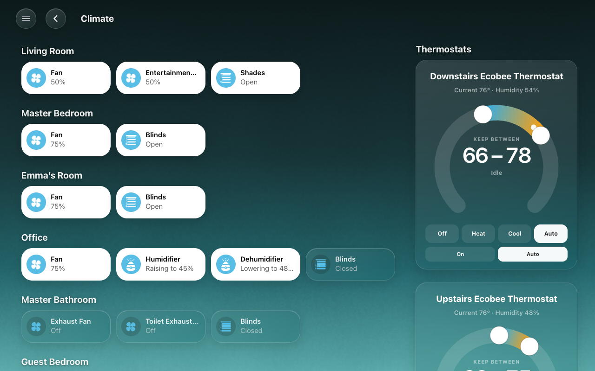
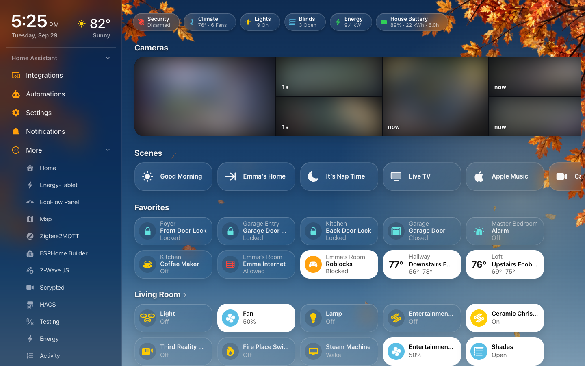

# Screens

A **screen** is a Home Assistant dashboard that HK Frontend draws and keeps
settings for: the dashboard on a wall tablet, on your phone, on your computer,
in your car. This page explains what a screen is made of and how to shape each
part. Every setting mentioned here is listed, with its default, in the
[HK Settings reference](settings.md#reference).


## Two kinds of screen

| | Generated screen | Your own YAML dashboard |
|---|---|---|
| What it is | A dashboard whose whole configuration is `strategy: type: custom:hk-dashboard` | A dashboard you write yourself, view by view, with HK Frontend’s [cards](cards.md) |
| Where its content comes from | Your floors, areas, devices and entities, read every time it opens: a light you add appears by itself | Your YAML |
| How you shape it | HK Settings: its menu, Home page, pages, appearance and behavior | Your YAML, plus the HK settings its cards read |

Start with a generated screen. You can have as many as you like: one per wall
tablet, one for phones, one for a computer. They all share the
[All Screens](settings.md#general) settings and the [Library](settings.md#accessories),
and each has its own page in HK Settings.

## Make a screen

### Add a generated screen

1. Open **HK Settings** in the sidebar.
2. Under **Screens**, select **Add Screen**.
3. Type a **Name**, for example “Kitchen”.
4. Select **Shown On** and pick what it will be shown on: **Wall Tablet**,
   **Phone or iPad**, **Computer**, **Car** or **Something Else**. This sets its
   starting values (below); every one can be changed afterwards.
5. Optional: turn on **Only Admins Can Open It**.
6. Select **Create Screen**.

You should see the screen’s page in HK Settings, with a live preview beside its
settings, and a new dashboard in the sidebar at `/hk-kitchen`.


| Shown On | Starts with |
|---|---|
| Wall Tablet | The menu always open with the time and weather in it, Return to Home When Idle, Home Assistant’s header and sidebar hidden |
| Phone or iPad | The menu behind a button, the time and weather in the header |
| Computer | The menu always open beside the page |
| Car | No menu, Car Browser on, Home Assistant’s header and sidebar hidden |
| Something Else | The defaults |

Hiding Home Assistant’s header and sidebar needs **Kiosk Mode** from HACS, and a
photo screensaver needs **WallPanel**. **Setup Check** says whether each is
installed. Setting up a wall tablet end to end: [Wall tablets](wall-tablets.md).

### Make a generated dashboard by hand

You can also make one yourself: **Settings → Dashboards → Add dashboard → New
dashboard from scratch**, then in its raw configuration editor:

```yaml
strategy:
  type: custom:hk-dashboard
```

Every option is optional:

```yaml
strategy:
  type: custom:hk-dashboard
  areas: [kitchen, living_room]        # only these areas, in this order
  exclude_areas: [garage]
  exclude_devices: [<device id>]
  exclude_entities: [switch.car_seat_heater]
  include_entities: [scene.movie_night]
  theme: HK Kiosk                      # default: HK Kiosk, when it is loaded
  sky: false                           # no live sky
  music: false                         # no Play Music or Browse Music pages
  chips: false                         # no status chips
  pages: false                         # no Lights, Climate, Doors & Windows, Timers, Vacuums or Water pages
  rooms: false                         # no room pages
```

The lists add to **HK Settings → Accessories → Hidden from Screens** and
**Also Shown**, which apply to every generated screen. Then give the dashboard
its settings as described next.

### Give an existing dashboard HK settings

1. Open **HK Settings → Screens → Add Screen**.
2. Under **Existing Dashboards**, pick the dashboard.
3. Pick what it is **Shown On**.
4. Select **Set Up Screen**.

A YAML dashboard draws its own Home page and pages, so its page in HK Settings
shows only what it can use:

| Setting | Reaches a YAML dashboard through |
|---|---|
| Menu | Every view (see [The menu on your own dashboard](#the-menu-on-your-own-dashboard)) |
| Status Chips | `custom:hk-chips-card` |
| Scenes | `custom:hk-scenes-card` (the list you pick replaces the card’s own) |
| Cameras | `custom:hk-camera-mosaic-card` (the cameras you pick replace the card’s own) |
| Rooms (room order) | Room sections in a `custom:hk-grid-view` view: a card whose first card is an `hk-heading-card` with `area:` |
| Glass, Live Sky | Every view. Live Sky can only turn off a sky the YAML turns on. |
| Return to Home, Tablet Room, Allow Pop-ups, Car Browser | The whole dashboard |

Favorites, the camera strip switch, On Phones, Pages, hiding Home Assistant’s
header, the now-playing bar and the photo screensaver are for generated
screens only. A YAML dashboard says those things in its own YAML.

## The Home page


A generated screen’s Home page shows, from the top:

1. **The header**: the time and date, the weather (tap it for the Weather
   page), and a security line: *Home Secured* when the alarm is armed and
   everything is shut, locked and reporting, otherwise what isn’t
   (“2 Doors Open”). On a screen whose menu shows the time and weather, the
   header moves into the menu and the status chips move up.
2. **Status chips**: a row of small summaries (Lights, Security, Climate, …).
3. **The camera strip**: one live camera and snapshots of the others.
4. **Scenes**: a row of scene pills, and pills that open a page.
5. **Favorites**, when you have picked some.
6. **Rooms**: a section for each room, with a tile for each accessory.
7. **More**: things you added under Also Shown that have no room.


**On a phone** the tiles reflow to two columns. The screen’s **On Phones**
setting (Home Page group) picks what sits at the top under 640 px: the clock
and weather header, or a one-line **Weather Strip**.

### Status chips

Each chip summarizes one kind of thing and opens its page:

| Chip | Shows | Opens |
|---|---|---|
| Weather Alerts | The current alert, while there is one | Weather |
| Security | The alarm’s state, or how many locks are unlocked | Security |
| Doors & Windows | How many doors, windows and garage doors are open | Doors & Windows |
| Climate | The indoor temperature and how many fans are on; its glyph shows heating or cooling | Climate |
| Lights | How many lights are on | Lights |
| Blinds | How many blinds are open | Climate |
| Timers | How many timers are running | Timers |
| Vacuums | How many vacuums are running | Vacuums |
| Speakers | How many speakers are playing | Play Music |
| Water | Whether a leak sensor is wet | Water |
| Energy | Power use, in kW | A [custom page](#custom-pages) with the address `energy`, if the screen has one |

What each chip counts is the same on every screen, and is set in
[What Counts](settings.md#what-counts). The alarm, indoor temperature and power
sensor are in [General](settings.md#general); the alerts sensor is in
[Weather](settings.md#weather). A kind your home has nothing of never shows a
chip.


**Only when there’s something to report.** Some chips are *quiet*: they appear
only while something is on, open, running or wet, so the row carries news
rather than a permanent “All Closed”. Weather Alerts, Doors & Windows, Blinds
and Water start quiet. To change one:

1. Open **HK Settings → Screens → (the screen) → Status Chips**.
2. Tap the chip’s row.
3. Set **Show** to **When Active** (quiet) or **Always**.

**Choose and order the chips.** On the same page, turn **Automatic** off. Drag
the chips into order, remove the ones you don’t want, and add others back from
**More**.

**An accessory as a chip.** Any entity can be a chip of its own: select **Add
Accessory Chip…** and pick it. The chip shows its name and state. In its
[accessory settings](#accessory-settings) you can give it a color, show it
only in one state (a mail sensor only when its state is “Delivered”), show one
of its attributes instead of its state, or give it a label.

**Custom chips.** For a chip you design yourself (several values, its own tap
action, a chip that appears only sometimes), write it once in the Library and
add it to any screen:

1. Open **HK Settings → Library → Custom Chips → Add Custom Chip**.
2. Give it a **Name**, and choose where it **Sits**: at the start, after a kind
   of chip, or at the end.
3. Write the chip in YAML: an `hk-status-chip-card`, or one inside a
   `conditional` card. There is an example on the page.
4. Select **Add Chip**.
5. On each screen that should show it, open **Status Chips** and add it from
   **More**.


A custom chip’s minus on a screen takes it off that screen only. **Delete
Chip** in the Library removes it everywhere.

### The camera strip

One camera plays live; the others show snapshots that refresh. Tap any camera
to open it full size, with sound, and hold-to-talk if it has a speaker (talking
needs Home Assistant over https).

- **Choose the cameras**: **Screens → (the screen) → Cameras**, turn
  **Automatic** off, then add, remove and drag. Automatic shows one tile per
  camera, using its low-resolution channel when it has several, and never a
  wall tablet’s own camera or a Live TV channel.
- **Choose the live one**: see [Live Camera Follows](#live-camera-follows)
  below. Nothing chosen: the first camera.
- **Turn it off**: **Show Camera Strip**.

A generated screen’s Cameras page shows the same cameras, all live.

#### Live Camera Follows

The strip plays one camera live. **Live Camera Follows** lets something else
choose which one, so the strip can jump to where someone was just seen.

It takes a **dropdown helper** (an `input_select`, or a `select`) whose options
are your cameras’ names. Whichever option is chosen, that camera plays live.
An option names a camera when it is the camera’s name or the start of it, so
`Front Door` names *Front Door Camera Low resolution channel*. An option that
names no camera, or nothing chosen, plays the first camera.

**HK Settings → Screens → (the screen) → Cameras → Set Up Live Camera Follows**
does the rest for you:

1. **The dropdown.** It lists the option each camera in the strip needs.
   **Create the Dropdown** makes a helper called *Live Camera* with those
   options and chooses it. If you already chose one, it shows which cameras
   your dropdown has no option for.
2. **The automation.** It writes one for your cameras, from the person
   sensor on each camera’s device (or its motion sensor): when that sensor
   turns on, its camera is chosen; after five minutes with every sensor off,
   the first camera is chosen again. **Copy Automation**, then in
   **Settings → Automations & Scenes** choose **Create Automation → Create New
   Automation → ⋮ → Edit in YAML**, paste it over everything there, and save.

The automation it writes looks like this, for two cameras:

```yaml
alias: Live camera follows motion
mode: queued
triggers:
  - trigger: state
    entity_id: binary_sensor.front_door_person_detected
    to: "on"
    id: "Front Door"
  - trigger: state
    entity_id: binary_sensor.driveway_person_detected
    to: "on"
    id: "Driveway"
  - trigger: state
    entity_id:
      - binary_sensor.front_door_person_detected
      - binary_sensor.driveway_person_detected
    to: "off"
    for:
      minutes: 5
    id: all quiet
actions:
  - if:
      - condition: trigger
        id: all quiet
    then:
      - condition: state
        entity_id:
          - binary_sensor.front_door_person_detected
          - binary_sensor.driveway_person_detected
        state: "off"
      - action: input_select.select_option
        target:
          entity_id: input_select.live_camera
        data:
          option: "Front Door"
    else:
      - action: input_select.select_option
        target:
          entity_id: input_select.live_camera
        data:
          option: "{{ trigger.id }}"
```

Each trigger’s `id` is the option it chooses, so it must be spelled exactly as
in the dropdown.

### Scenes and page pills

The scenes row runs a scene or script, or presses a button, with one tap.
Automatic shows every scene, A to Z. To choose, open **Scenes**, turn
**Automatic** off, and use **Add Scene or Shortcut…**. A scene’s name, icon and
color come from its [accessory settings](#accessory-settings).

**Page pills** open a page instead of running anything: a Play Music pill, a
Cameras pill. Add them from **More** on the Scenes page. Tap a page pill’s row
to change its name, icon and color; that look is the same on every screen.

### Favorites

*Generated screens.* A Favorites section above the rooms, for the things you
use most. Each favorite shows its room above its name, as the Home app does.

- Open **Screens → (the screen) → Favorites** and select **Add Favorite…**, or
- open an accessory’s detail sheet on that screen, tap the gear, and turn on
  **Favorite on this dashboard**.

A favorite can have its own name, room line and glyph, and can control several
lights together (“Main + Table Lights”). See
[As a favorite](#as-a-favorite).

### Rooms


A generated screen has a section on Home for every area with something in it,
floor by floor (in your floors’ order), then A to Z. Only things that are in an
area get a tile; to show something with no area, add it to
**Accessories → Also Shown** and it appears under **More**.

A room heading with a › opens the room’s own page (see [Room pages](#room-pages)).

To change the rooms, open **Screens → (the screen) → Rooms**:

- Turn **Automatic** off, then drag the rooms into the order you want. This is
  the screen’s **room order**.
- Move a room to **Not on Home** to leave it off Home. It keeps its room page
  and its place in the menu.
- **Rooms on Pages** (generated screens): whether the Lights, Climate, Water and
  other pages group rooms **By Floor** or in the **Room Order**.

Two settings live with each room in **HK Settings → Library → Accessories →
(the room)**, and apply on every generated screen:

- **Show As Part Of**: show a room inside another (a deck inside the
  backyard).
- **Tile Order**: the order of the room’s tiles, on Home and on its room page.

## Pages

A generated screen has a page for each kind of thing your home has, a page for
every room, and any custom pages you add. The status chips, the scene pills and
the menu open them; a back button returns to Home.


### Category pages

| Page | Appears when your home has | What it shows |
|---|---|---|
| Weather | A weather entity | The hours and days ahead, wind, sunrise and sunset, the moon, UV (with a UV sensor), the week’s outside temperature (with a sensor), any alerts, and a radar map (with the Weather Radar Card from HACS) |
| Cameras | Cameras | Every camera on the strip, live, three across |
| Live TV | The Live TV feature | The channel guide; tap a channel to watch it full screen |
| Security | An alarm panel (the one in General, else the first) | The alarm keypad, with the locks and garage doors beside it |
| Doors & Windows | Door or window contacts | The doors, then the windows, each with its room above its name |
| Climate | Thermostats, fans or blinds | Fans, humidifiers and blinds by room, and the thermostats |
| Lights | Lights | The lights by room (titled *Lights & Outlets* when What Counts counts an outlet as a light) |
| Timers | Timers | The running timers. With the optional quick-timer helpers (`helpers/quick_timers.yaml`), also presets, a New Timer keypad and your [House Timers](settings.md#general) |
| Vacuums | Vacuums | Each vacuum with its controls; with the Clean Areas feature, a picker to clean chosen rooms |
| Play Music, Browse Music | The Music feature, with speakers | The player and the speakers; the music library |
| Water | Leak sensors | The leak sensors by room, and a count of any that haven’t reported since Home Assistant started |

A page lists what [What Counts](settings.md#what-counts) counts, so the Lights
chip and the Lights page always agree. The Vacuums and Security pages list
things A to Z unless you give them an order: **Accessories → Page Order**.
The Doors & Windows page has the doors and windows only; the locks and garage
doors are on Security.

| | | |
|---|---|---|
|  |  |  |
| Weather | Security | Climate |
|  |  |  |
| Doors & Windows | Water | Timers |

Every page, on a tablet and a phone: [Gallery](gallery.md).

### Room pages

Each room page shows the room’s name, a **status row** (its temperature and
humidity, then what is open, on or detected), its cameras as snapshots in a
row, and its accessories in groups: Climate, Lights, Speakers & TVs, Security,
Water and Other.

What the status row can show is set in
[Menu & Rooms → Status Row](settings.md#menu--rooms). The temperature and
humidity are the area’s own sensors: **Settings → Areas → (the area) → Related
sensors**.

### Custom pages

A custom page is a page you write in YAML, once, that any generated screen can
show: an Energy page, say. It belongs to HK Frontend, not to any one dashboard.

1. Open **HK Settings → Library → Custom Pages → Add Page**.
2. Give it a **Name** and an **Icon**. Its **Address** is made from the name;
   change it now if you like (it can’t be changed later).
3. **Start From** a blank page, or from a page of any dashboard you already
   have (its cards are copied).
4. Select **Create Page**, then **Page Content** to write or edit its YAML.
5. On each screen that should show it, open **Pages** and add it from
   **More**.


A chip whose page has the same address opens it: the Energy chip opens a
custom page at `energy`.

### A screen of only custom pages

To make a screen that is just one or two custom pages (an energy panel, say),
open its **Pages**, turn **Home Page** off, and add the custom pages. The
screen opens on the first. With no custom page added, it stays a whole screen.

### Choose and order the pages

Open **Screens → (the screen) → Pages** and turn **Automatic** off. Drag the
pages into order, remove the ones this screen doesn’t need, and add others from
**More**. The order here is also the order in the menu. Each page’s row also
says where it sits in the menu (see below).

## The menu

The menu lists the screen’s pages and rooms, like the sidebar of Apple’s Home
app: **Home** first, then the pages at the top, then **Categories** and
**Rooms**. The page you are on is highlighted.

Each screen chooses its own menu, under **Screens → (the screen) → Menu**:

- **Off**: no menu. Pages are reached from the chips and pills.
- **Button**: the menu is hidden until opened. **Button Style** picks how:
  - **Automatic**: the round chip when Home has a menu button, otherwise the
    edge tab.
  - **Chip**: a round button at the start of the status chips (and beside the
    back button on other pages).
  - **Chip, Then Tab**: the chip, and a slim tab slides in from the left edge
    when the chip is scrolled out of sight.
  - **Chip on Home, Tab Elsewhere**.
  - **Edge Tab**: a slim tab on the left edge, level with the date. **Tab
    Position** can move it.
- **Always Open**: the menu stays beside the page, with no button. It needs
  room: narrower than **Keep Open Down To** (1,000 px unless you change it),
  it folds away and **When Folded** stands in for it. One screen can then serve
  a computer, an iPad and a phone. With **Time & Weather in Menu**, the time,
  date and weather sit at the top of the menu and the Home page gains the
  header’s space.

**On narrow screens.** Below 1,024 px wide (an iPad held upright, a phone), a
button menu uses **On Narrow Screens** instead of its Button Style: the chip
(the default), the chip then the tab, or the edge tab.

**Tapping the clock** also opens the menu, and the weather beside it opens the
Weather page. Both are [Menu & Rooms](settings.md#menu--rooms) settings for
every screen, along with the button’s icon.

**Top of Menu and Categories.** On a generated screen, Weather, Cameras and
Live TV sit at the top of the menu, right under Home, and every other page is
under **Categories**. To move one, open **Pages** and use the menu beside its
row: **Top of Menu**, **Categories** or **Not in Menu** (still one tap away on
its chip or pill). **Use the Automatic Menu** puts them back. Room pages are
always under **Rooms**, and Browse Music always follows Play Music.

**Rooms in the menu** are A to Z, or in the screen’s room order (**Rooms in
Menu**).

**The Home Assistant section.** **Home Assistant Section** adds Home
Assistant’s own pages to the menu, above Categories: Integrations,
Automations and Settings, Notifications, **More** (which folds out the rest
of your Home Assistant sidebar, in your order, without what you hid),
**Show Menu** (Home Assistant’s own sidebar, over the page, even where kiosk
mode hides it) and Profile. Settings shows how many updates and repairs are
waiting and Notifications how many notifications, as Home Assistant’s
sidebar does. Everything is read live from Home Assistant, and each person
sees only what they may open -- a wall tablet’s user gets Notifications,
More, Show Menu and Profile. On Home Assistant’s own pages its sidebar (or
its ☰) is the way back. Leave it off on a wall tablet everyone uses.



The menu closes itself when you choose a row, tap outside it, press Escape,
leave it untouched for a minute, or when the page changes any other way.

### The menu on your own dashboard

On a YAML dashboard, the menu is read from the dashboard itself:

- The first view is **Home**.
- A view with `area:` is a **room**, named by its title (else the area’s name)
  and pictured by the area’s icon (**Settings → Areas**).
- **Categories** are the pages Home’s status chips open, in chip order. With no
  chips, every other view with a title.

View keys adjust it:

| Key | Effect |
|---|---|
| `area: kitchen` or `area: [backyard, deck]` | The view is a room. |
| `menu: top` | Listed at the top, right under Home. |
| `menu: false` | Not listed. Hidden views, views with no title and views this user can’t see are never listed. |
| `menu_title:` | The name in the menu, when it should differ from the view’s title. |
| `menu_icon:` | The icon in the menu, when it should differ from the view’s `icon:`. |

The screen’s **Pages in Menu** overrides `menu: top` and `menu: false`, page
by page.

A room page for a YAML dashboard is built from its area every time it opens:

```yaml
- title: Kitchen
  path: room-kitchen
  subview: true
  strategy:
    type: custom:hk-room
    area: kitchen          # or a list: [backyard, deck]
```

To make a room heading on Home open it, give the heading the same area:

```yaml
- type: custom:hk-heading-card
  name: Kitchen
  area: kitchen
```

A page you lay out yourself is a room too, as long as the view has `area:`.
Give it a status row with `custom:hk-room-status-card`:

```yaml
- type: custom:hk-room-status-card
  area: kitchen
```

| Option | What it does |
|---|---|
| `area` | Required. One area or a list. |
| `items` | Which kinds show. Default: [Menu & Rooms → Status Row](settings.md#menu--rooms). |
| `temperature`, `humidity` | A sensor to use instead of the area’s own. |
| `entities` | The accessories on this page. Outlets, blinds, fans, locks and garage doors are then counted from this list rather than the whole area. |
| `exclude` | Entities to leave out of the counts. |
| `include` | Entities from outside the area to count too. |

Every card’s options: [Cards](cards.md).

## Detail sheets and pop-ups

**Detail sheets.** Tapping an accessory’s name opens a sheet with its controls:
a brightness slider, the thermostat, the player, a graph. Tapping its glyph
toggles it. Locks, the alarm, garage doors, valves, thermostats, water
heaters, sirens, vacuums and cameras never change from a single tap. To use
Home Assistant’s own dialog instead, turn off
[HK Detail Sheets](settings.md#appearance-1).


| | | |
|---|---|---|
|  |  |  |
| Thermostat | Lock | Garage door |

**Pop-ups** are sheets that an automation opens on a screen: the doorbell when
someone rings, the alarm keypad when the alarm needs a code. Each pop-up has an
address (a hash, such as `#front-door`) that any screen answers.


| Type | Shows |
|---|---|
| Camera or Doorbell | The camera’s picture to every edge, with sound, and hold-to-talk when it has a speaker |
| Alarm Keypad | The alarm’s keypad |
| Accessories | Several accessories on one sheet, in the order you pick |
| Custom | Your own cards, written in YAML: any Home Assistant card or custom card, on a narrow or wide sheet |


### Add a doorbell pop-up

1. Open **HK Settings → Library → Pop-ups → Add Pop-up**.
2. **Name**: “Front Door”. The **Address** becomes `front-door`.
3. **Type**: **Camera or Doorbell**.
4. Pick the **Camera**, and the **Talk-Back Speaker** if the doorbell has one.
5. Select **Add Pop-up**.

On the pop-up’s page you can then set how long it stays open (**Close After**),
and which screens answer it. Every setting: [Pop-ups](settings.md#pop-ups).


For a **Custom** pop-up, its cards are the next step: a YAML list, for example

```yaml
- type: custom:hk-heading-card
  name: Garage
- type: tile
  entity: cover.garage_door
- type: picture-entity
  entity: camera.garage
```

### Open a pop-up from an automation

There are two ways.

**The Show pop-up action** opens it on the screens that are showing a
dashboard now, over whatever page they are on:

```yaml
action: hk_frontend.show_popup
data:
  popup: front-door
  dashboards:
    - hk-kitchen
```

| Field | What it does |
|---|---|
| `popup` | Its address, with or without the `#`. An address with no pop-up is an error that lists the ones there are. |
| `dashboards` | Only screens showing these dashboards (their addresses, such as `hk-kitchen`). Empty: any. |
| `users` | Only screens signed in as these users (user IDs). Empty: anyone. |

It doesn’t wake a sleeping tablet or change its page.

**The screen’s address with the pop-up’s hash**, such as
`/hk-kitchen/0#front-door`, opens the screen and then the pop-up. A kiosk
browser’s “load URL” command does this, and wakes the tablet too: see
[Wall tablets](wall-tablets.md).

A pop-up closes itself **Close After** the last touch: a minute unless you
change it (an Alarm Keypad pop-up added in HK Settings starts at an hour). Closed by hand or by time, its hash leaves the address, so
nothing opens it again.

**Where pop-ups open.** A screen with **Allow Pop-ups** off (its Behavior
group) never shows one: turn it off for a car’s screen. A pop-up can also be
limited to some screens (its **Screens** group).

**The alarm keypad on a generated screen.** A generated screen answers
`#alarm` with the alarm keypad by itself. Add a pop-up with the address `alarm`
to set its Close After or limit it to some screens.

**On a YAML dashboard**, an `hk-popup-card` on the page that claims the same
hash wins over the Library’s pop-up.

## Accessory settings

How one accessory shows up on every screen: its name, room, icon, what its
states are called, and where it appears. These don’t change Home Assistant’s
own names or icons (only the room is Home Assistant’s own), so voice assistants
and other dashboards are untouched.

There are two ways in, to the same settings:

- **On a screen**: open the accessory’s detail sheet and tap the **gear**
  beside the close button. Tap it again (a check mark) when you are done. The
  gear is there for administrators only, and not on a camera sheet or a sheet
  of several accessories.
- **In HK Settings**: **Library → Accessories**, then its room (or search).

Everything saves as you change it and reaches every screen; a generated screen
redraws within about ten seconds. Each setting and its default:
[Accessories](settings.md#accessories).

### Name and room

- **Name**: the name on its tiles and sheet, short and room-relative like the
  Home app’s: “Lamp”, not “Living Room Lamp”. Empty: the entity’s name with its
  room’s name dropped.
- **Only on this dashboard** (on a screen’s sheet): the name is this screen’s
  alone.
- **Room**: Home Assistant’s own area for the entity. Choosing the device’s
  area goes back to following the device.

On Doors & Windows each tile shows its room above its name; on Security and
Climate the room goes in front of a name you give it (“Hallway Thermostat”).

### Show as

For switches, lights and input booleans: **Light**, **Switch**, **Outlet** or
**Fan**. It sets the tile, the glyph, and which chip counts it: a lamp on a
smart plug shown as a Light is counted by the Lights chip; a coffee maker shown
as an Outlet isn’t.

### What it says

For switches and input booleans: what its states are called, **When on** and
**When off**, on its tiles and as a favorite. For example “Blocked” and
“Allowed” for a switch that blocks a game console. Whether it looks lit still
follows its state.

### Icon

A glyph for its tiles and sheet, chosen from the ones that suit what it is. A
door or window sensor’s glyph comes as an open and a shut pair.

### Where it shows

- **Include in Status**: off, no chip counts it, and What Counts leaves it out
  of every kind. Because the category pages list what What Counts counts, it
  also leaves those pages.
- **Show on Home**: off, it isn’t on a generated screen’s Home. Its room page
  and the category pages still list it, as in the Home app.
- **Favorite on this dashboard** (on a generated screen’s sheet): adds it to,
  or removes it from, this screen’s Favorites.

### As a favorite

Shown for something that is a favorite on any screen:

- **Name**, **Room** and glyph as a favorite, on the Favorites row of every
  screen where it is one. **Room** is for something with no area of its own,
  such as a helper.
- **Together with** (lights, switches and input booleans): up to eight more it
  controls as one favorite. “Main + Table Lights” turns both on and off, is lit
  while either is, and shows their brightness.

### Color and chip settings

Shown for a chip, a scene pill or a favorite:

- **Color**: its color as a chip, a scene pill, or a favorite’s glyph while it
  is on.
- For an accessory chip: **Show only when it is** (a state), **Shows** (its
  state or one of its attributes) and **Label** (words to show instead).

### Reset to Automatic

Clears every setting of the accessory and this screen’s name for it. The room,
other screens’ names and favorites stay.

### Page order for Vacuums and Security

Pages that mix rooms list things A to Z. Two pages can have an order of your
own, in **HK Settings → Library → Accessories → Page Order**:

- **Vacuums**: the order of the vacuums.
- **Security**: the order of the locks and garage doors (automatic: the locks
  A to Z, then the garage doors), so you can list them the way you think of
  them: Front Door, Garage Door, Back Door.

A YAML dashboard’s tiles keep the names and glyphs written in its YAML; its
detail sheets use these settings.

---

HK Frontend is an independent project, not affiliated with or endorsed by Apple
Inc. Apple, HomeKit, SF Pro and SF Symbols are trademarks of Apple Inc.
