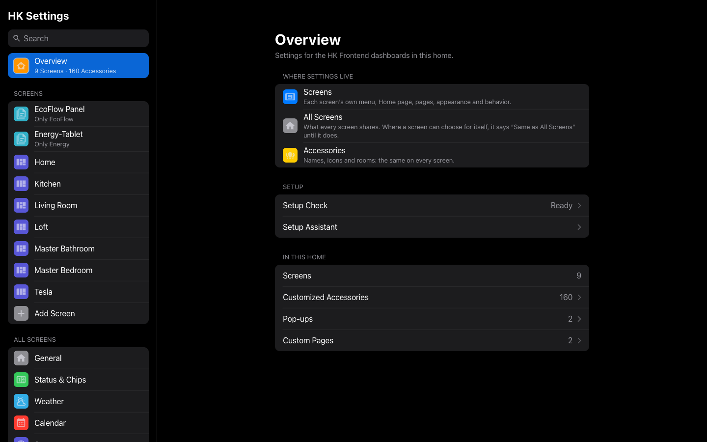
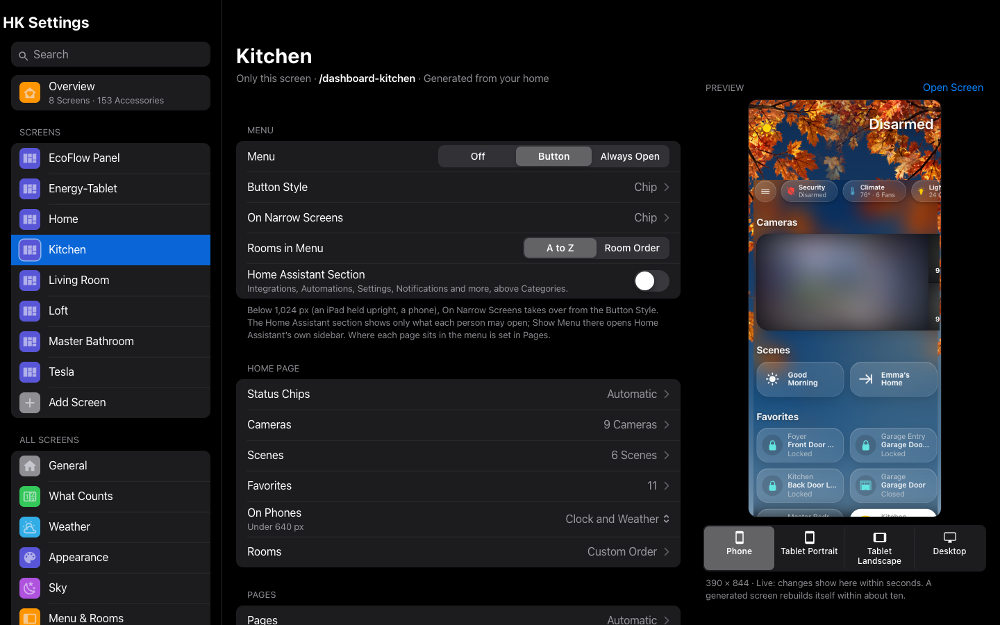
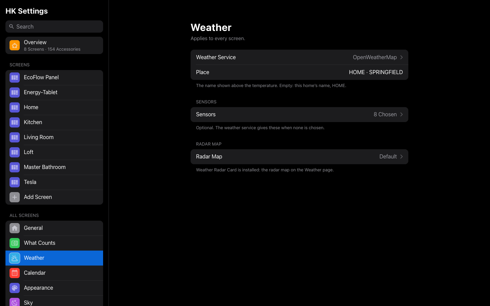
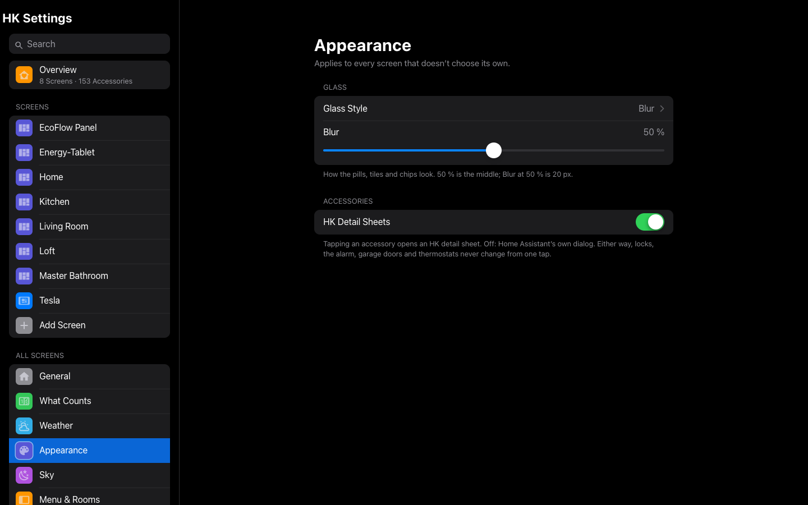
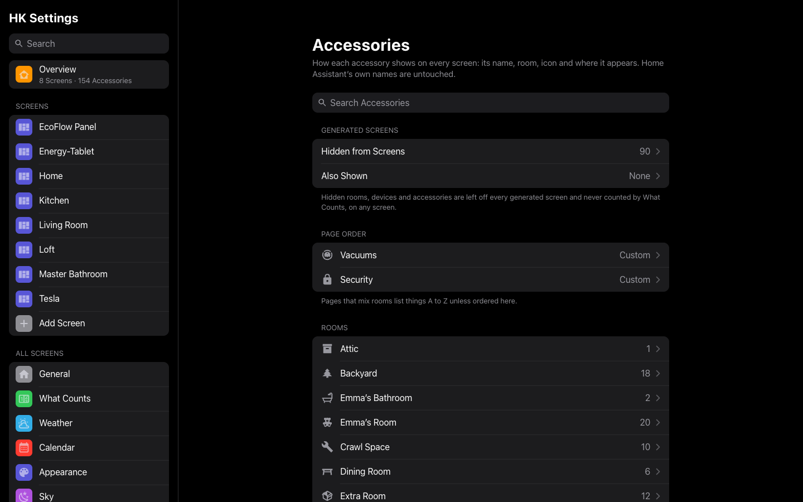

# HK Settings

**HK Settings** is the page where you set up everything HK Frontend draws: each
screen, the settings every screen shares, how your accessories show up, and the
optional features. It is in Home Assistant’s sidebar as **HK Settings**, at
`/hk-settings`. Only administrators can open it.

This page has two parts:

- [A tour of HK Settings](#a-tour-of-hk-settings): how the page is organized
  and how its controls behave.
- [The reference](#reference): every setting, grouped the way the page groups
  them, with its default and what it does.

For what a screen is and how to shape one (the Home page, pages, the menu,
pop-ups), read [Screens](screens.md). New to HK Frontend? Start with
[Getting started](getting-started.md).

---

## A tour of HK Settings



### Open it

1. In Home Assistant’s sidebar, select **HK Settings**.
2. If it isn’t in the sidebar, go to **Settings → Devices & services →
   HK Frontend → Configure → HK Settings page** and use the link there.

The first time you open it, before any screen has settings, it starts the
**Setup Assistant** (see [below](#the-setup-assistant)).

On a wide window the list sits on the left and the page you pick on the
right. On a phone the list is its own page, and each page has a back button.
The address in the browser follows the page you are on, so Back, reload and
bookmarks work.

### How it is organized

| Group | Pages | Applies to |
|---|---|---|
| **Overview** | Where settings live, the Setup Check status, and counts of your screens, customized accessories, pop-ups and custom pages | — |
| **Screens** | One page per screen, then **Add Screen** | That screen only |
| **All Screens** | **General**, **What Counts**, **Weather**, **Appearance**, **Sky**, **Menu & Rooms**, **Wall Tablets** | Every screen |
| **Features** | **Music**, **Live TV**, **Alarm PIN**, **Clean Areas** | Every screen |
| **Library** | **Accessories**, **Pop-ups**, **Custom Pages**, **Custom Chips** | Every screen that uses them |
| **System** | **Advanced**, **Setup Check** | — |


A screen’s page shows a live preview of that screen beside its settings (above
them on a narrower window). Changes show in the preview within seconds.
Under it, pick the size to look at -- **Phone** (390 × 844), **Tablet
Portrait** (an iPad upright, 820 × 1180), **Tablet Landscape** (1280 × 800,
a wall tablet), **Desktop** (1440 × 900), and **Car** (804 × 638, with the
car’s zoom) on a screen with Car Browser on. The preview is that size, so it
shows the layout that device really gets. It opens on the size the screen is
used at, and remembers your last choice for each screen in that browser.


**Open Screen** opens the screen itself in a new tab.

### How the controls behave

- **Every control saves as you change it.** There is no Save button, except on
  pages where you type YAML. The top bar says **Saved**, or says what went
  wrong beside the field. A value that can’t be saved is never quietly swapped
  for a default.
- **Changes reach open screens within about a second**, without a reload. A
  generated screen (see [Screens](screens.md#two-kinds-of-screen)) rebuilds
  itself within about ten seconds when something it is built from changes, and
  stays on the page you were looking at. Nothing here needs a restart.
- **A screen setting that can follow All Screens says so.** A screen’s Glass
  reads *Same as All Screens (Blur)* until you choose one for that screen, and
  its amount sliders are marked *Same as All Screens* until you move them.
- **Lists work the same way everywhere** (status chips, cameras, scenes,
  favorites, rooms, pages, Discover rows, a room’s tile order):
  - An **Automatic** switch at the top. On, the list follows your home: a
    light you add tomorrow shows up tomorrow. Turn it off to choose.
  - **Shown**: what is on the screen, in order. Drag a row by its handle to
    move it, or focus the handle and press the up and down arrow keys. Tap
    the red minus to remove a row.
  - **More**: what you can add. Tap the green plus.
- **Removing, deleting and going back to Automatic ask first.**
- **Back returns to the page you came from.** A page you reached from a link on
  another page (a screen’s link to What Counts, say) goes back there.

### Search

Type in **Search** at the top of the list to find any setting by name or by a
word you might use for it (“blur”, “doorbell”, “idle”). A setting that every
screen has is listed once per screen. Search also finds screens, pop-ups,
custom pages, rooms and the features’ settings. Selecting a result opens its
page and highlights the setting.

### The Setup Assistant

A short walk through the settings a new home needs. It opens by itself the
first time, and you can run it again from **Overview → Setup Assistant** or
**Advanced → Setup Assistant**.

1. **Welcome.**
2. **General**: your alarm panel, indoor temperature, power use and house
   timers.
3. **Weather**: your weather entity and place name.
4. **Appearance**: the glass style.
5. **Features**: Music, Live TV, Alarm PIN and Clean Areas. Each shows its page
   if it has been added, or an **Add** link if not.
6. **First Screen**: make your first generated screen (or **Skip**).
7. **Done**, with a link to open the screen you made.

Every step can be changed later from the list.

---

## Reference

Each section below is one page of HK Settings. “Default” is what you get when
you have never touched the setting.

### A screen

**Screens → (a screen).** The settings of one dashboard. A screen written in
YAML (not generated) only shows the settings its cards can read; the rows
marked *generated* are left out for it. [Screens](screens.md) explains what
each part of a screen is.

The first line under the title says the screen’s address and whether it is
*Generated from your home* or *Written in YAML*.

#### Menu

| Setting | Default | What it does |
|---|---|---|
| Menu | Button (a YAML screen added as *Something Else*: Off) | **Off**: no menu. **Button**: the menu is hidden until you open it. **Always Open**: the menu stays beside the page, like the sidebar of the Home app on a Mac. The screen’s [preset](#add-screen) sets this first. |
| Button Style | Automatic | *Menu: Button.* **Automatic**: a round chip at the start of the status chips when the Home page has a menu button, otherwise the edge tab. **Chip**: the round chip. **Chip, Then Tab**: the chip, and a slim tab slides in from the left edge while the chip is scrolled out of sight. **Chip on Home, Tab Elsewhere**: the chip on Home, the edge tab on every other page. **Edge Tab**: a slim tab on the left edge, level with the date. |
| On Narrow Screens | Chip | *Menu: Button.* Below 1,024 px wide (an iPad held upright, a phone), this takes over from Button Style: **Chip**, **Chip, Then Tab** or **Edge Tab**. |
| Tab Position | Level with the date | Shown when the edge tab can appear. Where the tab’s center sits: empty for level with the date under the clock, a distance from the top (`140px`, or just `140`), or a share of the screen’s height (`20%`). |
| Keep Open Down To | 1,000 px | *Menu: Always Open.* Narrower than this (700 to 3,000 px), the menu folds away and When Folded stands in for it. 1,000 keeps it open on a computer and an iPad held sideways and folds it on a small iPad held upright or a phone. |
| When Folded | Chip | *Menu: Always Open.* What stands in for a folded menu: **Chip**, **Chip, Then Tab** or **Edge Tab**. It is the same setting as On Narrow Screens. |
| Time & Weather in Menu | Off (Wall Tablet preset: on) | *Menu: Always Open.* The time, date and weather sit at the top of the menu instead of in the Home page’s header, and the status chips move up into the space. When the menu folds away, the header comes back. |
| Pages in Menu | Automatic | *YAML screens.* For each page: **Top of Menu** (right under Home), **Categories**, or **Not in Menu**. A generated screen sets this on its [Pages](#pages) instead. **Use the Automatic Menu** clears your choices. |
| Rooms in Menu | A to Z | **A to Z**, or **Room Order** (the order set in [Rooms](#rooms)). |
| Home Assistant Section | Off | Adds a **Home Assistant** section to the menu, above Categories: Integrations, Automations, Settings (with its updates-and-repairs count), Notifications (with its count), **More** (the rest of that person’s Home Assistant sidebar, in their order), **Show Menu** (Home Assistant’s own sidebar, even where it is hidden) and Profile. Each person sees only what they may open. Leave it off on a shared wall tablet. |

#### Home Page

| Setting | Default | What it does |
|---|---|---|
| Status Chips | Automatic | Opens [Status Chips](#status-chips). |
| Cameras | Automatic | Opens [Cameras](#cameras). |
| Scenes | Automatic | Opens [Scenes](#scenes). |
| Favorites | None | *Generated.* Opens [Favorites](#favorites). |
| On Phones | Clock and Weather | *Generated.* What the top of Home shows under 640 px: **Clock and Weather** (the header) or **Weather Strip** (one line of weather). |
| Rooms | Automatic | Opens [Rooms](#rooms). |

A YAML screen draws its own Home page. These settings reach it where it uses
the cards that read them: the status chips (`custom:hk-chips-card`), the scenes
row (`custom:hk-scenes-card`), the camera strip (`custom:hk-camera-mosaic-card`)
and the room order.

##### Status Chips

| Setting | Default | What it does |
|---|---|---|
| Show Status Chips | On | Off: no chip row on this screen. |
| Automatic | On | A chip for every kind your home has, in the usual order: Weather Alerts, Security, Doors & Windows, Climate, Lights, Blinds, Timers, Vacuums, Speakers, Water, Energy. A kind your home has nothing of never shows. |
| Shown | — | The chips, in order. A kind’s row opens its own page (below). |
| More | — | Kinds you took off, and your [custom chips](#custom-chips). |
| Add Accessory Chip… | — | Any entity as a chip of its own: its name and state. Its look is set in its [accessory settings](screens.md#accessory-settings). |

Each kind’s page:

| Setting | Default | What it does |
|---|---|---|
| Show | When Active for Weather Alerts, Doors & Windows, Blinds and Water; Always for the rest | **When Active**: the chip appears only while something is on, open, running or wet. **Always**: it is always there. |
| What It Counts | — | Links to the [What Counts](#what-counts) kinds, and to the single settings the chip reads (Alarm Panel, Indoor Temperature, Power Use, Weather Alerts). The same on every screen. |

##### Cameras

| Setting | Default | What it does |
|---|---|---|
| Show Camera Strip | On | *Generated.* The live camera strip under the chips. |
| Live Camera Follows | First Camera | A dropdown helper (input select or select) whose option names the camera to show live, set by an automation (for example on person detection). An option matches the camera whose name starts with it. The other tiles show snapshots. |
| Set Up Live Camera Follows | — | Explains it, lists the option each camera needs, makes the dropdown for you (**Create the Dropdown**), and writes the automation for your cameras’ person or motion sensors (**Copy Automation**). See [Screens](screens.md#live-camera-follows). |
| Automatic | On | One tile per camera, using its low-resolution channel when it has several. Never a wall tablet’s own camera or a Live TV channel. |
| Shown / More | — | The cameras, in order. A generated screen’s Cameras page shows the same ones. |

##### Scenes

| Setting | Default | What it does |
|---|---|---|
| Show Scenes Row | On | The row of scene pills. |
| Automatic | On | A generated screen: every scene, A to Z. A YAML screen: the scenes its YAML lists. Then any page pills. |
| Shown | — | Scenes, scripts and buttons, in order. Choosing here replaces a YAML screen’s own list. A scene’s row opens its accessory settings (its name, icon and color). |
| More | — | Page pills: a pill that opens a page (Weather, Cameras, Live TV, Security, Doors & Windows, Climate, Lights, Timers, Vacuums, Play Music, Water) instead of running something. A page the screen doesn’t have gets no pill. |
| Add Scene or Shortcut… | — | Any scene, script, button or input button. |

A page pill’s own page:

| Setting | Default | What it does |
|---|---|---|
| Name | The page’s name | The pill’s name on every screen that shows it (for example “Apple Music” for Play Music). |
| Icon | The page’s icon | An `mdi:` or `hk:` icon. |
| Color | The page’s color | White, Yellow, Orange, Red, Pink, Purple, Blue, Teal, Mint or Green. |

##### Favorites

*Generated screens.* A Favorites section above the rooms.

| Setting | Default | What it does |
|---|---|---|
| Favorites | None | The favorites, in order. None: no Favorites section. |
| Add Favorite… | — | A light, switch, fan, cover, lock, thermostat, media player, alarm panel, vacuum, valve, water heater, humidifier, input boolean, scene or script. |

A favorite’s name, room line and icon as a favorite are in its
[accessory settings](screens.md#accessory-settings).

##### Rooms

| Setting | Default | What it does |
|---|---|---|
| Automatic | On | Home shows its rooms as the screen lists them: on a generated screen, floor by floor (in your floors’ order), then A to Z. |
| On Home | — | Your areas, in order. This is the **room order**, also used by Rooms in Menu and Rooms on Pages. |
| Not on Home | — | Rooms left off Home. Each keeps its room page and its row in the menu. |
| Rooms on Pages | By Floor | *Generated.* How the Lights, Climate, Water and other pages group rooms: **By Floor** (floor by floor, A to Z) or **Room Order**. |

#### Pages

*Generated screens.* Which pages this screen has, in what order, and where each
sits in the menu.

| Setting | Default | What it does |
|---|---|---|
| Home Page | On | Off: the screen is only its custom pages, in order, and opens on the first. Add the custom pages below. With none added, the screen stays a whole screen. |
| Automatic | On | Every page your home has something for, in the usual order: Weather, Cameras, Live TV, Security, Doors & Windows, Climate, Lights, Timers, Vacuums, Play Music (with Browse Music), Water, Room Pages. Custom pages you add go before Room Pages. |
| Shown / More | — | The pages, in order. The order here is the menu’s order too. Browse Music always comes with Play Music. Custom pages are marked *Custom page*. |
| (each page) in the menu | Weather, Cameras and Live TV: Top of Menu. The rest: Categories | **Top of Menu** (right under Home), **Categories**, or **Not in Menu** (still one tap away on its chip or pill). Room Pages are always under Rooms. Categories keeps at least one page. |
| Use the Automatic Menu | — | Shown once you have moved a page. Puts every page back where it was. |

#### Appearance

| Setting | Default | What it does |
|---|---|---|
| Glass | Same as All Screens | **Same as All Screens**, or for this screen only **Clear**, **Frosted**, **Blur** or **Blur Each Card**. See [Appearance](#appearance-1) for what each looks like. |
| Frost / Blur | Same as All Screens | Shown for the amount this screen’s glass uses. Moving it gives this screen its own amount. |
| Use All-Screens Frost / Blur | — | Shown once the screen has its own amount. Goes back to following All Screens. |
| Live Sky | On | Off: a plain background instead of the animated sky. A YAML screen’s sky comes from its YAML; this can only turn it off. |
| Hide Home Assistant Header & Sidebar | Off (Wall Tablet and Car presets: on) | *Generated.* The whole window is the screen. Needs Kiosk Mode from HACS. The menu’s Home Assistant section still reaches it (Show Menu). |
| Kiosk Mode Options | Default | *Generated, with the switch above on.* See below. |

**Kiosk Mode Options**

| Setting | Default | What it does |
|---|---|---|
| Hide Header | On | Hides Home Assistant’s header. |
| Hide Sidebar | On | Hides Home Assistant’s sidebar. |
| Show Header for Admins | Off | Administrators still see the header. |
| Options in YAML | None | Any other [Kiosk Mode](https://github.com/NemesisRE/kiosk-mode) option. Only what you write changes; `key: null` removes a key from the tuned setup. |
| Use the Tuned Setup… | — | Shown once anything is changed. Clears every change. |

#### Behavior

| Setting | Default | What it does |
|---|---|---|
| Return to Home When Idle | Off (Wall Tablet preset: on) | A page left untouched goes back to Home. For wall tablets, not for screens people sit at. How long it waits: [Wall Tablets](#wall-tablets). |
| Tablet Room | Empty | Shown when Return to Home or Photo Screensaver is on. The tablet’s room, in lowercase letters, digits and underscores (`kitchen`, `living_room`). It names the tablet’s optional helpers (see [Wall Tablets](#wall-tablets)). |
| Allow Pop-ups | On | Your [pop-ups](#pop-ups) may open over this screen. Off: never here (a car’s screen, say). |
| Car Browser | Off (Car preset: on) | Fits a car’s narrow browser to a desktop layout. Add `?vw=1000` to the address to change the width it lays out (a bigger number makes everything smaller), or `?vw=off` to turn it off in that browser. |
| Now Playing Bar | Off | *Generated.* A bar that rises from the bottom while music plays or a quick timer runs. Needs the Music feature. |
| Photo Screensaver | Off | *Generated.* A photo screensaver for the tablet’s own user. Needs WallPanel from HACS. The live sky pauses behind it. |
| Screensaver Options | Default | *Generated, with Photo Screensaver on.* See below. |
| Tablet User | None | *With Photo Screensaver on.* The Home Assistant user the wall tablet signs in as. Only that user gets the screensaver, so a computer opening the same screen never does. |

**Screensaver Options**

| Setting | Default | What it does |
|---|---|---|
| Starts After | 3 Minutes | 1 to 30 minutes untouched. |
| Each Photo For | 30 Seconds | 10 seconds to 5 minutes. |
| Order | Random | **Random** or **In Order**. |
| Slow Zoom | On | A slow zoom across each photo. |
| Fill the Screen | On | Off: the whole photo, with room around it. |
| Options in YAML | None | Any other [WallPanel](https://github.com/j-a-n/lovelace-wallpanel) option. Only what you write changes, key by key. Changing `enabled`, `profiles` or `screensaver_entity` unhooks it from the tablet’s user and the sky. |
| Use the Tuned Setup… | — | Shown once anything is changed. Clears every change. |

The photos come from [Wall Tablets → Photos](#wall-tablets). The time, the
weather, what’s playing and running timers show over them.

#### Removing a screen’s settings

| Button | Shown for | What it does |
|---|---|---|
| Delete Screen… | A generated screen | Deletes the dashboard and its settings. A tablet showing it will need another screen. |
| Remove HK Settings… | A YAML screen | The dashboard stays. Its menu, Home page, pages and appearance go back to the defaults. |

A dashboard with no HK settings has no menu and uses the defaults for
everything else. Its page offers **Set Up This Screen**.

### Add Screen

**Screens → Add Screen.**

**New Screen** makes a new generated dashboard:

| Setting | Default | What it does |
|---|---|---|
| Name | — | Its title in the sidebar. Its address is made from the name (`hk-kitchen` for Kitchen). |
| Shown On | Wall Tablet | The preset it starts from (below). |
| Only Admins Can Open It | Off | Only administrators see it in the sidebar. |

**Existing Dashboards** lists your other dashboards. Pick one, choose what it is
**Shown On**, and select **Set Up Screen** to give it HK settings.

What each preset starts with (everything else is the default, and every value
can be changed afterwards; nothing remembers the preset):

| Shown On | Starts with |
|---|---|
| Wall Tablet | Menu Always Open, Time & Weather in Menu, Return to Home When Idle, Home Assistant’s header and sidebar hidden |
| Phone or iPad | Menu as a button (Automatic), the time and weather in the header |
| Computer | Menu Always Open |
| Car | No menu, Car Browser on, Home Assistant’s header and sidebar hidden |
| Something Else | The defaults: a generated screen gets the menu as a button, a YAML one no menu |

### General

**All Screens → General.** What your home has, for every screen.

| Setting | Default | What it does |
|---|---|---|
| Alarm Panel | No Alarm | The alarm for the header’s security line, the Security chip and page, and every alarm keypad that names no panel of its own. When none is chosen, the page offers **Use (your first alarm panel)**; a generated screen’s Security page uses the first alarm panel until you choose. |
| Indoor Temperature | First Thermostat’s | A temperature sensor for the Climate chip. |
| Power Use | None | A power sensor for the Energy chip, which needs it. W or kW; shown in kW. |
| House Timers | None | Timer helpers people start themselves (a nap, bedtime), shown as one-tap pills on the Timers page, in order. Each starts for its own duration and is named as the timer is, less a trailing “Timer”. |

### What Counts

**All Screens → What Counts.** What each status chip, its page and the header’s
security line count. Every kind finds its own entities; you only adjust. The
Lights chip and the Lights page count the same lights, so they can’t disagree.


| Kind | Found automatically | The chip counts |
|---|---|---|
| Lights | Every light | On (Lights chip) |
| Fans | Every fan | On (Climate chip) |
| Doors | Binary sensors of class door | Open (Doors & Windows chip) |
| Windows | Binary sensors of class window | Open (Doors & Windows chip) |
| Garage Doors | Covers of class garage or gate, binary sensors of class garage door | Open (Doors & Windows chip); the Security page lists the covers |
| Locks | Every lock | Unlocked (Security chip) |
| Blinds | Covers of class awning, blind, curtain, shade, shutter or window, or with no class | Open (Blinds chip) |
| Leak Sensors | Binary sensors of class moisture | Wet (the Water chip appears) |
| Thermostats | Every climate entity | Heating or cooling (the Climate chip’s glyph) |
| Timers | Every timer helper | Running (Timers chip) |
| Vacuums | Every vacuum | Cleaning, returning, paused or in error (Vacuums chip) |
| Speakers | Media players that aren’t TVs or receivers | Playing (Speakers chip). With the Music feature, its speakers are counted instead. |

Never found: hidden or disabled entities, configuration and diagnostic
entities, groups of other entities (a light group would count its lights
twice), and anything [Hidden from Screens](#accessories). An accessory with
**Include in Status** off, or shown as something else (a switch **Shown as** a
light), is counted as its [accessory settings](screens.md#accessory-settings)
say.

Each kind’s page:

| Setting | What it does |
|---|---|
| Found Automatically | How many the kind finds by itself. |
| Counted | Everything it counts now, with each one’s room. |
| Left Out · Leave Out… | Found, but not wanted: a car’s windows, a second copy of a blind. |
| Also Counted · Also Count… | Not found, but wanted: an outlet you think of as a light, a switch that runs a fan. |
| Reset to Automatic… | Clears both lists. |

A kind you never touch stays automatic, so a light you add tomorrow is counted
tomorrow. The category pages of a generated screen (Lights, Doors & Windows, …)
list what What Counts counts.

### Weather

**All Screens → Weather.** The weather entity is all you need; every sensor is
optional.



| Setting | Default | What it does |
|---|---|---|
| Weather Service | First Weather Entity | The weather entity every screen reads. |
| Place | Your home’s name, in capitals | The name over the temperature on the Weather page. |
| Sensors | None | Opens the sensors below. |
| Radar Map | Default | Opens the radar map’s options (below). |

**Sensors.** When a sensor is empty, the value comes from the weather entity.

| Setting | Default | What it does |
|---|---|---|
| Feels Like | From Weather Service | The feels-like temperature on the weather band. |
| Humidity | From Weather Service | Humidity on the weather band. |
| Wind Speed | From Weather Service | Wind on the weather band and the wind tile, in the sensor’s own unit. |
| Wind Gust | Not Shown | Gusts on the wind tile. |
| UV Index | None | The Weather page’s UV tile appears only with a UV sensor. |
| Outside Temperature | Not Shown | A temperature sensor outdoors. The Weather page shows its daily averages for the week. |
| Daily Forecast | From Weather Service | A sensor with a `forecast` attribute. |
| Hourly Forecast | From Weather Service | A sensor with a `forecast` attribute. |
| Weather Alerts | None | A sensor from the NWS Alerts integration (HACS). Its state is the number of alerts. With it, the Weather Alerts chip and the alert card show while an alert is active. |

If the weather entity offers no forecast, the band shows none and asks again
later.

**Radar Map.** Shown on every generated screen’s Weather page when the Weather
Radar Card is installed from HACS; the page says so when it isn’t.

| Setting | Default | What it does |
|---|---|---|
| Radar | Automatic (NOAA in the US, RainViewer elsewhere) | **NOAA** or **RainViewer**. |
| Zoom | 6 | 4 to 10. Higher is closer. |
| Height | 620 px | 420 to 820 px. |
| Playback Controls | On | The play and step controls. |
| Move and Zoom the Map | Off | Off: a still map. |
| Options in YAML | None | Any other [Weather Radar Card](https://github.com/Makin-Things/weather-radar-card) option, such as `zoom_level: 7`. Only what you write changes; `key: null` removes a key. |
| Use the Tuned Setup… | — | Shown once anything is changed. Clears every change. |

### Appearance

**All Screens → Appearance.** How the glass looks on every screen that doesn’t
choose its own.



| Setting | Default | What it does |
|---|---|---|
| Glass Style | Clear | How pills, tiles, chips, scenes and keypads look: **Clear**, the original glass, with the status chips blurring what’s behind them. **Frosted**, a frosted material with no blur: it costs a tablet nothing per frame. **Blur**, what’s behind the glass blurred as one shared layer, so wall tablets keep their frame rate. **Blur Each Card**, every surface blurs what’s behind it: for phones, iPads and computers, too heavy for a wall tablet. |
| Frost | 50 % | Shown when a screen uses Frosted. How milky it is, 0 to 100 %. |
| Blur | 50 % | Shown when a screen uses Blur or Blur Each Card. How strong the blur is, 0 to 100 %: 50 % is 20 px, 100 % is 40 px. |
| HK Detail Sheets | On | Tapping an accessory’s name opens a Home app–style detail sheet (a slider, the thermostat, the player, a graph). Off: Home Assistant’s own more-info dialog. Either way, locks, the alarm, garage doors and thermostats never change from a single tap. |

A card can keep Home Assistant’s dialog with `detail: false` in its YAML, and a
card can stay out of the shared blur with `glass: false`.

### Sky

**All Screens → Sky.** The live sky and what it dresses up for. How the sky
works, and each decoration, is in [The live sky](sky.md).


| Setting | Default | What it does |
|---|---|---|
| Sky Switch | None (Always On) | An input boolean or switch. While it is off, no generated screen shows the live sky. A YAML screen names its own. Each screen can also turn its sky off. |
| Seasonal Decorations | On | Pauses every decoration. The same switch as **Seasonal decorations** on the HK Frontend device. |
| (each decoration) | On | Opens its page (below). |
| Advanced | Northern | Opens the Advanced page (below). |

Each decoration’s page:

| Setting | What it does |
|---|---|
| Show (decoration) | Turns this decoration on or off. |
| Starts · Ends | Its dates. A window may run past New Year. **Use Default Dates** goes back to the built-in ones. |
| How Often | Seasons (Fall & Halloween, Thanksgiving, Christmas): **Every Day**, **Sometimes** (some days, more often as the last day nears, always the final days) or **Only the Last Days**. Spring Garden and Winter Wonderland: **Often**, **Sometimes** or **Rarely**. Storybook Magic and Space Night: **Once**, **Twice** or **Four Times a Month**. |
| Spooky Nights | *Fall & Halloween.* **Sometimes**, **Every Night** or **Never**: a big moon, fog, bats and a witch. |

| Decoration | Default dates | Default how often |
|---|---|---|
| Fall & Halloween | Sep 22 – Oct 31 | Sometimes; Spooky Nights Sometimes |
| Thanksgiving | Nov 1 – Thanksgiving Day | Sometimes |
| Christmas | Dec 7 – Dec 25 | Sometimes |
| Fourth of July | Jun 28 – Jul 4 | Every day between its dates |
| Valentine’s Day | Feb 8 – Feb 14 | Every day between its dates |
| Spring Garden | Mar 20 – Jun 20 (Southern: Sep 22 – Dec 20) | Sometimes (about one day in seven) |
| Winter Wonderland | Dec 21 – Mar 19 (Southern: Jun 21 – Sep 21) | Sometimes (about one day in eight) |
| Storybook Magic | — | Once a Month |
| Space Night | — | Once a Month |
| Birthdays | — | On the day. Add each person’s name, month and day under **Add a Birthday**. |

**Advanced**

| Setting | Default | What it does |
|---|---|---|
| Hemisphere | Northern | Southern moves the default spring and winter dates by six months. |
| Holiday Season | From the Dates | Optional: a sensor whose state is `Halloween`, `Thanksgiving` or `Christmas`. The dates then only limit when the sky decorates. |
| Moon Phase | Computed | Optional: a sensor giving the moon’s phase from 0 to 1. |
| Also Needs | Nothing Else | Optional: an input boolean or switch that must also be on for decorations to show. |

### Menu & Rooms

**All Screens → Menu & Rooms.** What every screen’s menu and room pages share.
Whether a screen has a menu, and its style, is set [on the screen](#menu).

| Setting | Default | What it does |
|---|---|---|
| Button Icon | Sidebar | The menu button’s picture: **Sidebar** or **Three Lines**. |
| Tap Clock to Open Menu | On | Tapping the header’s clock opens the menu. The weather beside it still opens the Weather page. |
| Room Headings Open Room Pages | On | A room heading on Home gets a › and opens that room’s page, when the screen has one. |
| Status Row | All 12 | What a room page’s status row can show, in this order when there’s something to say: Temperature, Humidity, Outlets, Blinds, Fans, Windows, Doors, Locks, Garage Doors, Motion, Occupancy, Leaks. Temperature and humidity are the area’s own sensors (**Settings → Areas → the area → Related sensors**). |

### Wall Tablets

**All Screens → Wall Tablets.** Settings for every wall tablet. Each tablet’s
own switches (Return to Home, Tablet Room, Photo Screensaver) are on its
[screen](#behavior). More about wall tablets: [Wall tablets](wall-tablets.md).

| Setting | Default | What it does |
|---|---|---|
| Default Idle Time | 60 Seconds | An input number or number entity: the room idle time for a tablet whose room has no `input_number.<room>_tablet_room_idle` of its own. Used only when the tablet’s return is set to `Auto` (below). |
| Photos | `media-source://media_source/local/photos` | The media folder a generated wall tablet’s photo screensaver shows. |
| Wall Tablets | — | Every screen with Return to Home or Photo Screensaver on, with its room. |

**How long Return to Home waits.** Without a Tablet Room, or without the
helpers below, a page goes back to Home after 50 seconds untouched. With a
Tablet Room, these optional helpers of yours are read when they exist:

| Helper | What it does |
|---|---|
| `input_select.<room>_tablet_idle_return` | Options `Quick 30s`, `Normal 50s`, `Relaxed 2 min (may return behind screensaver)`, `Never`, and `Auto (10s before Room Idle)`. |
| `input_number.<room>_tablet_room_idle` | Seconds, for `Auto`: the page returns 10 seconds before this (at least 10 seconds). Without it, Default Idle Time is used. |
| `binary_sensor.<room>_tablet_in_use` | While it is on, someone is reading the page: don’t return yet. |

### Features

The optional features each add a page here once they are part of your home.
Each is added from **Settings → Devices & services → HK Frontend → Add feature**;
a feature not added yet shows an **Add** link (to that same Add feature) instead
of its settings. What each feature does: [Features](features.md).

#### Music

**Features → Music.** The Music feature’s settings, then Browse Music’s, which
are HK Frontend’s own and are here even without the feature.

| Setting | Default | What it does |
|---|---|---|
| Speakers | None | The rooms music plays in: Music Assistant players, one per room. Each is named by its area and grouped by floor; within a floor, in the order you drag them. A preset’s sync group can’t also be a room. |
| Home Rooms | None | For each Home Assistant user, the room they start in when they play music. A wall tablet signs in as its own user, so this is where each tablet hangs. |
| House Volume | 35 % | The volume every room is set to when a playlist starts. |
| Presets | None | A Music Assistant sync group and the rooms it plays in (**Name**, **Sync Group**, **Rooms**). Choosing exactly those rooms on a screen plays through the group, in step. |
| Playlists | None | The pills on Play Music, in order (**Name**, **Icon**, **Chooser**, and the library playlists it **Plays**, as one queue). Pills with the same Chooser become one pill that asks which. |
| Browse Music → Categories | All shown | Music Assistant’s categories at the top of Browse Music: Artists, Albums, Songs, Playlists, Radio, Podcasts, Audiobooks. Untick the ones nobody opens. |
| Browse Music → Discover Rows | Recently played, Favorite playlists, Most played, Recently added, Favorite radio | The rows under the categories, in order. None: no Discover section. A row with nothing in it yet isn’t shown. |
| Advanced → Browse Page | `music-browse` | The page a speaker’s sheet opens with **Browse Music**, on YAML screens (a path on the same dashboard). Generated screens always use their own. Empty: no Browse button. |

A Browse Music card whose YAML sets its own `hide:` or `discover:` keeps them.

The Discover rows you can pick: Recently played, Recently played albums,
Recently played playlists, Recently played artists, Recently played podcasts,
Favorite playlists, Favorite songs, Favorite albums, Favorite artists, Favorite
radio, Favorite podcasts, Most played, Most played songs, Most played playlists,
Most played artists, Recently added, Recently added playlists, Recently added
songs, Newest albums, Albums at random.

#### Live TV

**Features → Live TV.**

| Setting | Default | What it does |
|---|---|---|
| Channels | Those picked when the feature was added | The channels on every screen’s Live TV page, from the tuner’s own lineup (**Shown** and **More Channels**). Tap a channel to rename it, or use its station or network name. |
| Quality | 720p | **720p** or **1080p**. 1080p uses about 40 % more of Home Assistant’s processor for each channel being watched. |
| Tuner Address | Set when the feature was added | The HDHomeRun’s address. |
| Guide Address | None | An XMLTV file. With a guide, each channel shows what’s on and uses the network’s name. |

#### Alarm PIN

**Features → Alarm PIN.** One group per alarm that has a PIN.

| Setting | Default | What it does |
|---|---|---|
| Change PIN | — | Type the new PIN twice (at least 4 characters). Only a salted hash is kept, so nothing can show the PIN again. |
| PIN to Arm | On | Off: arming needs no PIN. Disarming always does. |
| Protects | — | The alarm this PIN stands in front of. The PIN and the arm rule stay the same. |
| Keypad Panel | — | The PIN panel Alarm PIN made. Point keypads and screens at it. |
| Use on All Screens | — | Shown when General → Alarm Panel is another panel. Sets it to this PIN panel. |
| Remove PIN | — | Removes the PIN and its panel. The alarm itself stays. |
| Add a PIN to an Alarm | — | Choose the **Alarm**, type the PIN twice, set **PIN to Arm**, then **Add PIN**. |

#### Clean Areas

**Features → Clean Areas.**

| Setting | Default | What it does |
|---|---|---|
| Vacuums | All | The vacuums that take part. While all are ticked, a new vacuum joins by itself. A vacuum that cleans by area gets the chosen rooms from its room map (set in the vacuum’s entity settings in Home Assistant); one that can’t starts when its own room is chosen. |
| Rooms | Automatic | The rooms the Clean Areas picker offers on every screen. Automatic: every room a vacuum that takes part can reach. Off: only the rooms you choose. |
| Show What Would Be Cleaned | — | A dry run of every room the picker offers: which vacuum would clean what. Nothing moves. |

### Accessories

**Library → Accessories.** How each accessory shows up on every screen: its
name, room, icon and where it appears. Home Assistant’s own names and icons
are untouched.



| Setting | Default | What it does |
|---|---|---|
| Search Accessories | — | Find an accessory by name, entity ID or room. |
| Hidden from Screens | None | Rooms (**Hide a Room…**), devices (**Hide a Device…**) and single accessories (**Hide an Accessory…**) left off every generated screen (its rooms, chips and pages) and never counted by What Counts, on any screen. To hide something from Home only, use its **Show on Home**. |
| Also Shown | None | Things a generated screen wouldn’t show by itself: scenes, scripts, sensors. Each appears in its room, or in a section called **More** at the end of Home if it has no room. |
| Page Order → Vacuums | A to Z | The order of the Vacuums page. |
| Page Order → Security | Locks A to Z, then garage doors | The order of the locks and garage doors on the Security page. |
| Rooms | — | Every room with accessories, then Timers and No Room. |

A room’s page:

| Setting | Default | What it does |
|---|---|---|
| Show As Part Of | Its Own Room | Another room this one belongs to (a deck in the backyard). Its accessories appear inside that room on generated screens. |
| Tile Order | Automatic | The order of the room’s tiles, on Home and on its room page, on every generated screen. |
| Accessories | — | Each accessory in the room. *Customized* marks one with settings of its own. |

An accessory’s page holds the same settings as the gear on its
[detail sheet](screens.md#accessory-settings):

| Setting | Default | What it does |
|---|---|---|
| Name | The entity’s name, less its room’s | The name on its tiles and sheet on every screen (“Lamp”, not “Living Room Lamp”). |
| Only on this dashboard | Off | *On a dashboard’s sheet only.* The name above is this dashboard’s alone. Turning it off shows the house-wide name again. |
| Room | Its area | Home Assistant’s own area for the entity: the one setting here that changes Home Assistant. Choosing the device’s area goes back to following the device. |
| Show as | Automatic | *Switches, lights and input booleans.* **Light**, **Switch**, **Outlet** or **Fan**: the tile it gets, its glyph, and which chip counts it (a lamp on an outlet counts as a light; a coffee maker doesn’t). |
| What it says → When on · When off | On · Off | *Switches and input booleans.* What its states are called on its tiles and as a favorite (“Blocked” and “Allowed” for a switch that blocks a game). Whether it is lit still follows its state. |
| Icon | Auto | A glyph offered by what it is. A door or window sensor’s glyph comes as an open and shut pair. |
| Include in Status | On | Off: no chip counts it, and What Counts leaves it out everywhere. |
| Show on Home | On | Off: not on a generated screen’s Home. Its room page and the category pages still list it. |
| Favorite on this dashboard | Off | *On a generated screen’s sheet only.* Adds it to, or takes it off, this screen’s Favorites. |
| As a favorite → Name · Room · glyph · Together with | Its own | *Shown for a favorite.* Its name, the room line above it and its glyph on the Favorites row of every screen where it is a favorite. **Room** is for something with no area of its own (a helper). **Together with** (lights, switches and input booleans): up to 8 more it controls as one favorite (“Main + Table Lights”). |
| Color | Auto | *Shown for a chip, a scene pill or a favorite.* White, Yellow, Orange, Red, Pink, Purple, Blue, Teal, Mint or Green: its color as a chip, a scene pill, or a favorite’s glyph while it is on. |
| Show only when it is | Any state | *Shown for an accessory chip.* The chip appears only in this state. |
| Shows | Its state | *Shown for an accessory chip.* One of its attributes instead of its state. |
| Label | What it shows | *Shown for an accessory chip.* Words to show instead. |
| Reset to Automatic | — | Asks first. Clears every setting above and this dashboard’s name. The room, other dashboards’ names and favorites stay. |

A YAML screen’s tiles keep their own YAML names and glyphs; its detail sheets
use these.

### Pop-ups

**Library → Pop-ups.** Sheets an automation can open on any screen: the
doorbell, the alarm keypad. How pop-ups open: [Screens](screens.md#detail-sheets-and-pop-ups).

**Add Pop-up** asks for:

| Setting | Default | What it does |
|---|---|---|
| Name | — | Its title. |
| Address | Made from the name | The hash that opens it: *Front Door* becomes `#front-door`. Lowercase letters, digits, `-` and `_`. Can’t be changed once added. |
| Type | Camera or Doorbell | **Camera or Doorbell**: the picture to every edge, with talk-back when it has a speaker. **Alarm Keypad**. **Accessories**: several accessories on one sheet. **Custom**: your own cards, in YAML. Can’t be changed once added. |

A pop-up’s page:

| Setting | Default | What it does |
|---|---|---|
| Name | — | Its title. |
| Type · Address | — | Shown, not changeable. |
| Camera | — | *Camera or Doorbell.* The camera it shows. |
| Talk-Back Speaker | The speaker on the camera’s own device, if any | *Camera or Doorbell.* The speaker for the talk button. |
| Live Stream | The camera device’s high-resolution channel, else the camera itself | *Camera or Doorbell.* The camera entity streamed in the sheet. |
| Alarm Panel | Same as General | *Alarm Keypad.* The panel it controls. |
| Accessories | — | *Accessories.* What the sheet shows, in order. |
| Cards | None | *Custom.* The sheet’s cards, as a YAML list: any card, Home Assistant’s own or a custom card’s. A card that can’t be built shows Home Assistant’s error card in its place. |
| Icon | `mdi:card-text-outline` | *Custom.* The glyph beside its name (`mdi:` or `hk:`). |
| Width | Narrow | *Custom.* **Narrow** (460 px, a detail sheet’s) or **Wide** (820 px). |
| Close After | 1 Minute (an Alarm Keypad added here: 1 Hour) | It closes itself this long after the last touch: 30 seconds to 1 hour. |
| Screens → All Screens | On | Off: tick the screens that answer its address. A screen with Allow Pop-ups off never shows one. |
| Delete Pop-up… | — | Automations that open it will open nothing. |

### Custom Pages

**Library → Custom Pages.** Pages you write yourself in YAML (an Energy page, say)
that any generated screen can show. How to add one to a screen:
[Screens](screens.md#custom-pages).

**Add Page** asks for:

| Setting | Default | What it does |
|---|---|---|
| Name | — | Its title and its name in the menu. |
| Address | Made from the name | The last part of its address (`energy` in `/hk-kitchen/energy`). Lowercase letters, digits and dashes. Not an address a screen uses itself (`home`, `weather`, `cameras`, `live-tv`, `security`, `doors-windows`, `climate`, `lights`, `timers`, `vacuums`, `playmusic`, `music-browse`, `water`) or a room page’s (`room-…`). Can’t be changed once made. |
| Icon | None | Its icon in the menu. |
| Start From | A Blank Page | Or a page of any dashboard: its cards are copied, and the page is yours from then on. |

A custom page’s page:

| Setting | What it does |
|---|---|
| Name · Icon | As above. |
| Address | Shown, not changeable. |
| Shown On | The screens that show it. Add or remove it in a screen’s [Pages](#pages). |
| Page Content | The page in YAML, as a dashboard view without its title, address and icon: its type, layout, background and cards. Saving reaches every screen showing it within seconds. |
| Open Page | Opens it on the first screen that shows it. |
| Delete Page… | Removes it from every screen. |

### Custom Chips

**Library → Custom Chips.** Status chips you write yourself in YAML: an
`hk-status-chip-card`, or one inside a `conditional` card that shows it only
sometimes. A screen shows one once it is added to that screen’s
[Status Chips](#status-chips).

| Setting | Default | What it does |
|---|---|---|
| Name | — | Its name in the lists. |
| Sits | At the End | **At the Start**, **After** a kind (After Weather Alerts, After Security, …), or **At the End**. A screen that orders its chips itself places it where you drag it. |
| The chip (YAML) | — | One card, with a `type`. **Add Chip** or **Save Chip** saves it. |
| Delete Chip | — | Removes it from every screen that shows it. |

For example:

```yaml
type: custom:hk-status-chip-card
entity: sensor.house_battery
name: House Battery
icon: hk:home-battery
icon_color: green
tap_action:
  action: navigate
  navigation_path: ./energy
```

### Advanced

**System → Advanced.** What almost nobody changes. Everything here works when
left empty.

| Setting | Default | What it does |
|---|---|---|
| Time Sensor | `sensor.time` | Home Assistant’s Time & Date sensor, which keeps every screen’s clock in step. Without it, each screen uses its own clock. |
| Date Sensor | `sensor.date` | The same, for the date. |
| Clean-Areas Script | None (the Clean Areas feature) | Only for a home whose own script should receive `areas: [area ids]` instead of the Clean Areas feature sending the vacuums. |
| Wrong-Code Indicator | Automatic | Only for an alarm panel that fails silently on a wrong code (a template panel that checks the code itself): an input boolean or binary sensor your automation turns on briefly. Most panels refuse a wrong code, and the keypad shows “Wrong Code” by itself. For an alarm that takes no code at all, use [Alarm PIN](#alarm-pin). |
| Show in Sidebar | On | Off: HK Settings leaves the sidebar for everyone. It is still reachable from Configure (below). Each person can also hide it from their own sidebar in their profile. |
| Your Files → Folder | `hk_local` | A folder under `/config` for the files that can’t ship with HK Frontend: Apple’s SF Pro font (`fonts/SF-Pro.woff2`) and the SF Symbols glyphs (`iconset/hk-glyphs.js`). **SF Pro Font** and **SF Symbols Glyphs** say whether each is found. See [Your files](your-files.md). |
| Setup Assistant | — | Runs the [Setup Assistant](#the-setup-assistant) again. |

### Setup Check

**System → Setup Check.** Reads this Home Assistant and says what HK Frontend
needs. It changes nothing. Lines are grouped as **Needs Doing**, **Ready** and
**Notes**; **Check Again** runs it again. Fixes for each line:
[Troubleshooting](troubleshooting.md).

| Line | Fine when | Otherwise |
|---|---|---|
| Home Assistant | 2026.8 or newer | Update Home Assistant. Also a Repairs issue. |
| HK Kiosk theme | Loaded | Every page draws in the wrong colors. HK Frontend loads it itself, so this means it couldn’t. Also a Repairs issue with the `configuration.yaml` lines that load it instead. |
| Card files | Every card file is a dashboard resource | Added by themselves once Home Assistant has started. With YAML-mode resources, the line lists the ones to add. |
| SF Pro and the SF Symbols glyphs | Both in your files folder | A note: Roboto and Material Design icons stand in. |
| Devices in no area | None | A note: a generated screen shows a tile only for something in an area, so these are left off its rooms and room pages. Put each device in an area, or add an entity to [Also Shown](#accessories) to show it under More. |
| Areas with no icon · with no temperature or humidity sensor | None | A note: the menu draws a plain room glyph; a room page’s status row leaves the reading out. |
| Menu and room pages | Every screen with a menu exists | Names a screen whose dashboard was deleted. |
| WallPanel · Kiosk Mode · Weather Radar Card | Installed from HACS (and, for WallPanel and Kiosk Mode, loaded as dashboard resources) | A note: without WallPanel no photo screensaver, without Kiosk Mode Home Assistant’s header and sidebar stay, without the radar card no map on the Weather page. |
| Music · Alarm PIN · Clean Areas · Live TV | — | Whether each feature is added. All are optional. |

---

## Configure on the integration

**Settings → Devices & services → HK Frontend → Configure** is only the way to
HK Settings, plus two things you may need before it works:

| Page | Setting | Default | What it does |
|---|---|---|---|
| HK Settings page | (a link) | — | Opens HK Settings. |
| HK Settings page | Show HK Settings in the sidebar | On | The same as [Advanced → Show in Sidebar](#advanced). |
| Your files | Folder (under /config) | `hk_local` | The same as Advanced → Your Files. It is served without sign-in, like `/local/`, so use a folder that holds nothing else. A folder containing Home Assistant’s own files is refused. |
| Setup check | — | — | The same report as [Setup Check](#setup-check). Submitting it goes back. |

The integration’s page also lists each screen, pop-up, custom page and custom
chip as an item. A screen’s gear links to its page in HK Settings.
**Download diagnostics** exports every setting (birthdays and PIN hashes are
left out). Features are added from **Add feature** on the same page.

## Which setting wins

When the same thing can be set in more than one place, the most specific wins:

1. A screen’s own setting (Screens → the screen).
2. A card’s own YAML (a weather card’s `entity:`, a keypad’s alarm).
3. The All Screens setting.
4. The default.

## Settings that point at your own entities

Several settings can point at helpers or sensors you make yourself. All are
optional, and each has a fallback.

| Setting | Typically points at | Left empty |
|---|---|---|
| Advanced → Time Sensor, Date Sensor | `sensor.time`, `sensor.date` (Time & Date) | Each screen’s own clock |
| General → Indoor Temperature | Any temperature sensor (an average, say) | The first thermostat’s reading |
| General → Power Use | A whole-home power sensor | No Energy chip |
| Weather → Sensors → forecasts | Template sensors over `weather.get_forecasts` | Read from the weather entity |
| Weather → Sensors → Weather Alerts | The NWS Alerts integration (HACS) | No alerts chip or card |
| Sky → Sky Switch | An input boolean | Always on |
| Sky → Advanced → Holiday Season, Moon Phase | Template sensors | Worked out from the date |
| Sky → Advanced → Also Needs | An input boolean | Only the Seasonal decorations switch decides |
| Wall Tablets → Default Idle Time | An input number | 60 seconds |
| A screen’s Tablet Room → its helpers | `input_select`, `input_number`, `binary_sensor` per room | 50-second return |
| A screen’s Cameras → Live Camera Follows | An input select set by your automation | The first camera is live |
| Advanced → Clean-Areas Script | A script that takes `areas` | The Clean Areas feature sends the vacuums |
| Advanced → Wrong-Code Indicator | An input boolean your alarm automation flashes | Refused codes are shown automatically |

---

HK Frontend is an independent project, not affiliated with or endorsed by Apple
Inc. Apple, HomeKit, SF Pro and SF Symbols are trademarks of Apple Inc.
